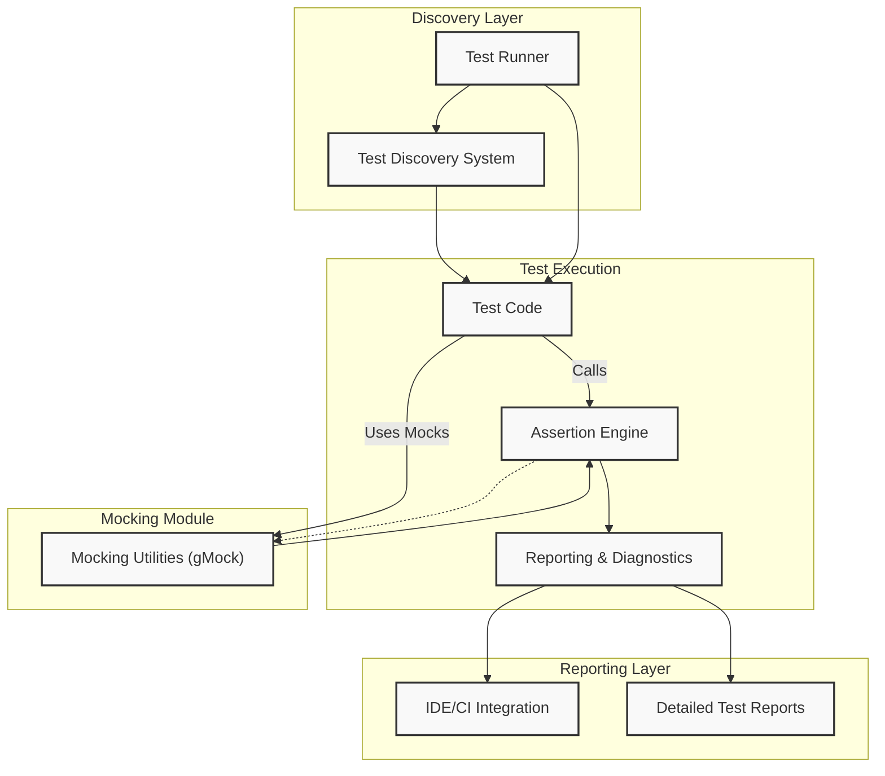

# System Architecture Overview

Explore GoogleTest’s modular system design with a clear, benefit-driven architecture diagram. This page provides a visual map of how the core components of GoogleTest interact, including test execution, assertion handling, mocking capabilities, discovery, and reporting.

## Understanding GoogleTest’s Architecture

GoogleTest is built as a collection of modular components that seamlessly collaborate to support comprehensive and efficient C++ testing. This architecture ensures flexibility, ease of extension, and clarity about the roles each component plays in the testing lifecycle.

At its core, GoogleTest runs your test code, verifies assertions, mocks dependencies when needed, discovers tests dynamically, and presents the results clearly for quick diagnosis. This layered design means you can focus on writing tests, while GoogleTest handles execution details.

### Why This Matters to You

- **Clear Interaction Flow:** Understand how your test code triggers assertions, how mock objects operate, and how the system gathers and reports results.
- **Easier Debugging:** By visualizing dependencies and component boundaries, you can identify where failures or slowdowns originate.
- **Smooth Integration:** Knowing module responsibilities helps you integrate GoogleTest with other tools or extend its capabilities thoughtfully.

## Components of GoogleTest

### 1. Test Code
Your test code contains the logic that exercises your application. It calls into GoogleTest’s assertion engine to verify expected outcomes.

### 2. Assertion Engine
This subsystem evaluates expressions in your tests and reports successes or failures. It underpins all verification and provides user-friendly diagnostics.

### 3. Mocking Utilities (GoogleMock Integration)
GoogleMock (gMock) extends GoogleTest’s ability to simulate parts of your system. It lets you create mock classes, define method call expectations, and control behavior for isolated testing.

### 4. Test Discovery
The discovery system scans for all available tests at runtime. It automates test execution by listing and organizing tests without manual registration.

### 5. Reporting Layers
After tests run, GoogleTest collates results, formats summaries, and provides detailed output. This includes integration with IDEs, CI pipelines, and specialized reporters.

## GoogleTest and GoogleMock Synergy

GoogleMock is fully integrated into GoogleTest, enhancing testability by mocking interfaces and verifying interactions. The architecture highlights the complementary role of GoogleMock components alongside GoogleTest’s core test execution and reporting.

## Visual Architecture Diagram

This diagram illustrates the key modules you interact with when using GoogleTest and GoogleMock.

## Real-World Scenario

Imagine you are testing a function that calls a remote service. Your test code uses GoogleMock to provide a mock implementation of the service interface. When your test runs:

1. Your test code calls the mocked interface (through Mocking Utilities).
2. GoogleMock verifies the expected calls and parameters.
3. Assertions validate results.
4. The assertion engine triggers a report on any failure.
5. The reporting system formats and outputs the status.

This flow highlights the modular collaboration enabling robust tests.

## Practical Tips

- When extending GoogleTest, ensure new components define clear interfaces and fit cleanly into this architecture.
- Use GoogleMock for dependency injection and precise interaction testing.
- Leverage GoogleTest's discovery features to keep your test suites manageable.
- Utilize reporting outputs for automation and continuous integration feedback.

## Troubleshooting Common Architecture Issues

- **Test Not Discovered:** Check that your test code is properly registered with the test discovery system.
- **Mock Method Not Called:** Verify mock expectations and check if the mock is correctly injected.
- **Unclear Failure Reports:** Use detailed reporting modes and enable verbose logging in GoogleTest.

## Next Steps

To get hands-on with this architecture:

- Visit [gMock Cookbook](https://google.github.io/googletest/gmock_cook_book.html) to master mocking basics.
- Explore [Mock Object Definition](https://google.github.io/googletest/api/gmock_reference.html#mock-object-definition) to create your own mocks.
- Review [Setting Expectations and Behavior](https://google.github.io/googletest/api/gmock_reference.html#setting-expectations-and-behavior) for controlling mocks.
- Understand [Strictness Modes](https://google.github.io/googletest/api/gmock_reference.html#strictness-modes) to manage mock call warnings and failures.

---

For broader context, please refer to the full [GoogleTest Overview](https://google.github.io/googletest/) and relevant guides on mocking, assertions, and test organization in this documentation set.

<Source url="https://github.com/google/googletest" branch="main" paths={[{"path": "googlemock/test/gmock-spec-builders_test.cc", "range": "1-725"},{"path": "docs/gmock_for_dummies.md", "range": "1-365"},{"path": "docs/gmock_cheat_sheet.md", "range": "1-432"},{"path": "docs/reference/mocking.md", "range": "1-563"}]} />