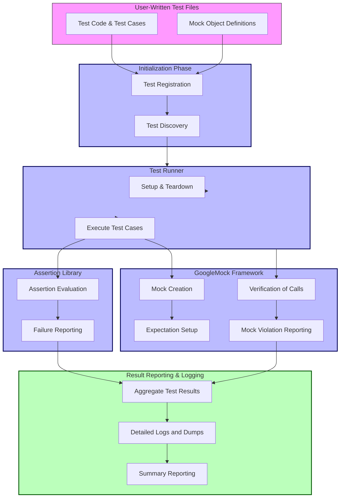

# System Architecture Diagram

## Overview

This page presents a clear and comprehensive system architecture diagram that illustrates the core components of GoogleTest and GoogleMock. It reveals how user-written test files interact with the testing framework, demonstrating the flow from test registration to execution, assertion evaluation, mock handling, and ultimately result reporting.

GoogleTest and GoogleMock form a powerful combined framework enabling developers to write, organize, and run C++ tests with rich mocking capabilities. This architecture overview enables users to understand how the pieces fit together to deliver a seamless testing experience.

---

## Architecture Components and Flow

### 1. User-Written Test Files

At the entry point are the test files written by developers. These files contain:

- Test cases implemented using GoogleTest’s macros and assertions.
- Mock objects defined with GoogleMock to simulate dependencies.

Through intuitive syntax, users express the expected behavior and interactions to be verified.

### 2. Test Registration and Discovery

During program initialization:

- Tests are automatically registered with the framework.
- GoogleTest discovers all registered test cases and suites without manual listing.

This automation spares users from maintaining test registration boilerplate.

### 3. Test Runner

The central orchestrator is the Test Runner, which:

- Initiates the execution of test suites.
- Manages setup and teardown methods.
- Coordinates test order and filtering.

The test runner ensures a controlled environment for predictable results.

### 4. Assertion Library

Within individual tests, the assertion library:

- Provides a rich set of assertion macros to check conditions.
- Reports failures clearly upon unmet expectations.

These assertions empower precise verification of test outcomes.

### 5. GoogleMock Framework

GoogleMock integrates seamlessly by:

- Allowing mock class creation with declarative syntax.
- Offering powerful expectation setting and behavior specification.
- Automatically verifying interactions and reporting expectation mismatches.

Mocks help users isolate code under test and verify complex interactions.

### 6. Result Reporting and Logging

After test execution, the framework:

- Aggregates results including passed, failed, and skipped tests.
- Produces clear, actionable logs and stack traces for failures.

This feedback loop guides developers in quickly locating and fixing issues.

---

## Visualizing the Architecture

---

## Why This Matters to You

Understanding this architecture helps you:

- **Navigate the testing workflow**: Know how your test code is discovered, run, and reported.
- **Leverage mocking effectively**: See how GoogleMock integrates to validate code interactions.
- **Diagnose issues faster**: Grasp the path from assertion failure or mock violation to reporting.
- **Optimize test design**: Recognize where setup and teardown hooks fit into test execution.

---

## Practical Tips and Best Practices

- **Write clear, focused tests** leveraging GoogleTest's macros to ensure predictable discovery.
- **Encapsulate dependencies in mocks** to isolate units and test behaviors precisely.
- **Use setup and teardown** for consistent test environments and avoid flaky tests.
- **Examine detailed logs and failure reports** to rapidly pinpoint test issues.
- **Leverage the registration and discovery features** to minimize manual test management overhead.

---

## Next Steps

- See [GoogleTest Primer](/overview/introduction-core-value/what-is-googletest) to deepen knowledge of writing tests.
- Explore [Mocking for Dummies](/guides/mocking-and-advanced-usage/mocking-with-gmock) for hands-on mock usage.
- Review [Test Structure & Registration](/api-reference/core-testing-api/test-structure-and-registration) for lifecycle details.

---

*This page integrates harmoniously within the Architecture & Core Concepts section, complementing the detailed explanations in terminologies and platform integrations.*