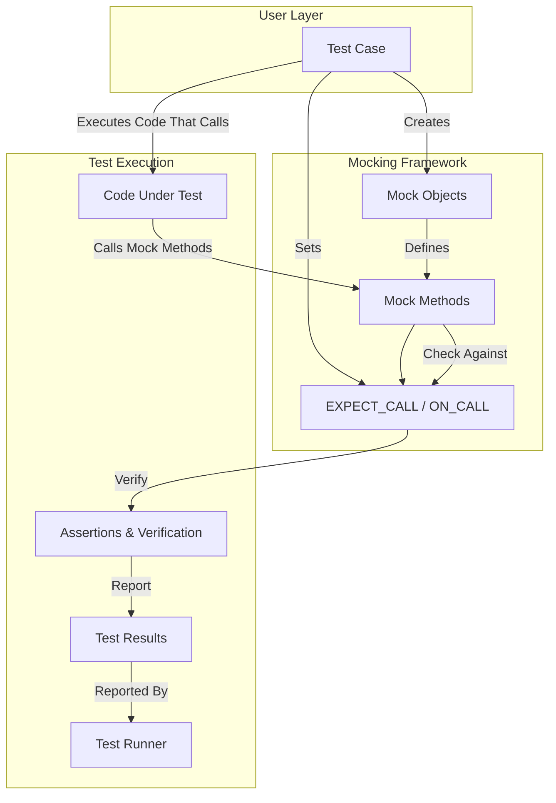

# System Architecture Overview

## Visualizing the GoogleTest and GoogleMock Interoperation

Understanding how GoogleTest and GoogleMock components work together is key to leveraging their full power for creating robust C++ tests. This overview provides a clear visual and conceptual description of their architecture, highlighting the roles of major components and the flow of control and data during test execution.

---

## Key Components Interaction

### 1. Test Cases
Test cases are user-written code blocks that define what to test and how. They drive the testing process by:
- Creating mock objects.
- Setting expectations on those mocks.
- Executing code under test that invokes mocked methods or real methods.
- Evaluating assertions on outcomes.

### 2. Assertions
Within test cases, assertions verify expected outcomes, including interaction with mocks. They immediately report failures when expectations are violated, such as incorrect calls or argument mismatches.

### 3. Mocks & Mock Methods
Mocks (mock objects) embody the interfaces to be tested or replaced. They define mock methods using `MOCK_METHOD` macros, which generate mock implementations that:
- Record calls
- Verify call counts and arguments
- Provide specified return values or actions

### 4. Expectations & Spec Builders
Using macros like `EXPECT_CALL` and `ON_CALL`, users specify behavior:
- `EXPECT_CALL` sets explicit expectations (what, how many times, order, arguments).
- `ON_CALL` defines default behaviors if no `EXPECT_CALL` is set.

These expectations are translated into internal spec builder objects that manage the lifecycle and matching logic.

### 5. Test Runner
GoogleTest's test runner manages the overall lifecycle of tests:
- Initializes mocks and test environment
- Invokes test cases
- Collects assertion results
- Reports summary

The interaction between GoogleMock and GoogleTest is seamless: mocking details affect test flow through expectations that get verified automatically during test execution.

---

## Core Workflow in Practice

The diagram below illustrates the typical lifecycle and interaction flow when running a test involving mocks:

### Flow Explanation
- **Test Case** initiates the process, creating mocks and setting expectations.
- The **Mock Objects** generate **Mock Methods**, which intercept calls during test.
- The **Expectations** hold specifications for mock behavior and validations.
- When test code runs, it calls mock methods which reference their expectations to check for compliance.
- Failures are caught and reported immediately via **Assertions**.
- The **Test Runner** aggregates these results for a test summary.

---

## Control & Data Flow Highlights

- **Expectations Are Set Before Test Execution:** Expectations must be declared before exercising the mocks, allowing GoogleMock to verify interactions eagerly and provide immediate feedback on deviations.

- **Automatic Verification:** Mocks automatically verify that all expected interactions have occurred when the mock object is destructed or when the test finishes, reducing manual verification burdens.

- **Sticky Expectations and Ordering:** Expectations remain active until retired either explicitly or by specific sequencing directives. The framework supports strict, partial, or unordered call sequences, empowering precise control.

- **Default vs. Expected Behavior:** `ON_CALL` defines the default behavior for mock methods when no expectation exists; `EXPECT_CALL` overrides and asserts expectations.

- **Error Reporting:** On mismatches or call count violations, GoogleMock reports detailed messages, including call stack trace, argument values, and expectation states, simplifying debugging.

---

## Practical Implications

This architecture enables test writers to:

- Design mocks easily using `MOCK_METHOD` macros.
- Specify rich expectations controlling call counts, order, arguments, and behaviors.
- Run tests with automatic, transparent verification and informative diagnostics.
- Compose complex interaction patterns with sequences and pre-requisite expectations.

By mastering these components and their interplay, users can craft maintainable, precise, and efficient tests that catch interaction-level bugs early and reliably.

---

## Next Steps

To apply this knowledge in practice, proceed to:

- [Core Concepts & Terminology](/overview/architecture-concepts/core-concepts-terminology) for detailed understanding of mock objects, expectations, and matchers.
- [Using Mocks in Tests](/api-reference/gmock-mocking-apis/mock-object-definition) to learn the practical steps of defining and using mocks.
- [Setting Expectations & Control](/api-reference/gmock-mocking-apis/expectations-and-control) for deep coverage of expectation syntax and semantics.
- [Writing Effective Assertions](/api-reference/gtest-core-apis/assertions) to improve test validation.

Together with this architecture overview, these resources provide a solid foundation for mastering GoogleTest and GoogleMock.

---

_Last updated from [GoogleTest GitHub repo](https://github.com/google/googletest) (main branch)._