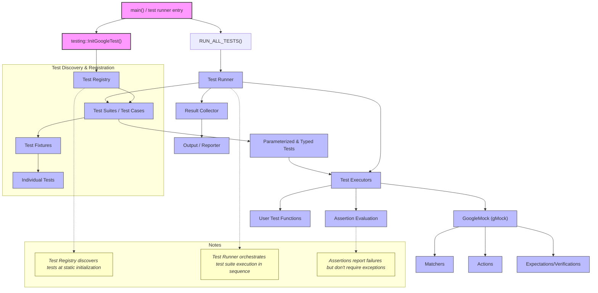

# System Architecture

Understanding how GoogleTest orchestrates the complex process of test discovery, execution, and result reporting is crucial to mastering its use and integration. This page lays out a high-level view of GoogleTest’s internal architecture, helping you grasp how the different components work together to provide a seamless testing experience.

## Visualizing GoogleTest’s Core Architecture

At its heart, GoogleTest is a modular framework that spans multiple layers—from automatic test discovery and rich assertion mechanisms to powerful mocking capabilities and flexible parameterized test execution. This modularity supports extensibility, robust error reporting, and efficient test execution.

### High-Level Data and Control Flow

## Core Components Explained

### 1. `main()` / Test Runner Entry Point
This is the user’s executable entry point. After initializing GoogleTest via `testing::InitGoogleTest()`, it calls `RUN_ALL_TESTS()` to start the test execution lifecycle.

### 2. Test Registry
GoogleTest uses a global test registry which collects all defined tests during static initialization. Users don’t need to manually register tests; GoogleTest automatically gathers them into test suites (previously known as test cases).

### 3. Test Suites and Fixtures
Tests are grouped logically into test suites. Within each suite, tests can share common setup/teardown code via test fixtures, enabling reuse of configuration and access to shared data.

### 4. Test Runner & Executors
The test runner orchestrates iterating over test suites and invoking the individual test executors.

- Each test executor runs a single test instance.
- Executor handles lifecycle events like setup, running the test body, and tear down.

### 5. Assertion Engine
Assertions, such as `ASSERT_EQ` or `EXPECT_TRUE`, form the core of verification. This engine evaluates assertions and records successes or failures without throwing exceptions, allowing tests to proceed where applicable.

### 6. GoogleMock (gMock) Integration
The mocking layer extends GoogleTest with the ability to create mock objects and expectations:

- **Matchers** validate arguments passed to mock methods.
- **Actions** define what mocked methods do when called.
- **Expectations/Verifications** enforce constraints on how many times mocks should be called and in what order.

### 7. Parameterized & Typed Tests
GoogleTest supports parameterized tests allowing repeated execution of the same logic over different data sets or types. This layer integrates with the executors to instantiate test variants.

### 8. Result Collection & Reporting
After running tests, the results collector aggregates data on passed, failed, skipped, and flaky tests. This data is formatted and output according to configured reporters (console, XML, JSON, etc.).

### 9. User Test Code
This is where users write the actual test logic, leveraging GoogleTest’s assertions and mocking API.

## Why This Architecture Matters

- **Automatic Test Discovery**: You write tests as code; no manual registration needed.
- **Test Isolation**: Each test runs in a fresh fixture to prevent cross-contamination.
- **Flexible Assertion Behavior**: Supports fatal and nonfatal assertions, enabling richer test diagnostics.
- **Comprehensive Mocking**: Advanced mock object support tightly integrated into test execution.
- **Extensible Execution Model**: Parameterized and typed tests allow comprehensive test coverage with minimal boilerplate.
- **Clear Reporting Pipeline**: Result collector and formatter separate test logic from output, enabling multiple reporter types.

## Practical Example: How a Test Runs

1. You compile your tests linked against GoogleTest.
2. At runtime, when the executable starts, `main()` calls `InitGoogleTest()`, which initializes global state and parses flags.
3. Registered tests are read from the Test Registry.
4. `RUN_ALL_TESTS()` triggers the Test Runner.
5. For each test suite:
   - For each test in the suite:
     - A fresh fixture instance is created.
     - `SetUp()` is called on the fixture.
     - The test body is executed.
     - Assertions are evaluated and results logged.
     - `TearDown()` is called.
6. Mocks, if used, verify that expectations are met.
7. Results are collected and output.
8. Return status indicates overall test success or failure.

## Tips and Best Practices

- Always write tests that can run independently—GoogleTest’s architecture supports this through test fixture isolation.
- Use parameterized tests to reduce duplication across similar test cases.
- Mock only where necessary to isolate dependencies, and rely on GoogleMock’s rich features to keep tests clean.
- Familiarize yourself with flag options via `testing::InitGoogleTest` to customize test runs.
- Take advantage of result output formats for integration with CI systems.

<Info>
This overview is a foundation for exploring related pages like [Core Concepts & Terminology](overview/architecture-concepts/core-concepts) and [Feature Overview](overview/architecture-concepts/feature-overview).
</Info>