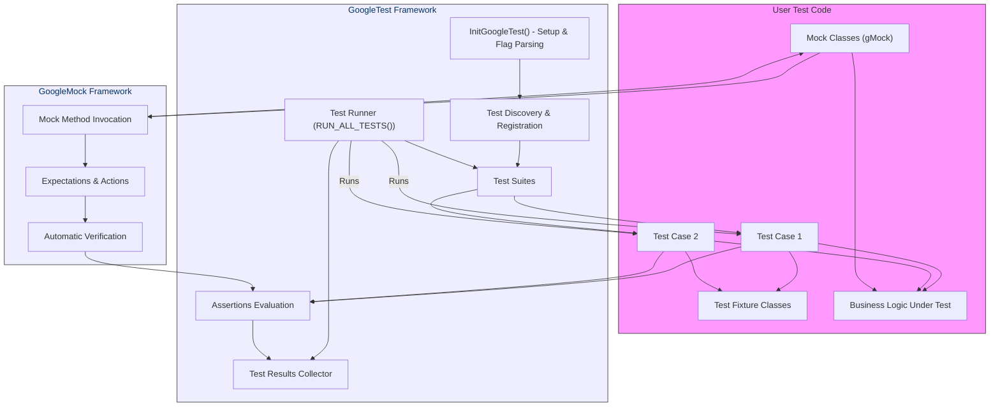

# System Architecture (with Diagram)

## Visualizing GoogleTest's Core Architecture

Understanding the inner workings of GoogleTest and how its components interact is essential for effective test design, debugging, and extension. This page delivers a clear, visual overview of GoogleTest’s architecture using a Mermaid diagram, illustrating how your test code fits with the GoogleTest and GoogleMock frameworks during test execution.

---

## Overview

GoogleTest is a robust C++ testing framework designed around a simple yet powerful architecture. It seamlessly integrates your test cases and suites with test runners, assertions, and mock objects, orchestrating the entire test flow from initialization to reporting.

This diagram-centric overview helps you grasp:

- How the GoogleTest framework initializes and discovers tests,
- The relationship between test fixtures, test suites, and individual test cases,
- The role of mock objects within GoogleMock,
- How assertions are evaluated and results are gathered,
- The link between your user code and the GoogleTest harness.

By contextualizing these components, you can better design your tests and mocks, and troubleshoot issues with confidence.

## Architecture Diagram

---

## How It Works: Step-by-Step

1. **Initialization**
   - `InitGoogleTest()` prepares the framework, parses command-line flags, and sets up necessary environment components.

2. **Test Discovery & Registration**
   - GoogleTest automatically discovers all tests registered via `TEST()`, `TEST_F()`, and related macros.
   - These tests are grouped logically into test suites.

3. **Test Execution**
   - The `Test Runner` (`RUN_ALL_TESTS()`) sequentially runs each test suite and their test cases.
   - For tests that use fixtures, fresh fixtures are instantiated per test, guaranteeing isolation.

4. **Assertions Processing**
   - During each test, assertions (`ASSERT_*` and `EXPECT_*`) evaluate conditions on your tested code.
   - Failures are recorded, affecting test success.

5. **Mock Handling (GoogleMock)**
   - Mock objects intercept calls in user code.
   - Expectations define what method calls and arguments are valid.
   - The framework verifies these expectations automatically when tests complete.

6. **Result Aggregation**
   - All test outcomes, including passes, failures, and errors, are collected.
   - Results can be output in various formats, aiding debugging and continuous integration.

---

## Practical Scenario

Imagine you are testing a class `Foo` that depends on an interface `Bar`. You use GoogleMock to create a mock of `Bar`.

- Your `FooTest` fixture creates the mock object.
- Test cases within `FooTest` set expectations on mock methods using `EXPECT_CALL()`.
- When the test runs, calls from `Foo` to `Bar` go through the mock implementation.
- The framework verifies that these calls satisfy expectations.
- Assertions check the results of `Foo`'s behavior.

This structured flow ensures that your mock interactions and assertions are tightly integrated, enabling clear, maintainable, and reliable tests.

---

## Tips for Using This Architecture Effectively

- **Isolate Tests:** Use fixtures properly to avoid shared state and ensure repeatability.
- **Leverage Mock Expectations:** Define clear, concise expectations to catch undesired interactions early.
- **Use Assertions Thoughtfully:** Prefer `EXPECT_*` to allow multiple checks per test; use `ASSERT_*` when continuation doesn’t make sense.
- **Understand Test Discovery:** Name your tests and suites clearly to benefit from automatic discovery and easy test execution.
- **Interpret Results in Context:** The framework’s result collector can output detailed failure info tied directly to your test cases.

By aligning with GoogleTest’s architecture, you create tests that are easier to maintain, debug, and integrate in larger projects.

---

For a deeper dive into test creation, assertions, and mocking APIs, visit the related documentation on [GoogleTest Primer](../docs/primer.md) and the [Mocking Reference](../docs/reference/mocking.md).
