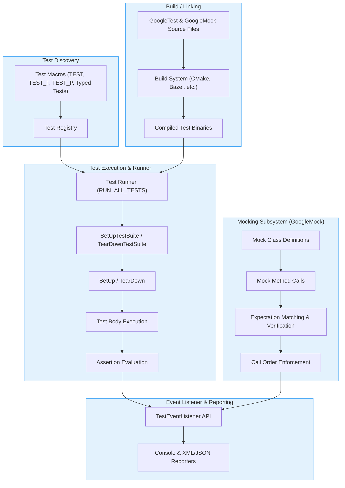

# System Architecture (with Diagram)

## Understanding the Architecture of GoogleTest and GoogleMock

GoogleTest and GoogleMock together form an integrated, robust testing ecosystem for C++ applications. This page provides a detailed visualization of their architecture, illustrating how test discovery, assertion evaluation, runners, and the mocking subsystem collaborate to create a comprehensive test framework. Understanding these interactions will help you optimize your testing workflows, troubleshoot issues, and strategically integrate GoogleTest and GoogleMock in your projects.

---

## Architecture Overview

GoogleTest and GoogleMock operate as a unified framework combining core testing functionalities with powerful mocking capabilities. Their architecture is designed around key components that manage test discovery, execution, assertion evaluation, and mocking behavior tracking. These components interact seamlessly during the build and execution of test binaries.

### Core Components and Interactions

- **Test Discovery:** Automatically detects tests defined by macros like `TEST`, `TEST_F`, `TEST_P`, and typed test macros. This eliminates the need for manual registration and helps in running the right tests efficiently.

- **Test Runners:** Responsible for executing the discovered tests. They honor test lifecycle events such as setup, teardown, and iteration, while managing parallel execution and sharding.

- **Assertion Evaluation:** Central to validating test outcomes, assertions track success or failure states and control test flow via fatal and non-fatal failure handling.

- **Mocking Subsystem:** Integrated through GoogleMock, this subsystem enables defining, invoking, and verifying mock methods with rich controls on expectations and behavior.

- **Event Listeners:** Provide hooks to monitor test progress, results, and failures, enabling customization or extension of test output.

- **Build Integration:** GoogleTest and GoogleMock source files and headers are incorporated into your build system. The build process generates test binaries which embed the mechanisms for test discovery, execution, and result reporting.

---

## How the Components Work Together

Upon build and execution of your test binary:

1. **Startup:** The test program initializes GoogleTest, parsing command-line flags and environment variables to configure the test run.

2. **Test Discovery:** GoogleTest scans linked test suites and test cases created through macros.

3. **Execution Management:** The test runner orchestrates test execution, calling `SetUpTestSuite`, `SetUp`, individual test bodies, `TearDown`, and `TearDownTestSuite` in sequence.

4. **Assertion Checking:** Inside each test body, assertions evaluate conditions and report failures or successes.

5. **Mock Interactions:** If mocks are used, expectations are set and verified automatically, capturing call order and argument matching.

6. **Event Reporting:** Event listeners receive notifications of test start/end and assertion results, enabling detailed output or custom handling.

7. **Test Completion:** The runner aggregates results and outputs summaries, XML/JSON reports, or other formats based on configuration.

---

## Visual Diagram of the System Architecture

---

## How to Identify Integration Points

### Test Discovery
- Defined tests are registered automatically by macros during translation unit initialization.
- Test registry collects these definitions for runtime discovery by the test runner.

### Assertion Evaluation
- Tests implement assertions using GoogleTest macros like `ASSERT_EQ`, `EXPECT_TRUE`, etc.
- Assertion results determine test success or failure and influence the test flow.

### Mocking Integration
- Mock classes extend from GoogleMock macros and base classes.
- Expectation setting and method behavior definitions connect mocks to the test execution flow.
- Automatic verification takes place at test end or upon destruction.

### Build Path Considerations
- GoogleTest and GoogleMock source files are compiled alongside your test code.
- Build configurations must include appropriate include paths and link libraries.
- CMake scripts and instructions (see [googletest/README.md](https://github.com/google/googletest#build-instructions)) guide proper build setup.

---

## Best Practices for Successful Integration

- Always ensure to initialize GoogleTest with `InitGoogleTest()` before running tests.
- Use provided macros consistently for defining tests and mock methods.
- Register and instantiate parameterized and typed tests properly to avoid silent test omission.
- Leverage event listener APIs to customize output and integrate with CI systems.
- Maintain build scripts to correctly link GoogleTest/GoogleMock libraries and headers.

---

By understanding the orchestration of these components and their build-time and runtime interactions, you can effectively utilize GoogleTest and GoogleMock to write expressive, maintainable, and high-quality tests that scale with your project needs.

---

_For more details on writing tests and using GoogleMock, see the corresponding [Testing Reference](../docs/reference/testing.md) and [gMock documentation](../googlemock/README.md)._

---

### Related Resources
- [GoogleTest User's Guide](https://google.github.io/googletest/)
- [GoogleMock Framework Overview](https://github.com/google/googletest/blob/main/googlemock/README.md)
- [Building GoogleTest and GoogleMock](https://github.com/google/googletest/blob/main/googletest/README.md)
- [Test Lifecycle and Core Concepts](./core-concepts)
- [Feature Overview: GoogleTest & GoogleMock](./feature-glance)

---

### Troubleshooting Common Issues

<AccordionGroup title="Troubleshooting Integration Issues">
<Accordion title="Tests Not Discovered at Runtime">
Ensure your tests are declared with the correct macros (`TEST`, `TEST_F`, `TEST_P`, etc.) and linked into the test binary. Check for missing registrations or incorrect instantiations especially with parameterized tests.
</Accordion>
<Accordion title="Mock Expectations Not Enforced">
Verify that mock objects are alive during test execution and that expectations are properly set. Ensure `Mock::AllowLeak()` is used if mocks must outlive the test scope (common with death tests).
</Accordion>
<Accordion title="Build or Linking Errors Related to GoogleTest/GoogleMock">
Confirm your build system includes GoogleTest and GoogleMock source files and headers correctly. When using CMake, use `add_subdirectory` or `find_package(GTest)` accordingly, and link your tests against `gtest_main` or `gmock_main`.
</Accordion>
</AccordionGroup>

---

By mastering these architecture details and interactions, you unlock the full power of GoogleTest and GoogleMock for comprehensive, maintainable testing of your C++ projects.
