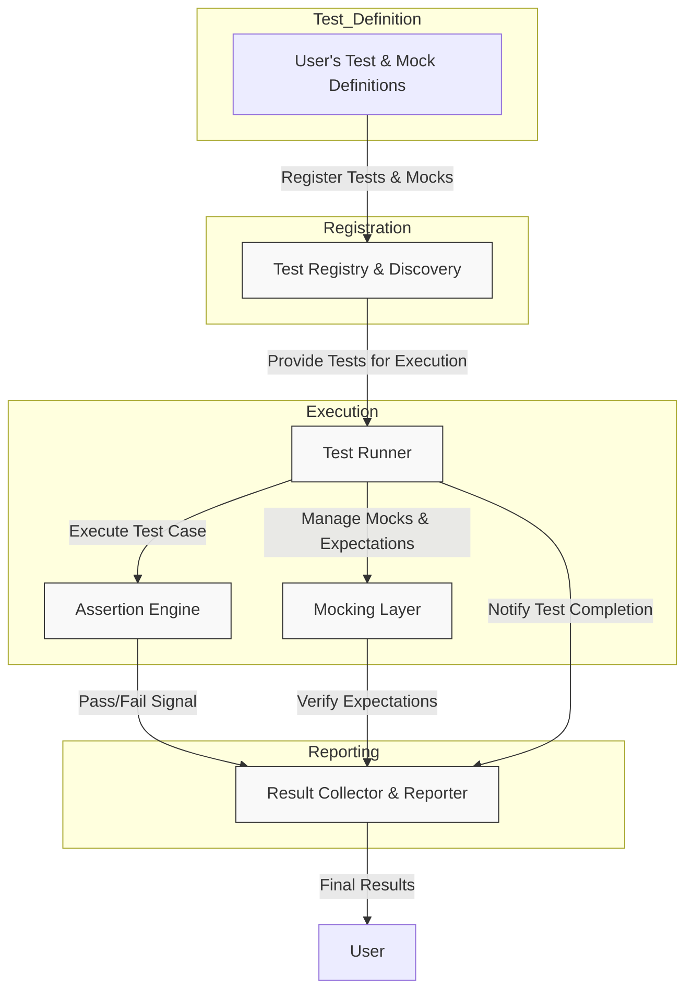

# System Architecture

## Understanding the GoogleTest & GoogleMock Framework Interactions

Welcome to the System Architecture overview of GoogleTest and GoogleMock. This page helps you visualize the entire journey of your tests — from definitions through execution to reporting — giving you an insightful view of the internal layers and their interactions. Understanding this layered architecture enables you to write more effective tests, troubleshoot with confidence, and appreciate how Google’s C++ testing framework executes your code reliably.

---

### Why Care About The System Architecture?

Imagine you’re running a complex suite of C++ tests for your application. Beyond writing assertions and test cases, knowing how test definitions move through the framework, how mock expectations are verified, and how results get reported can transform how you design your tests and interpret results.

The System Architecture page shows you exactly how key pieces like the test runner, assertion engine, mocking layers, and reporting mechanisms connect and operate cohesively — all while maintaining test isolation, robustness, and clarity.

## GoogleTest and GoogleMock: What Is It?

GoogleTest is a widely adopted C++ testing framework based on the familiar xUnit architecture, supporting extensive assertion types and comprehensive test structuring.

GoogleMock extends GoogleTest by enabling the creation and control of mock objects—allowing precise testing of interactions and dependencies through declarative expectations.

Together, they provide a unified testing and mocking environment to write thoroughly verified, maintainable C++ tests.

## Core Components and Their Purpose

At a high-level, the system architecture reveals a layered design that handles:

- **Test Definitions and Discovery:** Your tests (defined with `TEST()`, `TEST_F()`, mocks, and expectations) are automatically registered and grouped.
- **Test Runner:** Orchestrates the ordered execution of tests, ensuring isolated environments for each test, managing setup/teardown of fixtures.
- **Assertion Engine:** Evaluates each assertion’s success or failure and handles fatal versus nonfatal failures to control test flow.
- **Mocking Layer:** Integrates mock object creation, expectation matching, and call verification, allowing precise behavioral control without manual bookkeeping.
- **Result Collection and Reporting:** Gathers test outcomes with detailed context to produce comprehensive reports.

### How Do These Components Interact?

Here is an illustrative Mermaid.js flowchart showing the main interactions and data flow within the GoogleTest and GoogleMock architecture:

- **User's Test & Mock Definitions:** When you write tests using `TEST()`, declare mocks with `MOCK_METHOD()`, and set expectations, these definitions get automatically registered.

- **Test Registry & Discovery:** This layer tracks all registered tests and mocks, enabling the test runner to discover them dynamically without manual enumeration.

- **Test Runner:** Drives the test execution pipeline by creating instances of test fixtures, invoking tests, and managing lifecycle hooks.

- **Assertion Engine:** At runtime, processes assertions within your test functions and communicates results.

- **Mocking Layer:** Implements mocks, controls their behavior, matches method calls against expectations, and verifies their fulfillment.

- **Result Collector & Reporter:** Captures all test outcomes and provides detailed failure reports, enabling effective debugging.

## Real-World Example

Consider you have a test suite verifying a class `Queue`. Each test uses assertions like `EXPECT_EQ` and mocks out dependency classes.

1. You define `TEST_F(QueueTest, IsEmptyInitially)` and mock dependencies.
2. The test runner discovers this test from the registry.
3. The runner creates a fresh `QueueTest` fixture instance.
4. Assertion engine evaluates `EXPECT_EQ` calls in your test; mock layer checks if expected calls to mocks happen.
5. If a failure occurs, the reporter logs detailed context including line numbers, input state, and mock call info.
6. After test completion, the runner tears down, preparing for the next test.

Through this systematic flow, GoogleTest and GoogleMock ensure isolated, repeatable, and informative testing.

## Practical Tips & Best Practices

- **Leverage Automatic Test Registration:** You don't need manual test lists; define tests and mocks, and the registry handles discovery.

- **Understand Failure Types:** Use `ASSERT_*` macros for fatal failures (stop the current function) and `EXPECT_*` for nonfatal to gather multiple insights in one run.

- **Isolate Mocks Per Test:** Mock objects are managed fresh per test, avoiding side effects across tests.

- **Interpret Reports with Architecture in Mind:** Knowing the flow from assertion engine and mocking verification to final reporting helps decode failure messages.

- **Use Fixtures for Shared Setup:** The runner creates fixtures per test ensuring consistent environments and proper resource management.

## Troubleshooting Common Issues

<AccordionGroup title="Troubleshooting Common Scenarios">
<Accordion title="Why does GoogleTest run tests in a specific order?">
The test runner executes tests in the order registered, but you should not rely on this order. Each test runs in a fresh fixture to guarantee isolation. If order is meaningful, re-examine to improve test independence.
</Accordion>
<Accordion title="My mock expectations aren't verified correctly—what's wrong?">
Ensure you set expectations **before** exercising mocks in your tests. The mocking layer verifies expectations at test teardown, so late or missing expectations cause failures.
</Accordion>
<Accordion title="How can I debug failing assertions with minimal output noise?">
Use `ASSERT_*` for critical test checkpoints and `EXPECT_*` when you want to continue and see more assertion results. Understanding the assertion engine's handling of failures helps balance thoroughness and noise.
</Accordion>
</AccordionGroup>

## Getting Started Preview

To explore the system in action:

1. Write your first simple test using the `TEST()` macro.
2. Use mocks with `MOCK_METHOD()` and set expectations using `EXPECT_CALL()`.
3. Run tests via `RUN_ALL_TESTS()` and observe detailed output from the reporter.

Once comfortable with this overview, dive deeper into [Test Discovery and Execution Workflow](/guides/getting-started/test-discovery-execution) and [Using Mocks: Patterns and Best Practices](/guides/mocking-and-advanced-techniques/using-mocks) to master the capabilities of GoogleTest and GoogleMock.

---

For the complete walkthrough, refer to related documentation such as the [GoogleTest Primer](https://google.github.io/googletest/primer.html), [Mocking Reference](reference/mocking.md), and [gMock for Dummies](https://google.github.io/googletest/gmock_for_dummies.html).

---

## References

- GoogleTest Primer: Introduction to basic test writing.
- Mocking Reference: In-depth guidance on defining and using mocks.
- gmock_main.cc: Entry point showing integration of GoogleMock and GoogleTest initialization.

<Source url="https://github.com/google/googletest" paths={[{"path": "googlemock/src/gmock_main.cc", "range": "1-57"}]} />

---