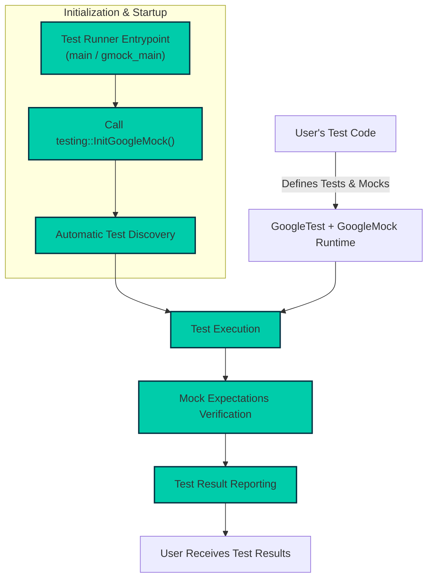

# System Architecture Overview

Explore how GoogleTest and GoogleMock collaborate to empower you with a seamless workflow for authoring, discovering, executing, and reporting tests. This page maps out the key components and architectural flows, helping you understand the roles of your test code, the framework runtime, and the output mechanisms involved.

---

## Introduction

GoogleTest and GoogleMock together form a powerful C++ testing and mocking framework designed to streamline test automation for your projects. This page focuses on the architectural view of how these tools work together during the entire testing lifecycle.

Understanding the architecture is crucial for diagnosing integration issues, extending the framework, or optimizing test performance.

---

## Architecture Overview

At its core, GoogleTest acts as the test authoring and execution engine, while GoogleMock complements it by enabling sophisticated mock object generation and behavior verification. Their runtime systems integrate tightly to support a robust workflow from test discovery to reporting.

### Core Components

- **User Test Code:** This is the test code you write using GoogleTest’s APIs, including mock classes defined by GoogleMock.
- **Test Framework Runtime:** The combined runtime environment of GoogleTest and GoogleMock that discovers tests automatically, executes them, applies assertions, and handles mock verifications.
- **Test Runner Entry Point:** The entry function (e.g., `main`) often provided by libraries like `gtest_main` or `gmock_main` initiates and controls the test lifecycle.
- **Test Result Reporter:** Mechanisms that collect the outcomes and generate human- or machine-readable reports.

### High-Level Flow

1. **Initialization:** Your test executable calls `testing::InitGoogleMock()`, which initializes GoogleMock as well as GoogleTest.
2. **Test Discovery:** The framework automatically discovers all test cases and mock expectations defined.
3. **Execution:** Tests run sequentially or in parallel, invoking test fixtures, assertions, and mock methods.
4. **Verification:** Post execution, expectations on mocks are automatically verified.
5. **Reporting:** The results are formatted and outputted to console or other reporters.

---

## Key Architectural Aspects

### 1. Test Entrypoint

The main function typically provided by GoogleMock’s `gmock_main` defines the program’s entry. It performs test initialization by calling `testing::InitGoogleMock(...)`, which prepares both GoogleMock and GoogleTest. You do not need to define this yourself unless custom behavior is needed.

### 2. Automatic Test Discovery

GoogleTest automatically finds all your tests and mock expectations registered by the macros (`TEST()`, `TEST_F()`, `EXPECT_CALL()` etc.) at static initialization phase. This obviates the need to manually list or register tests.

### 3. Test Execution Lifecycle

Tests are run one by one, creating fresh test fixture instances for isolated state. GoogleMock tracks mock calls, enforcing expectations during each test.

### 4. Mock Integration

Since GoogleMock depends on GoogleTest, mock expectations participate fully in the testing lifecycle. Mock method calls are monitored, and failures or unexpected calls trigger test failures immediately.

### 5. Test Reporting

Results aggregate successes, failures, and warnings. Output is highly detailed, including failure messages and stack traces, making it easy to identify problems.

---

## Practical User Flow

Imagine you are developing a module that relies on external dependencies. You write tests for your module using GoogleTest and GoogleMock:

1. Define test cases with `TEST()` or `TEST_F()`.
2. Create mock classes using `MOCK_METHOD` macros.
3. Use `EXPECT_CALL` to specify required mock behavior and validate interactions.
4. Run tests. The test binary, powered by `gmock_main`, initializes everything and automatically discovers your tests.
5. Tests execute. Your test code interacts with mocks, which verify calls in real-time.
6. Upon test completion (or failure), all mock expectations are verified, and a detailed test report is generated.

This architecture hides complex runtime mechanics, so you focus on writing meaningful tests without boilerplate or manual registration.

---

## Troubleshooting & Tips

<Tip>
If tests do not run, verify that your executable links against `gmock_main` or calls `testing::InitGoogleMock()` explicitly. Without initialization, tests won’t be discovered or executed.
</Tip>

<Tip>
Linking GoogleMock with the proper compiler and linker flags, as guided by the CMake build instructions, is essential for correct test runtime behavior.
</Tip>

<Tip>
Use GoogleMock’s strict or nice mock wrappers (`StrictMock`, `NiceMock`) to control warning and error reporting of unexpected calls, aiding clear failure diagnosis.
</Tip>

<Tip>
For parallel or advanced test runners, knowing the architecture helps you ensure your tests remain isolated and mock verifications do not interfere.
</Tip>

---

## Summary

This architecture overview gives you the foundational understanding of how GoogleTest and GoogleMock interoperate to provide an efficient, robust testing environment. By recognizing the test lifecycle stages, your interaction with user code, and how the framework manages mocks and test reporting, you can use, debug, or extend the framework confidently.

---

## Additional Resources

- [What is GoogleTest?](./overview/intro-value-prop/what-is-googletest) — Start here for a gentle product introduction.
- [Core Value and Key Features](./overview/intro-value-prop/core-value-features) — Dive into capabilities that shape the architecture.
- [GoogleMock for Dummies](https://google.github.io/googletest/gmock_for_dummies.html) — Beginner-friendly guide to mocks.
- [gMock Cookbook](https://google.github.io/googletest/gmock_cook_book.html) — Covers advanced mocking strategies.
- [Test Structure & Lifecycle](./api-reference/core-testing-api/test-structure) — API reference on test lifecycles.
- [Integration with Build Systems & Other Tools](./overview/integration-feature-overview/integration-build-systems) — Ensure you build and integrate properly.

---

<Source url="https://github.com/google/googletest" branch="main" paths={[{"path": "googlemock/src/gmock_main.cc", "range": "1-59"}]} />