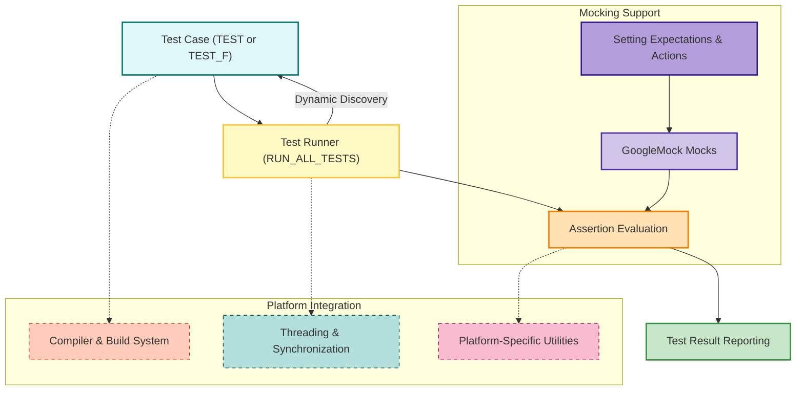

# System Architecture

## Understanding the Core of GoogleTest

GoogleTest is a comprehensive C++ testing framework designed to simplify writing, organizing, and running tests. This page unpacks the internal relationship between the primary components involved in test execution: from writing test cases, to running them, verifying with assertions, optionally mocking behaviors, and integrating with diverse platforms.

Whether you're a developer aiming to optimize your testing workflow or a team integrating GoogleTest into complex environments, this architecture overview will illuminate how GoogleTest orchestrates these elements seamlessly.

---

## High-Level Workflow: From Tests to Results

At its core, GoogleTest follows a clear sequence:

- **Test Authors** write individual *test cases* using GoogleTest macros.
- The *test runner* discovers and executes these test cases.
- Inside each test case, assertions verify behavior correctness.
- For richer scenarios, *GoogleMock* components simulate dependencies, enabling precise control and verification of interactions.
- Throughout, platform-specific integration ensures compatibility and efficiency.

The following section illustrates this process visually.

### Visualizing GoogleTest System Architecture

## Components Explained

### 1. Test Cases

Users write tests using macros such as `TEST()` or `TEST_F()`, defining individual test functions within test suites or fixture classes. These leverage assertion macros to validate expected behaviors.

**Why it matters:** Tests isolate code paths and verify correctness, forming the foundation of reliable software.

### 2. Test Runner

GoogleTest's internal test runner automatically discovers all registered tests and invokes them one by one via `RUN_ALL_TESTS()`. It handles setup, teardown, and result aggregation.

**Why it matters:** Automates test execution and ensures consistent environment control.

### 3. Assertions

Assertions like `EXPECT_EQ`, `ASSERT_TRUE`, and many others evaluate if conditions hold. GoogleTest distinguishes between **fatal** (aborts current test on failure) and **non-fatal** (reports failure but continues).

**Why it matters:** Provides detailed failure diagnostics and supports flexible failure handling strategies.

### 4. GoogleMock Integration (Optional)

For tests that interact with external components or complex dependencies, GoogleMock offers:

- **Mocks:** Objects that simulate real interfaces.
- **Expectations:** Control what calls are expected and when.
- **Actions:** Define behavior responses or side effects.

These integrate seamlessly, allowing GoogleMock mocks to be used inside test cases.

**Why it matters:** Enables precise behavioral verification and unit testing of components in isolation.

### 5. Platform Integration

GoogleTest integrates tightly with platform-specific aspects such as compiler/linker configurations, threading primitives, and file I/O mechanisms to provide:

- Thread safety when possible
- Cross-platform portability
- Optimized build configurations

**Why it matters:** Ensures reliable operation across multiple operating systems and toolchains.

---

## Real-World Usage Scenario

Imagine you are developing a C++ library that processes user input. You want to:

- Write **test cases** that check input validation.
- Use **assertions** to verify expected outputs.
- For the component that interacts with a database, use **GoogleMock** to simulate database calls.
- Run your tests via the **test runner** and get concise reports to guide debugging.

This system architecture ensures each step is modular, well-coordinated, and extensible to manage complexity.

---

## Tips for Success With GoogleTest System Architecture

- **Structure your tests logically**: Group related tests into suites to improve clarity.
- **Leverage test fixtures** (`TEST_F`) to share setup and teardown:
  Clear separation keeps tests independent and maintainable.
- **Use GoogleMock for isolated behavior verification**: This allows your tests to focus on code under test without side effects.
- **Understand assertion types and proper use cases**: Use fatal assertions to stop on critical failures, and non-fatal ones to gather multiple failure reports.
- **Be aware of platform settings**: Make sure the build system compiles GoogleTest to match your project's runtime environment (especially on Windows regarding runtime libraries).

---

## Troubleshooting Common Issues

<AccordionGroup title="System Architecture Troubleshooting">
<Accordion title="Why aren't my tests discovered by the test runner?">
Ensure your source files containing tests are compiled and linked correctly. Verify that macros like TEST() are used and that `RUN_ALL_TESTS()` is called.
</Accordion>
<Accordion title="How to debug assertion failures?">
When an assertion fails, GoogleTest prints the exact file and line number, along with details of the failed condition. Use non-fatal assertions to get multiple failure points in one run.
</Accordion>
<Accordion title="Can I use GoogleMock features without including the full GoogleMock framework?">
GoogleMock is designed to integrate with GoogleTest seamlessly, but if you only need GoogleTest’s assertions and test execution, you can omit GoogleMock. However, the power of mocking requires linking with GoogleMock libraries.
</Accordion>
<Accordion title="How to ensure my custom mocks interact properly with platform threading?">
GoogleTest automatically manages threading primitives when pthread is available, ensuring thread-safe mocks. On unsupported platforms, use synchronization carefully or disable multi-threading.
</Accordion>
<Accordion title="How to configure GoogleTest for different platforms?">
Refer to platform-specific configuration macros and compiler flags defined in CMake or your build system to ensure compatibility and optimal behavior for your target environment.
</Accordion>
</AccordionGroup>

---

## Next Steps

- Dive into **[Core Concepts and Terminology](/overview/architecture-concepts/core-concepts-terminology)** to understand foundational terms.
- Explore **[Integration with Tools & Extensions](/overview/integration-and-ecosystem/ecosystem-integrations)** to connect GoogleTest with CI/CD and build environments.
- Start writing your first tests with **[Writing Your First Test](/getting-started/first-run-validation/writing-first-test)**.

---

*This page provides the architecture context to empower you to master GoogleTest’s workflow from test creation to execution, bolstered by powerful mocking and platform support.*