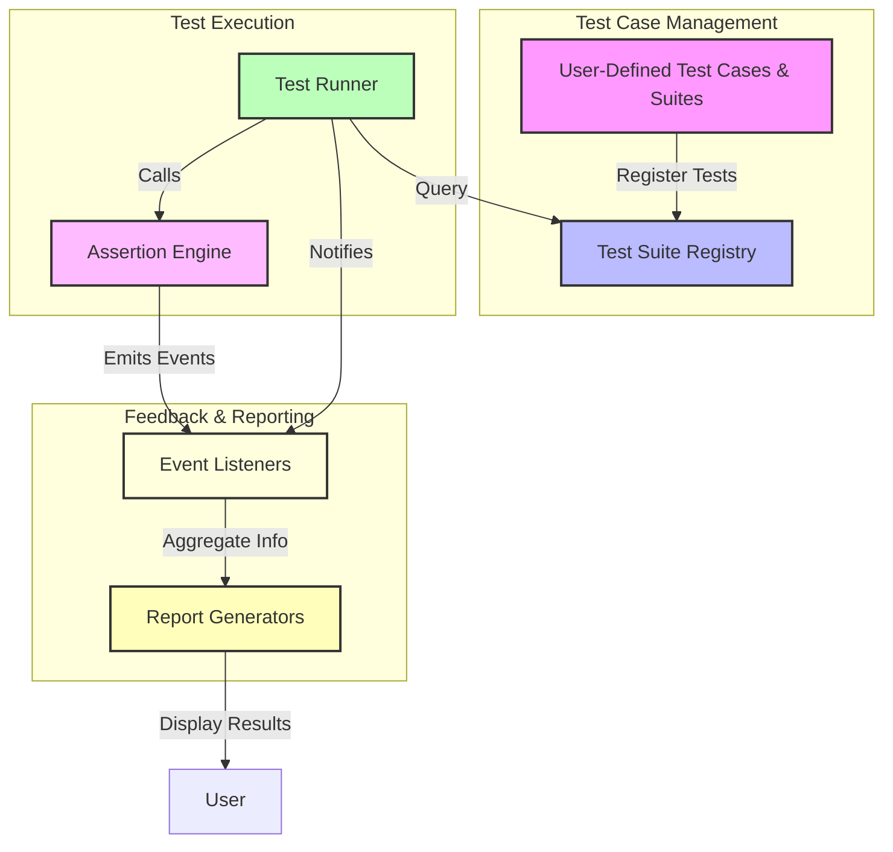

# System Architecture Overview

## High-Level View of GoogleTest Architecture

GoogleTest is architected to provide a robust, extensible framework for defining, executing, and reporting on C++ unit tests. This page offers a high-level perspective on how GoogleTest organizes and manages its core components to support the full testing workflow—from test definition through execution to assertion evaluation and final reporting.

### What You Will Learn Here

- The main building blocks of GoogleTest’s architecture
- How GoogleTest orchestrates key testing workflows
- The interaction and data flow among components
- Why the architecture enables portability and extensibility

---

## Understanding GoogleTest’s Core Architecture

At its core, GoogleTest is a modular system comprising several key components that collaborate to make test writing, running, and validation seamless and powerful.

### Core Purpose

GoogleTest’s architecture is designed to enable developers to write tests declaratively and run them efficiently, while receiving detailed feedback on test outcomes. It manages test registration, organizes test cases, evaluates assertions within tests, and handles result reporting.

### Main Components and Their Responsibilities

- **Test Case & Test Suite Registry:** Maintains and manages all defined tests, organizing them into suites.
- **Test Runner:** Executes tests in their registered order, controls setup and teardown routines.
- **Assertion Engine:** Supports a wide variety of assertions and verifies test correctness.
- **Event Listeners & Reporters:** Capture test progress and outcome information, enabling logging and user feedback.

This layered architecture lets users focus on writing tests without worrying about orchestration, while also providing extension points to customize behavior (e.g., listeners).

## Architectural Highlights

- **Portability:** Designed to work across diverse platforms and compilers.
- **Extensibility:** Users can add custom listeners, assertions, or test filters.
- **Separation of Concerns:** Each component focuses on a single responsibility for easy maintenance.

### Interaction Highlights

- Test definitions plug into the Test Suite Registry.
- When the test binary runs, the Test Runner queries the registry for all tests.
- For each test, the assertion engine evaluates conditions.
- Event listeners respond to lifecycle events raised by the runner.
- Results aggregate for reporting.

## Visualizing the GoogleTest System Architecture

Below is a Mermaid diagram that articulates the architecture and interaction flow between the components of GoogleTest.

## How This Architecture Supports Testing Workflows

1. **Defining Tests:** Users write test cases using macros that automatically register tests with the central registry.

2. **Running Tests:** When executed, the runner accesses the registry, loading all test suites and iterating through their tests in defined order.

3. **Evaluating Assertions:** Inside each test, assertions invoke the assertion engine to verify conditions and track pass/failure status.

4. **Reporting:** Throughout the run, event listeners monitor lifecycle events, delivering progress information. Aggregated results are forwarded to reporters for user-facing summaries.

5. **Extensibility:** Users can inject custom listeners or reporters to modify reporting behavior without changing core functionality.

## Practical Value for Users

This architecture ensures that GoogleTest:

- Easily integrates into C++ projects regardless of complexity.
- Allows rapid iteration with automated discovery and test invocation.
- Provides actionable, detailed feedback to troubleshoot failing tests.
- Supports customization to tailor testing experience to project needs.

## Tips for Working Within the Architecture

- Use GoogleTest macros for auto-registration to leverage the registry efficiently.
- Customize event listeners only if standard reporting does not meet your needs.
- Understand the role of the assertion engine to better write expressive, meaningful assertions.
- When extending, avoid modifying core components directly; prefer well-defined extension points.

## Summary

GoogleTest’s system architecture orchestrates its robust testing features through a clear set of interacting components. This design not only promotes ease of use but also offers flexibility and power to even complex testing scenarios.

---

For more detailed operational guidance, explore these documentation pages:

- [Writing Your First Test](https://google.github.io/googletest/quickstart.html)
- [Assertions in Practice](https://google.github.io/googletest/reference/assertions.html)
- [Using Mocks Effectively](https://google.github.io/googletest/gmock_for_dummies.html)

## Getting Started Preview

To experience how this architecture functions in practice, begin by writing your first test case and running it through the GoogleTest runner. You will witness the lifecycle from test registration through to final report generation.

Explore our quick start guides and tutorials located in the Getting Started section of this documentation.

---

_Source code and architectural details are publicly available at [GoogleTest GitHub repository](https://github.com/google/googletest).

<Check>
Remember: This overview focuses on the architecture and does not dive deeply into internal implementation details. For practical API usage, refer to the API Reference and Core Testing Workflows guides.
</Check>
