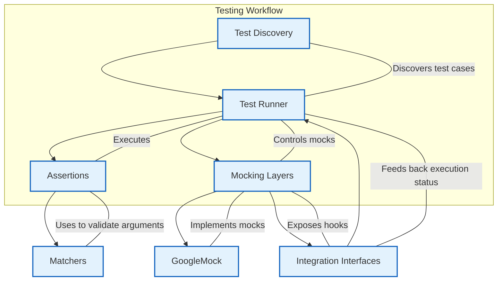

# System Architecture

The System Architecture page offers a clear visualization of the core architectural components that form the foundation of the GoogleTest framework’s testing workflow. This page is designed to orient newcomers by illustrating how the different modules interact, showing the flow from test discovery to execution while highlighting critical components such as assertions, matchers, mocking layers—including GoogleMock—and integration interfaces.

---

## Overview

GoogleTest operates as a robust C++ testing framework, integrating an intuitive test discovery mechanism with a test runner that executes suites and tests efficiently. Central to its power is the interplay of assertions for validating behaviors, matchers for argument checking, and mocking layers which enable fine-grained control over dependencies and collaboration between components.

This System Architecture page puts those elements together visually and contextually, so you can easily grasp how the modules cooperate to facilitate expressive, maintainable, and reliable tests.

---

## Visualizing the Architecture

Below is a Mermaid.js flowchart diagram that captures the primary components and their interactions during a testing session with GoogleTest and GoogleMock.

---

## Component Descriptions

### Test Discovery
Automatically locates and registers tests based on TEST and TEST_F macros in your codebase. It enables effortless scaling of your tests without manual bookkeeping.

### Test Runner
Coordinates the execution of discovered tests, manages test fixtures, and handles test lifecycle events. It invokes assertions and interacts with mocking layers to ensure test correctness.

### Assertions
Provide runtime checks that verify expected outcomes of tests. Assertions internally rely on matchers for flexible and expressive argument validation.

### Matchers
Matchers form a rich set of predicates used by assertions and mocks to specify argument expectations concisely. This makes checking function calls and return values expressive and precise.

### Mocking Layers
A modular framework integrated into the test runner, enabling the creation of mock objects that simulate dependencies and collaborators.

### GoogleMock
The concrete implementation of the mocking framework. It offers declarative syntax for mocks, supports rich matchers, and manages expectation verification automatically during testing.

### Integration Interfaces
Define extensibility points in the system that allow GoogleTest and GoogleMock to be embedded or interfaced with external tools, CI systems, and build frameworks.

---

## How It Works in Practice

1. **Test Discovery** scans all linked binaries and test suites, collecting all test cases.
2. The **Test Runner** initializes and schedules these test cases for execution.
3. As each test is executed, assertions use **Matchers** to validate output and input arguments.
4. When mocking is required, the **Mocking Layers** engage, utilizing GoogleMock’s capabilities to create mock objects and verify interactions.
5. **Integration Interfaces** provide hooks and callbacks to integrate with continuous integration pipelines, IDEs, or custom tooling.

This architecture separates concerns clearly, providing maintainability and flexibility, while reducing the friction of writing thorough C++ tests.

---

## Tips for New Users

- Start by focusing on the **Test Runner** and **Assertions** to write straightforward tests.
- Leverage the **Matchers** to write expressive expectations on function arguments.
- When dependencies or collaborators become complex, use **Mocking Layers** powered by GoogleMock to isolate the system under test.
- Understand the flow from **Test Discovery** through execution to see how your tests are organized and run.

---

## Troubleshooting Common Issues

- If tests are not running, verify that the **Test Discovery** module is able to find your test cases (check test registration macros).
- Unexpected assertion failures? Confirm your **Matchers** correctly express your expectations.
- Mock interactions fail unexpectedly? Review **GoogleMock** expectations and ensure order and cardinality of calls match test logic.

---

## Additional Resources

To deepen your understanding, explore:

- The [gMock Cookbook](https://google.github.io/googletest/gmock_cook_book.html) for practical mocking recipes.
- The [Mocking Reference](https://google.github.io/googletest/reference/mocking.html) for detailed API documentation.
- The [System Architecture Related Topics](https://github.com/google/googletest/tree/main/docs) for foundational concepts and integration patterns.

---

With this overview, you are now oriented on how GoogleTest’s main architectural components synchronize to deliver a cohesive and powerful testing environment.
