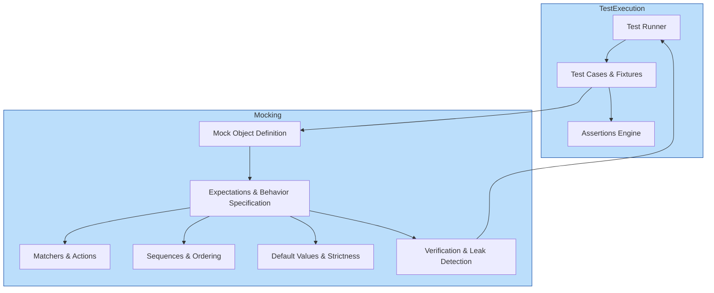

# System Architecture Overview

## Introduction

Understanding the architecture of GoogleTest and its mocking extension, GoogleMock (gMock), is pivotal for leveraging its full capabilities. This overview provides a high-level view of the primary components, their roles, and how they interact — equipping you with a mental map to navigate the framework confidently.

## Architectural Components

### 1. Core Testing Modules

- **Test Cases and Test Fixtures**: These organize individual tests and prepare/clean up shared resources.
- **Assertions Engine**: Validates conditions during test execution; failures produce detailed reports.
- **Test Runners**: Manage the execution flow of tests, handling setup, running, teardown, and reporting.

Together, these modules enable structured, independent, and informative testing workflows.

### 2. Mocking Infrastructure

GoogleMock is integrated tightly with GoogleTest, extending it to enable behavior verification through mock objects.

- **Mock Object Definition**: Using `MOCK_METHOD` macros, mock classes implement specified interfaces with mocked behaviors.
- **Expectations and Behavior Specification**: Via `EXPECT_CALL` and `ON_CALL`, you define how mocks should behave and what calls are expected.
- **Matchers & Actions**: Provide rich mechanisms to specify argument constraints and return or side-effect behavior from mock methods.

This infrastructure empowers developers to isolate units by replacing real dependencies with controllable, test-specific versions.

### 3. Supporting Utilities and Framework Features

- **Sequences and Ordering Constraints**: Control the order and partial order of calls for complex interaction scenarios.
- **Default Values and Strictness Policies**: Specify default method behaviors and control verbosity and error handling of unexpected or uninteresting calls.
- **Verification and Leak Detection**: Automatic checking ensures all expectations are met and detects leaked mocks that could invalidate test results.

## How Components Interact

### High-Level Flow

This diagram shows the testing lifecycle where the test runner triggers test case execution, which uses assertions and mock objects. Mock definitions carry expectations that interact with matchers, sequences, and policies. Verification is performed before the runner completes.

## Detailed Module Overview

### Test Runner
Handles test discovery, lifecycle orchestration, and final result aggregation — the control center of your testing process.

### Test Cases and Fixtures
Encapsulate units under test and shared setup/cleanup steps to ensure isolated and repeatable tests.

### Assertions Engine
Provides expressive verification, reporting failures with rich contextual information.

### Mock Object Definition
Enables defining mock classes using the `MOCK_METHOD` macros. It automates the creation of mock implementations aligned to interfaces or existing classes.

### Expectations and Behavior Specification
Users define what mock methods are expected to be called and how they behave via `EXPECT_CALL` (for setting expectations) and `ON_CALL` (for setting default behavior). This declarative style allows precise test intent expression.

### Matchers and Actions
Matchers specify argument validation rules (`Eq()`, `_,` `Ge()`, etc.), while actions govern return values or side effects (`Return()`, `SetArgPointee()`, `Invoke()`), enabling sophisticated control over mock behavior.

### Sequences and Ordering
Supports enforcing strict or partial order sequences of method calls, essential for complex interaction verification.

### Default Value and Strictness Policies
Control default return values and the treatment of uninteresting or unexpected calls, influencing test robustness and verbosity.

### Verification and Leak Detection
On destruction or explicit invocation, mocks verify if expectations are satisfied. The framework detects leaked mocks, warning of unverified expectations and potential test defects.

## Why This Architecture Matters

GoogleTest’s architecture separates concerns clearly: the core testing framework manages test execution and assertion handling, while GoogleMock seamlessly overlays behavior verification through mock objects. This design lets you:

- Write modular, maintainable tests.
- Precisely control and verify interactions.
- Diagnose failures with meaningful diagnostics.
- Safeguard against common pitfalls like expectation leaks.

Making the framework extensible with modular components like matchers, actions, and policies ensures it can adapt to diverse testing needs without sacrificing usability.

## Practical Considerations

- **Progressive Mastery**: Start writing simple tests using the runner and assertions, then incrementally incorporate mocks to isolate dependencies as needed.
- **Best Practices**: Separate building the test model (expectations) from execution, carefully ordering your expectations and understanding default behaviors.
- **Troubleshooting**: Watch for uninteresting calls or unexpected calls in test logs; use verbosity flags to gain insight into mock interaction and failures.

## Summary

This overview frames your journey through GoogleTest and GoogleMock by revealing the architectural pillars. With this understanding, you can navigate the detailed guides and API references with context and confidence, leveraging the full power of these frameworks for reliable, maintainable C++ testing.

---

<AccordionGroup title="Additional Resources">
<Accordion title="Explore the 'gMock for Dummies' Guide">
Dive deep into mocking concepts and practical examples that complement this architecture overview. Understand the why and how of mock objects.
</Accordion>
<Accordion title="Access the Mocking Reference">
Consult the detailed specification of macros, classes, and methods for creating and using mocks in GoogleMock.
</Accordion>
<Accordion title="Consult the gMock Cookbook">
Learn recipes and best practices, including mocking intricate scenarios, delegating to fake or real objects, and advanced action customization.
</Accordion>
</AccordionGroup>

<Note>
GoogleMock is fully integrated with GoogleTest, so understanding the architecture supports unlocking advantages from both libraries together. For practical usage, complement this conceptual framework with the Getting Started and Core Concepts pages.
</Note>
