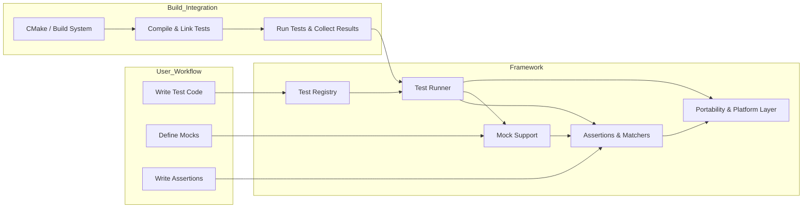

# System Architecture Overview

## Visualizing GoogleTest & GoogleMock Architecture

Understanding the architecture of GoogleTest and GoogleMock is crucial to unlocking their full potential for C++ testing. This overview guides you through the core components, layers of abstraction, and essential workflows—illuminating how test code flows from your source files down to the test runners, assertions, and mocks. Visual diagrams bridge the gap between daily user experience and the underlying structure that delivers robust and efficient test execution.

---

## Core Architecture and Components

At its heart, GoogleTest provides a comprehensive framework for writing and running C++ tests, complemented by GoogleMock’s powerful mocking support. The architecture is designed to balance flexibility, ease of use, and portability across platforms.

### Key Components

- **Test Code:** User-written tests using macros such as `TEST()`, `TEST_F()`, and `TEST_P()`. These are the entry points for your test logic.
- **Test Runners:** Framework components that discover, instantiate, and execute tests. They handle execution, setup, and teardown lifecycle stages.
- **Assertions Layer:** Implements expressive assertions (`EXPECT_*`, `ASSERT_*`) to verify conditions and report failures with detailed diagnostics.
- **Matchers:** Used chiefly by GoogleMock, matchers provide expressive predicates for function arguments during mocking.
- **Mocking Support (GoogleMock):** An extension layer enabling declarative creation of mock classes, setting expectations, and controlling function behaviors.
- **Portability & Platform Layer:** Abstracts platform-specific details to ensure seamless operation on Linux, Windows, Mac, and other supported OSes.

### How These Fit Together

The system architecture fosters a layered design:

```mermaid
graph TD

  UserTests[Test Code: User Test Functions]
  TestRegistry[Test Registry: Stores Test Suites & Tests]
  TestRunner[Test Runner: Manages Execution & Lifecycle]
  AssertionsLayer[Assertions & Verification Layer]
  MatcherLayer[Matcher Engine - Evaluates Matchers]
  MockSupport[Mocking Framework (GoogleMock)]
  PortabilityLayer[Platform Abstraction & Utilities]

  UserTests -->|Register Tests| TestRegistry
  TestRunner -->|Fetch & Run Tests| TestRegistry
  TestRunner -->|Invoke Assertions| AssertionsLayer
  MockSupport -->|Use Matchers| MatcherLayer
  UserTests -->|Use Mocks & Assertions| MockSupport
  TestRunner -->|Platform Services| PortabilityLayer
  AssertionsLayer -->|Platform Services| PortabilityLayer
  MockSupport -->|Platform Services| PortabilityLayer
```

This flow ensures a clear separation:

- Your test code is independently registered.
- The test runner orchestrates discovery and execution.
- Assertions verify expected outcomes during tests.
- GoogleMock provides a clean syntax and runtime backing to build test doubles.
- Platform details are encapsulated to maximize portability.

---

## Testing Workflow: From Writing to Execution

When you write tests using GoogleTest and GoogleMock, the journey your code travels looks like this:

1. **Test Definition:** Using `TEST()`, `TEST_F()`, or GoogleMock mock classes, you describe the intended test behavior.
2. **Test Discovery:** On startup, the framework scans for all registered tests and suites.
3. **Test Execution:** The runner enters a loop, instantiates fresh test fixtures, runs tests, evaluates assertions, and tracks results.
4. **Mock Interactions:** When mocks are involved, GoogleMock intercepts calls, invoking matchers and enforcing expectations.
5. **Reporting:** Outcome details including failures, stack traces, and logs are captured and output to console or files.

This workflow abstracts the complexity, allowing you to focus on writing quality tests.

---

## Build and Integration Layers

GoogleTest and GoogleMock integrate cleanly into your build setup:

- **CMake Integration:** Provides a ready-to-use build script for most platforms.
- **Shared vs Static Libraries:** Supports flexible linkage scenarios.
- **Threading Support:** Built-in threading support adapts to POSIX or Windows threading APIs depending on platform.

This layered approach ties runtime architecture to your build and deployment pipeline seamlessly.

---

## Practical Insights & Tips

- **Leverage Test Fixtures:** Use fixtures (`TEST_F`) to organize shared setup and teardown, increasing test clarity.
- **Understand Mocking Roles:** Use GoogleMock’s declarative syntax to isolate dependencies and assert interactions.
- **Watch Thread Safety Macros:** Be mindful of `GTEST_IS_THREADSAFE` macro for concurrency considerations.
- **Platform Awareness:** Consult platform portability layers when integrating into unusual or embedded environments.

---

## Summary Diagram With Build & Test Process Details



This reveals the cyclical relationship between build, test execution, and framework layers.

---

## Troubleshooting and Common Pitfalls

- **Test Discovery Failures:** Ensure tests are properly registered and linked.
- **Mock Expectation Errors:** Verify calls match expectations and argument matchers.
- **Thread Safety:** On platforms lacking pthreads, thread safety is limited.
- **Build Issues:** Check C++17 support and correct linkage flags for threading and mocking.

---

## Next Steps

- Explore the [Core Concepts & Key Terminology](../architecture-core-concepts/core-concepts-terminology) page for deeper understanding.
- Review the [Key Features at a Glance](../features-integration/feature-glance) to see how architecture translates to capabilities.
- Follow the [Getting Started Guides](../../getting-started) to set up your environment and write your first tests.

---

> This page provides a high-level architectural visualization aimed to bridge your everyday test writing with the internal workings of GoogleTest and GoogleMock.

---