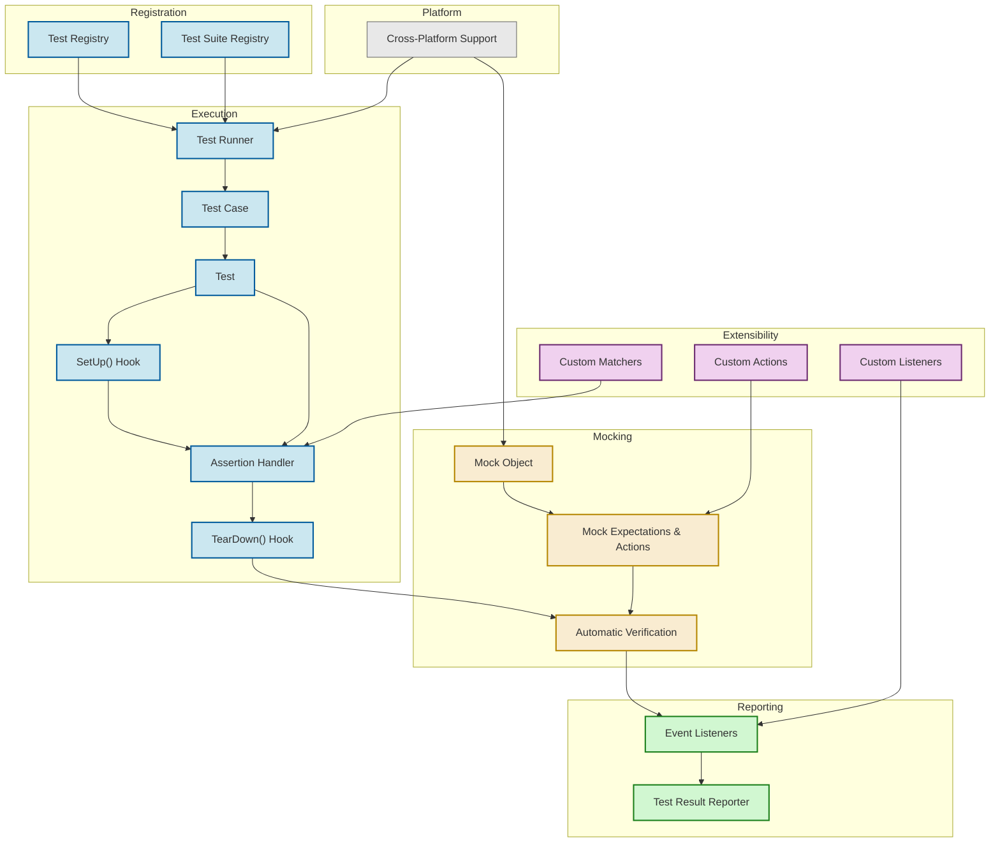

# GoogleTest Architecture Overview

## Bringing GoogleTest and GoogleMock to Life: A Visual Architecture Walkthrough

GoogleTest and GoogleMock together form a powerful, extensible, and reliable C++ testing framework trusted worldwide. This page presents a high-level architecture overview that maps out how the core components collaborate—from discovering tests, executing them, handling assertions, to seamlessly integrating mock objects. A detailed Mermaid diagram visually explains the flow and interaction between the major pieces, highlighting extensibility and cross-platform capabilities.

---

## Understanding the GoogleTest Architecture

At its core, GoogleTest is designed to let developers write and run tests effortlessly while providing clear, immediate feedback for C++ code correctness. GoogleMock extends this by enabling sophisticated mocking capabilities that facilitate interaction testing and dependency isolation.

This architecture overview answers: *How do tests get discovered, executed, and reported? How does the mocking framework plug in? Where can you extend or configure behaviors?*

By clarifying these relationships, users can better grasp how GoogleTest and GoogleMock work together under the hood, enabling confident adoption, debugging, and extension.

---

## Key Components and Interactions

### Test Discovery
- **Test Registries** manage the collection of tests and test cases. When your test binary runs, GoogleTest automatically registers all defined tests using static initialization.
- **Test Suite Registry** groups tests, allowing organized discovery and execution.

### Test Execution & Lifecycle
- The **Test Runner** serves as the central coordinator. It iterates through registered tests, orchestrates test setup, execution, and teardown.
- **Test Cases** contain multiple individual tests; each test's lifecycle hooks (`SetUp()`, `TearDown()`) help manage state.
- **Assertions Handler** records results during test execution, associating failures or successes with specific assertions.

### Mock Integration
- GoogleMock’s **Mock Objects** seamlessly interleave with the test execution, allowing you to define expectations on mock methods.
- **Mock Expectations and Actions** are verified automatically at the end of each test lifecycle.

### Result Reporting and Listeners
- **Event Listeners** capture lifecycle events—start, success, failure, test suite completion—and can be customized.
- The typical workflow outputs detailed reports, enhancing troubleshooting.

### Extensibility & Platform Support
- The architecture is designed to be modular: custom listeners, actions, and matchers plug in cleanly.
- Cross-platform support ensures consistent behavior on Linux, Windows, macOS, and embedded platforms.

---

## Architecture Diagram

---

## Why This Architecture Matters to You

Understanding this architecture helps you:

- **Write Better Tests:** You’ll see how lifecycle hooks organize test execution, helping you properly set up and tear down state.
- **Effectively Use Mocks:** Knowing when and how GoogleMock participates clarifies test flow and the verification process.
- **Customize & Extend:** Integrate your own listeners, actions, or matchers precisely where they fit.
- **Debug Faster:** With an overview of event propagation and assertion handling, diagnose test failures confidently.
- **Integrate Cross-Platform:** Leverage the framework’s built-in support to ensure your tests run consistently everywhere.

---

## Getting Started Preview

To start exploring the architecture further and dive into coding, see:

- [Core Concepts & Terminology](/overview/architecture-core-concepts/core-concepts-terminology) for definitions behind components.
- [Key Features at a Glance](/overview/architecture-core-concepts/feature-glance) to understand the functional pillars.
- [Getting Started: Write and Run Your First Test](/getting_started/initial_usage_and_validation/your_first_test) to experience the test lifecycle hands-on.

<Tip>
Plan your test design by understanding how test discovery, execution, and mocking flow together. This empowers you to write meaningful tests that interact predictably with the framework.
</Tip>

<Note>
The architecture diagram here is a conceptual overview and not an internal implementation map. Your focus should be on how to leverage these components effectively in your test suites.
</Note>

---

For a deeper dive on the GoogleMock internals, mocking best practices, and example usage, explore the [gMock Cookbook](https://google.github.io/googletest/gmock_cook_book.html) and [Mocking for Dummies](https://google.github.io/googletest/gmock_for_dummies.html).

