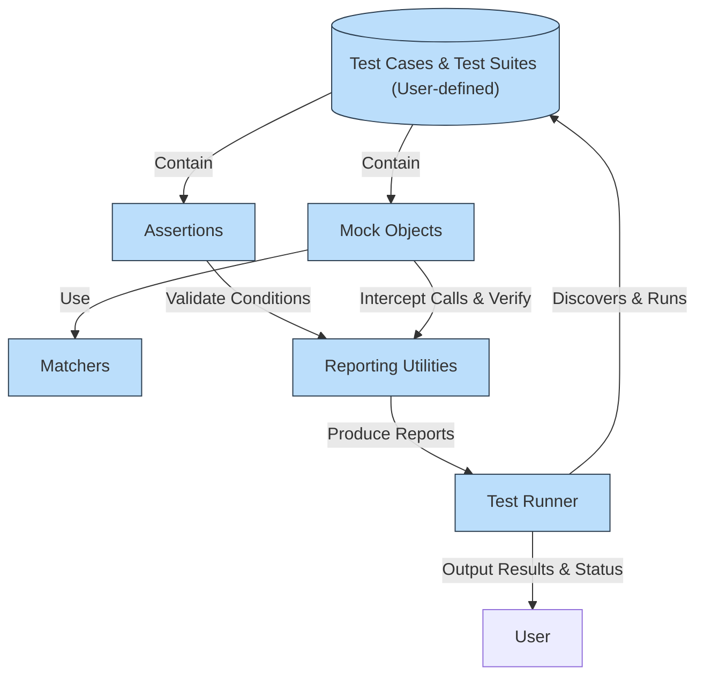

# System Architecture (with Diagram)

## Visualizing the High-Level Architecture

Understanding how GoogleTest and GoogleMock orchestrate their components will empower you to harness their full testing potential. This page presents a clear, high-level architecture diagram that maps out the core elements and their interactions, revealing how test cases, assertions, matchers, mock objects, runners, and reporting utilities seamlessly collaborate.

By focusing on the user’s perspective, this visualization clarifies what happens behind the scenes when you write and run tests, so you can better comprehend test flows and debug effectively.

---

## Architecture Overview: What You Will See Here

GoogleTest and GoogleMock form an integrated system designed to simplify and elevate C++ testing. The key constructs and their interactions covered in this architectural view include:

- **Test Cases**: The centerpiece of your testing efforts; collection of test functions organized as suites.
- **Assertions**: Statements within tests validating conditions, triggering detailed reports on failures.
- **Matchers**: Powerful predicates describing expected argument values for mock methods.
- **Mock Objects**: Simulated versions of real objects, enabling controlled behavior and interaction verification.
- **Test Runner**: The component responsible for discovering, registering, and running all tests automatically.
- **Reporting Utilities**: Subsystems that collect test results and render informative failure messages.

Each part is crucial to the smooth operation of your tests, together forming an ecosystem that emphasizes automation, flexibility, and precise reporting.

---

## Core Components and Their Collaboration

### 1. Test Cases and Test Runner

Test cases are authored by users to group logically related tests. These tests are automatically discovered and executed by the **Test Runner** without requiring manual registration—saving you setup time and avoiding human error.

### 2. Assertions

Within each test, assertions actively verify that your code behaves as expected. When an assertion fails, the reporting utilities create rich, contextual failure messages, showing you exactly what went wrong.

### 3. Matchers and Mock Objects

GoogleMock extends GoogleTest capabilities by introducing mocking:

- **Matchers** define conditions on the arguments that mock methods are expected to receive.
- **Mock Objects** replace real dependencies, allowing you to set expectations, control method behavior, and track the interactions precisely.

Together, they enable isolated testing of units by simulating dependencies.

### 4. Reporting Utilities

These utilities provide detailed feedback including:
- Failure descriptions,
- Mismatch explanations,
- Call order violations,
- And stack traces.

Such detailed output makes failures actionable and improves debugging speed.

---

## Visual Architecture Diagram

---

## How It Works in Practice: A User Story Flow

1. **Write your test case**, including assertions and optionally mock objects.
2. **Run tests** using the built-in Test Runner; it finds all tests automatically.
3. As tests execute, **assertions validate outputs** and **mock objects verify interactions**.
4. On failures, **rich reporting explains** what failed and why, including argument mismatches and call errors.
5. **Review feedback from Reporting Utilities** to quickly identify and fix issues.

This flow emphasizes minimal setup and maximum automated support.

---

## Practical Tips for Users

- Organize tests into meaningful suites to leverage automatic discovery.
- Use assertions liberally to check all critical behavior.
- Leverage GoogleMock when you need to isolate the unit under test from dependencies.
- Explore custom matchers to express argument expectations clearly.
- Always review failure reports—they provide detailed diagnostics including which expectations failed and why.

---

## Troubleshooting Common Architecture Questions

<AccordionGroup title="Common Questions about GoogleTest & GoogleMock Architecture">
<Accordion title="How does automatic test discovery work?">
GoogleTest’s Test Runner scans the test binaries and automatically registers all tests declared via its macros, eliminating manual steps and reducing errors.
</Accordion>
<Accordion title="What happens when an assertion fails?">
The Reporting Utilities capture the failure context, including the file, line number, and a detailed message explaining the assertion failure, helping you quickly pinpoint the cause.
</Accordion>
<Accordion title="How do mocks verify interactions?">
Mocks intercept calls to their methods and compare these with your expectations defined via matchers and call sequences. Verification happens automatically at test completion.
</Accordion>
<Accordion title="Can I customize how reporting looks?">
Yes, GoogleTest supports various output formats and extensions for reporting. You can format output to suit CI systems, IDEs, or custom workflows.
</Accordion>
</AccordionGroup>

---

## Where to Go Next

Now that you understand the architecture, explore these next steps:

- [GoogleTest Primer](/overview/introduction-product-value/what-is-googletest): Learn about writing and organizing tests.
- [GoogleMock Overview](/overview/introduction-product-value/googletest-and-googlemock): Dive into creating and using mock objects.
- [Writing and Running Tests](/guides/core-workflows/writing-tests): Detailed guide on test authoring.
- [Defining and Using Mock Objects](/guides/mocking-patterns/defining-and-using-mocks): Start integrating mocks effectively.

These will help you apply the architectural understanding to practical usage.

---

## References

- GitHub Repository: [https://github.com/google/googletest](https://github.com/google/googletest)
- GoogleTest Overview: [/overview/introduction-product-value/what-is-googletest](https://google.github.io/googletest/overview/introduction-product-value/what-is-googletest)
- GoogleMock Introduction: [/overview/introduction-product-value/googletest-and-googlemock](https://google.github.io/googletest/overview/introduction-product-value/googletest-and-googlemock)

---

Unlock the power of GoogleTest and GoogleMock by understanding how each piece fits together. This architectural insight lays the foundation for writing comprehensive, maintainable, and efficient tests.