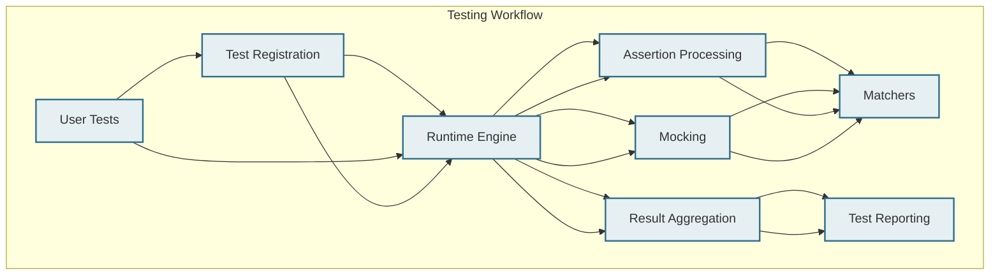

# Architecture Diagram

A comprehensive mermaid diagram visualizes the core system components involved in GoogleTest and GoogleMock's runtime workflows. This diagram elucidates how test registration, assertion processing, matchers, mocking, and result aggregation work together, showcasing the interaction between user tests, mocks, and assertions through the runtime. Understanding this visualization empowers new users to quickly grasp the system's workflow and identify key extension points.

---

## Why This Diagram Matters

Starting with an abstract concept of testing or mocking can feel daunting. This diagram fills that gap by providing a bird's-eye view of the system, making the relationships and flows intuitive. Whether you are a new user trying to understand how your test calls get processed or an advanced user wanting to extend or customize behaviors, this overview is your gateway.

## Main System Components & Workflow

Here’s a progressive introduction to each main part depicted in the diagram, aligned with your testing journey:

### 1. **Test Registration**
- **Purpose:** Collects and records all user-defined test cases before execution.
- **User Impact:** Defines where your tests fit into the overall test suite.
- **Example:** When you write `TEST()` macros in your code, they become registered here.

### 2. **Assertion Processing**
- **Purpose:** Handles execution of assertions made in tests, interpreting success or failure.
- **User Impact:** Provides immediate validation feedback on the correctness of your code.
- **Example:** Assertions like `EXPECT_EQ()` or `ASSERT_TRUE()` are processed in this stage.

### 3. **Matchers**
- **Purpose:** Evaluate whether actual values meet expected conditions during assertions or mocking.
- **User Impact:** Increase the expressiveness and precision of your test validations.
- **Example:** Using matchers such as `_` for wildcards or `Eq()`, `Ge()`, etc., to specify criteria for mock method calls or assertions.

### 4. **Mocking**
- **Purpose:** Implements stand-in objects that simulate real object behavior for isolated testing.
- **User Impact:** Enable testing of components in isolation by controlling dependencies’ behavior.
- **Example:** Defining mock classes with `MOCK_METHOD()` and setting expectations with `EXPECT_CALL()`.

### 5. **Result Aggregation**
- **Purpose:** Collects and consolidates test outcomes, determining overall success or failure.
- **User Impact:** Offers a clear summary of what passed and what failed to help diagnose issues efficiently.
- **Example:** Test runners compile results and report pass/fail statuses after running tests.

## How It All Flows Together

User code initiates test execution by running the registered tests. Assertions within these tests send evaluation requests that are matched against expected outcomes using matchers. Meanwhile, mocks intervene to simulate complex or external dependencies, validating that certain interactions occurred as expected. Finally, results from all assertions, mocks, and test executions are aggregated and reported.

This streamlined flow ensures that each test is accurately verified, with detailed diagnostics facilitating rapid debugging.

---

## Practical Tips

- **Follow the test registration hooks carefully:** Your test definitions must be correctly registered to appear in the suite.
- **Leverage matchers for more expressive validations:** Instead of rigid fixed values, use matchers to handle flexible argument checking.
- **Use mocks to isolate units under test:** Enable your tests to focus on the logic without external side effects.
- **Check the aggregated results for detailed failure insights:** Analyze which assertions or mock expectations failed to quickly locate issues.

<AccordionGroup title="Common Pitfalls and Troubleshooting">
<Accordion title="Tests Not Running or Being Registered">
Ensure your test functions are properly declared with the test macros like `TEST` or `TEST_F`. If tests do not appear in the aggregated results, double-check the test registration phase.
</Accordion>
<Accordion title="Unexpected Mock Behavior">
Verify that mock objects are set up correctly with `EXPECT_CALL` preceding any calls. Review matcher usage to avoid overly strict or overly loose expectations that can cause failures or false positives.
</Accordion>
<Accordion title="Assertions Not Firing as Expected">
Make sure assertions are placed where the tested conditions change state, and matchers precisely describe the target expectations.
</Accordion>
</AccordionGroup>

---

## Getting Started Preview

To begin exploring this architecture practically:

- **Register and write your first test cases:** See the [Getting Started / Creating Your First Test](/getting-started/first-steps/create-first-test) guide.
- **Master assertion and mocking basics:** Visit the [GoogleTest Primer](/primer.html) and [gMock for Dummies](/gmock_for_dummies.html).
- **Leverage this diagram as a reference:** Use it as a mental map to understand what happens under the hood as you run your tests.

You are encouraged to complement this visualization with the detailed [System Architecture Overview](/overview/architecture-core-concepts/system-architecture) to deepen understanding.

---

## Mermaid Diagram Representation

---

This diagram offers a clear, approachable view of the testing system for users at all levels. Use this as your orientation guide to navigate deeper documentation and practical usage scenarios.
