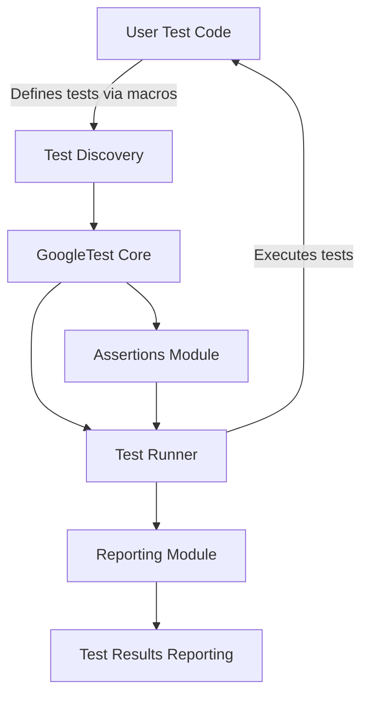

# How GoogleTest Works (Architecture)

## Visual Overview of GoogleTest Architecture

Understanding how GoogleTest operates under the hood significantly enhances your ability to write effective and maintainable tests. This page provides a clear and concise visual representation of GoogleTest's architecture and data flow, helping you see how your test code interacts with the GoogleTest core, and how discovery, assertions, and reporting work together seamlessly to validate your C++ code.

---

## The Big Picture: What Happens When You Run Tests with GoogleTest?

GoogleTest is designed to simplify your testing process by automating key steps. Here's the typical workflow from a user perspective:

1. **Write Your Test Code:** You write test cases using GoogleTest macros, focusing on what functionality to verify, not how to register or manage tests.
2. **Test Discovery:** GoogleTest automatically discovers these test cases at runtime — no manual registration needed.
3. **Test Execution:** The framework runs all discovered tests, applying your assertions to check correctness.
4. **Assertions & Verification:** When you use assertions (e.g., `EXPECT_EQ`), GoogleTest verifies expected outcomes and logs success or failure accordingly.
5. **Reporting Results:** After running the tests, GoogleTest generates detailed reports with summaries and failure descriptions.

## Core Components and Their Relationships

To visualize the architecture, consider the following major components:

- **User Test Code:** Your C++ source files using GoogleTest macros to define tests.
- **GoogleTest Core:** The engine that discovers, executes, and reports on tests.
- **Test Discovery Module:** Identifies registered tests by scanning your test definitions.
- **Assertions Module:** Evaluates the various assertions you include in tests.
- **Test Runner:** Orchestrates the test execution lifecycle.
- **Reporting Module:** Collects and formats test outcomes for presentation.

This flow minimizes your maintenance overhead while maximizing clarity and control over the testing process.

---

## GoogleTest Architecture Diagram

This simplified flowchart captures the essence: your test definitions feed into GoogleTest’s discovery mechanism, which is managed by the core engine. Assertions within tests are evaluated, the test runner controls execution, and finally, results are reported back to you.

---

## What Makes This Architecture Valuable?

- **Automatic Test Discovery:** Write tests freely without worrying about manual registration.
- **Rich Assertion Support:** Various assertion macros provide flexible and expressive checks.
- **Unified Test Lifecycle Management:** The test runner handles ordering, setup, teardown, and execution flow.
- **Clear Feedback & Reporting:** Detailed reports pinpoint exact assertion failures with contextual information.

With no extra effort, you get a full testing framework that respects your focus on test logic rather than plumbing.

---

## Real-World Scenario: Running Your Test Suite

Imagine you have a set of unit tests verifying several components of your system. When you build and run your test executable:

- GoogleTest locates all your tests through the **Test Discovery** mechanism.
- The **Test Runner** initializes, optionally handling test fixtures.
- Your assertions inside each test run, and the **Assertions Module** captures their outcomes.
- The **Reporting Module** summarizes all results and outputs to your console or log.

This architecture supports running individual tests, suites, or the entire test set with minimal setup.

---

## Practical Tips & Best Practices

- **Understand Test Lifecycle:** Knowing how tests are discovered and executed helps in designing robust fixtures and avoiding side effects.
- **Write Clear Assertions:** GoogleTest's rich assertion support lets you write precise checks, so leverage them to improve test clarity.
- **Use Reporting Effectively:** Review the detailed output to quickly identify failures and maintain test quality.
- **Avoid Manual Test Registration:** Trust GoogleTest’s discovery mechanism; manual registration is error-prone and unnecessary.

## Getting Started with Architecture in Mind

Understanding architecture gives you context before diving into writing your first test. To quickly begin:

1. Explore the [GoogleTest Primer](https://google.github.io/googletest/primer.html) for step-by-step guides.
2. Review the [Writing Your First Test](../../getting-started/first-test-experience/write-first-test) page to apply concepts practically.
3. Check [Core Concepts & Terminology](../core-concepts-terminology) for deeper understanding.

---

## Troubleshooting Common Issues

- **Tests Not Discovered:** Ensure your test code uses the `TEST()` or `TEST_F()` macros correctly.
- **Assertions Not Being Evaluated:** Verify that your test executable links against GoogleTest properly.
- **Unexpected Test Failures:** Use detailed reporting to locate exact assertion failures and check test preconditions.

---

By understanding how GoogleTest works internally, you become empowered to write better tests and troubleshoot effectively. This architecture overview shines a light on the unseen mechanics that make daily testing simpler and more reliable.