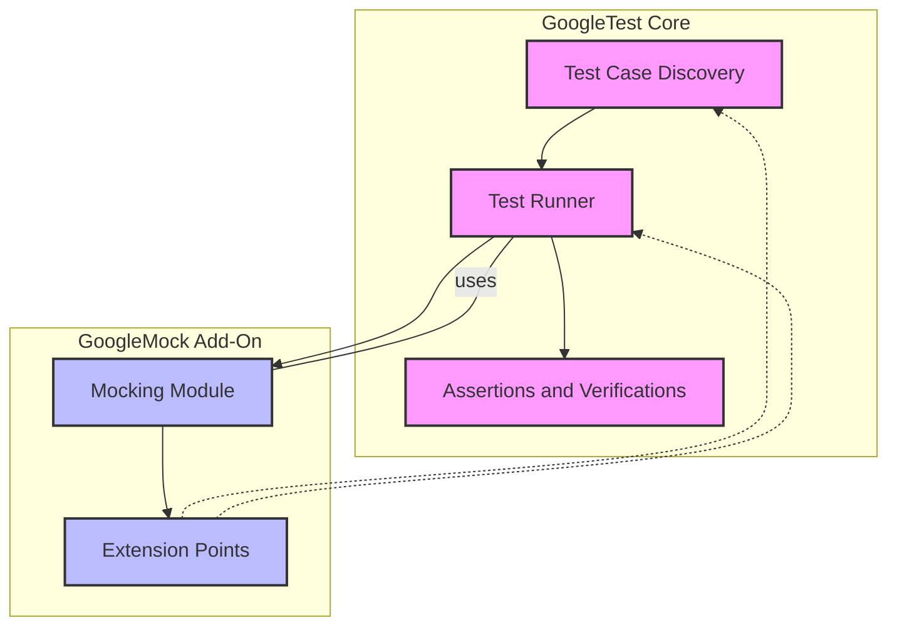

# System Architecture

## Overview

The System Architecture page presents a clear, high-level view of the core components that make up the GoogleTest and GoogleMock frameworks. It outlines the key modules responsible for test automation and mocking capabilities, illustrating how these modules interact to enable efficient and extensible testing workflows.

This page is tailored for developers and teams looking to grasp the structural foundation of GoogleTest and GoogleMock, offering a roadmap that clarifies the boundaries and integration points of each major part. Understanding this architecture helps users appreciate the modular design and how the components work together to deliver robust testing and mocking capabilities.

---

## High-Level Architecture

At the heart of the architecture are several fundamental modules:

- **Test Case Discovery and Registration**: Automatically discovers and organizes test cases written using the GoogleTest framework.
- **Assertions and Verifications**: Executes assertions to verify expected behaviors and outcomes within tests.
- **Test Runners**: Orchestrate the execution of registered tests, managing setup, teardown, and reporting.
- **Mocking Module**: Built on GoogleMock, adds advanced mocking capabilities for creating mock objects, setting expectations, and validating interactions.
- **Extension Points**: Provide hooks that allow users to customize or extend the framework’s behaviors without modifying core code.

The system distinctly separates the core test framework (GoogleTest) from the mocking add-on (GoogleMock), which is architected as a complementary yet independently usable module. This separation ensures flexibility and clear ownership of responsibilities within the testing infrastructure.

### Architectural Diagram

This diagram highlights the boundaries and interactions between the GoogleTest core framework and the GoogleMock mocking add-on.

---

## Module Descriptions

### Test Case Discovery

This module automatically discovers all the tests written following GoogleTest conventions. It scans the registered test cases and test fixtures, organizing them for execution. Users benefit from seamless test registration and organization without manual intervention.

### Assertions and Verification

Assertions form the backbone of test validation. This module executes the assertion macros and verifies that expected conditions are met during test execution. It reports detailed information on failures, helping developers locate issues quickly.

### Test Runner

The test runner coordinates the lifecycle of each test run, including setup, execution, teardown, and reporting. It ensures tests run in isolation with proper management of resources. The runner integrates with the mocking module to handle mock lifecycles and expectation verification.

### Mocking Module (GoogleMock)

GoogleMock extends GoogleTest by enabling users to define mock classes with ease and specify complex behaviors and expectations. It supports:

- Defining mock methods via macros
- Specifying expected calls, argument matchers, and return behaviors
- Verifying that interactions conform to expectations
- Using strict, naggy, or nice mock behaviors to control test strictness

This module is designed as an add-on, depending on but remaining distinct from the core test framework.

### Extension Points

Designed for adaptability, extension points enable users to customize behaviors such as test filtering, output formatting, and mocking strategies. This makes GoogleTest and GoogleMock flexible enough for a wide range of projects and testing styles.

---

## Integration Between GoogleTest and GoogleMock

While GoogleTest handles organizing and executing tests, GoogleMock hooks into GoogleTest's lifecycle:

- Mock expectations are established before tests run.
- During test execution, calls to mock objects are validated against those expectations.
- On test completion, the mocking module automatically verifies that all expectations were satisfied.

This integration allows users to write tests that combine classic assertions with sophisticated interaction verification without additional boilerplate.

---

## Why This Architecture Matters

- **Clarity and Modularity:** Clear separation between the test framework and mocking enables focused development and maintenance.
- **Flexible Usage:** Users can use GoogleTest independently or enhance their tests incrementally by adding GoogleMock.
- **Extensibility:** Extension points empower teams to tailor the framework, integrating with custom workflows or tools.
- **Robust Interaction Verification:** The mocking add-on’s tight integration ensures accurate verification of expected interactions in tests, increasing test reliability.

---

## Getting Started

Once familiar with this architecture, users should proceed to:

1. **Explore the Core Concepts & Terminology** page to understand essential definitions.
2. **Read the gMock for Dummies guide** to learn mock class creation and usage patterns.
3. **Dive into the gMock Cheat Sheet and Cookbook** for detailed usage examples and recipes.

Understanding the architecture provides users the confidence to leverage GoogleTest and GoogleMock efficiently, aligning test design with framework capabilities.

---

## Additional Resources

- [GoogleTest User's Guide](../index.md)
- [gMock for Dummies](../gmock_for_dummies.md)
- [gMock Cheat Sheet](../gmock_cheat_sheet.md)
- [gMock Cookbook](../gmock_cook_book.md)
- [Mocking Reference Documentation](../reference/mocking.md)

---

## Source Code

You can explore the source and further implementation details here:

<Source url="https://github.com/google/googletest" paths={[{"path": "googlemock/src/gmock_main.cc", "range": "1-60"}]} />

