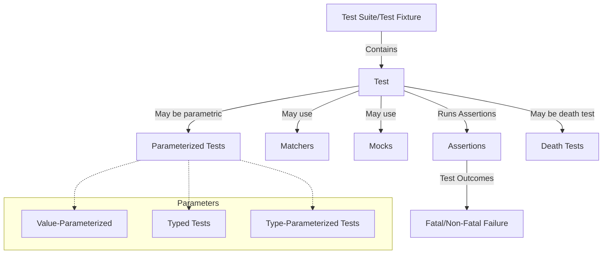

# Core Concepts & Terminology

Welcome to your foundational guide for GoogleTest. This page introduces you to essential concepts and terms like test fixtures, test suites, assertions, matchers, mocks, death tests, parameterized and typed tests, and the difference between fatal and non-fatal test failures. By mastering these ideas, you'll confidently harness GoogleTest's powerful capabilities to write clear, maintainable, and effective C++ tests.

---

## Understanding GoogleTest’s Core Concepts

### Test Suites and Tests

- **Test Suite**: A collection of related tests grouped logically, usually reflecting the structure or functionality of the code under test. GoogleTest uses the term "Test Suite" (previously "Test Case") to describe this grouping.
- **Test**: An individual test checks a particular behavior or scenario, composed of executable code plus assertions.

### Test Fixtures

Test fixtures allow you to reuse and share the same data setup among multiple tests within the same test suite. Rather than repeating the same initialization code, you define a fixture class derived from `testing::Test`.

**Example: Using a Test Fixture**

```cpp
class QueueTest : public testing::Test {
 protected:
  QueueTest() {
    // Initialize queues
    q0_ = Queue<int>();
    q1_.Enqueue(1);
    q2_.Enqueue(2);
    q2_.Enqueue(3);
  }

  Queue<int> q0_, q1_, q2_;
};

TEST_F(QueueTest, IsEmptyInitially) {
  EXPECT_EQ(q0_.size(), 0);
}

TEST_F(QueueTest, DequeueWorks) {
  EXPECT_EQ(q1_.Dequeue(), 1);
  EXPECT_EQ(q1_.size(), 0);
}
```

Here, `TEST_F` means "test with the fixture." GoogleTest creates a fresh fixture object for each test to guarantee test independence.

### Assertions: Verifying Expected Behavior

Assertions are the building blocks of tests, verifying that the tested code behaves as expected.

- **Fatal Assertions (`ASSERT_*`)**: Failures cause the test function to abort immediately.
- **Non-Fatal Assertions (`EXPECT_*`)**: Failures are reported but the test continues.

Both support expressions checking equality, inequality, exceptions, string contents, floating-point comparisons, and more.

You can also add custom failure messages for clarity:

```cpp
ASSERT_EQ(x.size(), y.size()) << "Vectors x and y have unequal length";
```

### Matchers

Matchers enable expressive, readable assertions, especially useful with `EXPECT_THAT`.

Example:

```cpp
EXPECT_THAT(my_string, StartsWith("Hello"));
EXPECT_THAT(error_msg, MatchesRegex("Error code: \d+"));
```

### Mocks and Test Doubles

GoogleTest integrates closely with GoogleMock to provide mocking capabilities, enabling you to enforce interfaces and verify interactions between units.

Learn more in [Getting Started with Mock Objects](https://google.github.io/googletest/gmock_for_dummies.html) and the related documentation.

### Death Tests

Death tests verify that your program correctly terminates under error conditions, such as failed assertions or fatal errors.

- Use `EXPECT_DEATH` or `ASSERT_DEATH` macros to write these tests.
- You can specify output patterns to match typical error messages.

Example:

```cpp
TEST(MyDeathTest, DiesOnInvalidInput) {
  ASSERT_DEATH({
    MyFunction(nullptr);
  }, "Invalid input provided");
}
```

### Parameterized Tests

Running the same test logic with different input values is straightforward using parameterized tests.

- **Value-Parameterized Tests**: Run tests with different data values.
- **Typed Tests**: Run tests across multiple types.
- **Type-Parameterized Tests**: Like typed tests but allow separate instantiation.

**How to write a value-parameterized test:**

1. Define a fixture derived from `testing::TestWithParam<T>`.
2. Write tests using `TEST_P` and access the parameter with `GetParam()`.
3. Instantiate the test suite with `INSTANTIATE_TEST_SUITE_P`.

Example:

```cpp
class FooTest : public testing::TestWithParam<int> {};

TEST_P(FooTest, WorksWithParameters) {
  EXPECT_GT(GetParam(), 0);
}

INSTANTIATE_TEST_SUITE_P(MyGroup, FooTest, testing::Values(1, 2, 3));
```

### Fatal vs. Non-Fatal Failures

- **Fatal Failure**: Aborts the current test immediately (`ASSERT_*` macros).
- **Non-Fatal Failure**: Logs the failure but continues (`EXPECT_*` macros).

Use fatal failures when continuing the test doesn’t make sense (e.g., when further assertions would cause invalid operations).

---

## How These Concepts Work Together

1. **Organize your tests in suites and fixtures:** Fixtures create a reusable data context.
2. **Write clear assertions:** Distinguish between fatal and non-fatal based on whether it makes sense to proceed after failure.
3. **Use parameterized tests:** Reduce duplication and expand your coverage with varying inputs and types.
4. **Employ mocks where needed:** Control and verify external object interactions.
5. **Include death tests:** Ensure your program handles fatal conditions properly.

By mastering these concepts, your tests will be well-structured, maintainable, and expressive.

---

## Practical Tips & Common Pitfalls

- Always use `TEST_F` when you need fixture state; use `TEST` for simple independent tests.
- Prefer `EXPECT_*` when you want to gather multiple failures in a test; use `ASSERT_*` when failures make subsequent code unsafe.
- Define `SetUp()` and `TearDown()` carefully in your fixtures to manage resource lifecycles.
- Beware of calling `GetParam()` outside of `TEST_P` test bodies — it will fail.
- When writing death tests, ensure the tested code truly aborts or exits.
- Use matchers to make complex assertions more readable and meaningful.
- For parameterized tests, instantiate your tests with generators like `Values()`, `Range()`, or `Combine()` to cover comprehensive scenarios.
- When handling failures, use `SCOPED_TRACE()` to add context and improve debugging.

---

## Summary Diagram: GoogleTest Core Concept Relationships



---

## Getting Started

To start with these core concepts:

- Explore the [GoogleTest Primer](https://google.github.io/googletest/primer.html) to get hands-on with simple tests.
- Practice writing your own test suites with fixtures and assertions.
- Gradually introduce parameterized tests and mocks as needed.
- Understand the failure modes by writing and debugging death tests.

Each step strengthens your grasp on writing robust and maintainable tests using GoogleTest.

---

For in-depth examples showing the use of these concepts, visit the [Googletest Samples](https://github.com/google/googletest/blob/main/googletest/samples) directory.


---

[Learn More about Assertions](../reference/assertions.md) | [Value-Parameterized Tests Guide](../advanced.md#value-parameterized-tests) | [Death Tests Guide](../advanced.md#death-tests)

---

_This documentation is part of the [GoogleTest Overview](https://google.github.io/googletest/overview/architecture-core-concepts/core-concepts-terminology.html)_

---

*For detailed API references and usage, see the* [GoogleTest API Reference](../reference/testing.md).


---

**Note:** The terms “Test Suite” and “Test Case” in GoogleTest have evolved. Please align with the current terminology where "Test Suite" is preferred for grouping tests, as detailed in the GoogleTest Primer.


<Info>
Full product documentation can be navigated using the sidebar listing core concepts, guides, API references, and FAQs.
</Info>
