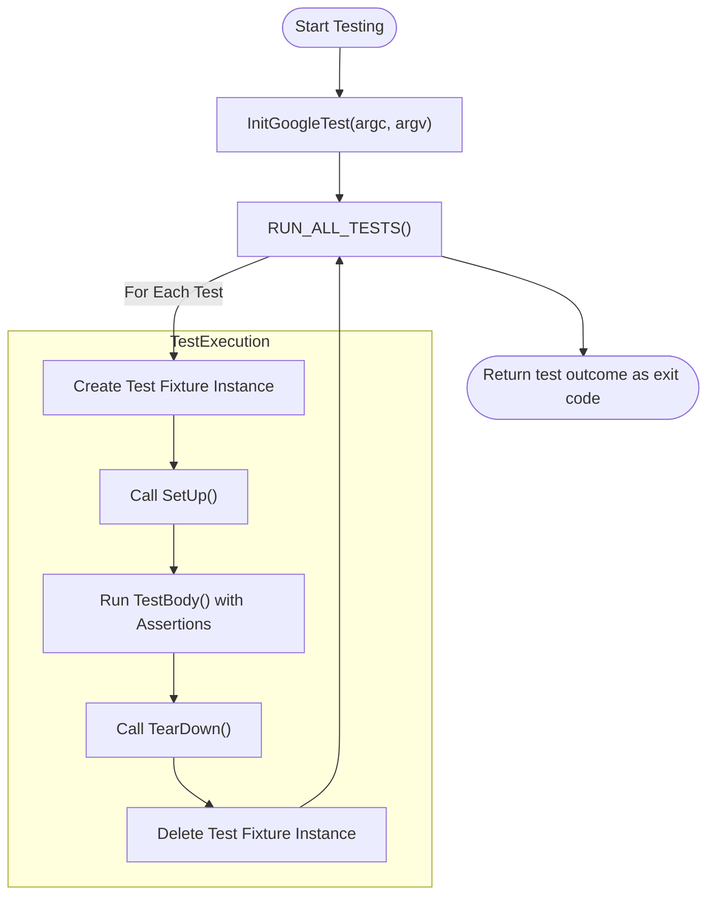

# Core Concepts & Terminology

## Introduction

Understanding the foundational vocabulary and concepts is essential to using GoogleTest effectively. This section introduces key ideas such as **assertions**, **test fixtures**, **test suites**, **parameterized tests**, and **mocks** — all critical building blocks for writing robust, maintainable C++ tests.

Whether you are new to testing frameworks or coming from other xUnit variants, mastering these core concepts will empower you to harness GoogleTest's full power.

## Assertions: Verifying Expectations

At the heart of any test lies an *assertion* — a statement that checks if a certain condition holds true during program execution. GoogleTest assertions come in two primary forms:

- **`EXPECT_*` assertions** generate *nonfatal failures* when expectations are not met. The test continues running, allowing multiple failures to be reported in a single run.
- **`ASSERT_*` assertions** produce *fatal failures*, immediately aborting the current function to prevent further execution when continuing would be nonsensical or dangerous.

For example:

```cpp
EXPECT_EQ(computed_value, expected_value) << "Values should be equal";
ASSERT_TRUE(condition) << "Condition must be true to proceed";
```

Each assertion reports failure location, meaning that failed assertions are instrumental in quickly finding bugs. They also support streaming in custom messages to clarify the failure context.

### Types of Assertions

GoogleTest offers a rich library of assertions beyond simple equality, including:

- Boolean checks (`EXPECT_TRUE`, `EXPECT_FALSE`)
- Binary comparisons (`EXPECT_EQ`, `EXPECT_NE`, `EXPECT_LT`, etc.)
- String comparisons (`EXPECT_STREQ`, `EXPECT_STRNE`, ignoring case variants)
- Floating-point comparisons with tolerance (`EXPECT_FLOAT_EQ`, `EXPECT_DOUBLE_EQ`, `EXPECT_NEAR`)
- Exception testing (`EXPECT_THROW`, `EXPECT_NO_THROW`, `EXPECT_ANY_THROW`)
- Predicate assertions for complex user-defined conditions

See [Assertions Reference](../reference/assertions.md) for a comprehensive list.

## Tests and Test Suites: Organizing Checks

A *test* is a single function that contains one or more assertions checking a specific behavior or property of the code under test. Multiple related tests are grouped into a *test suite*. Test suites reflect the logical structure of the code being tested.

Naming conventions for test suites and tests follow C++ identifier rules, with the recommendation to avoid underscores (`_`) to prevent internal naming conflicts (see [FAQ](../faq.md#why-should-test-suite-names-and-test-names-not-contain-underscore)).

GoogleTest distinguishes two main styles for writing tests:

- **Simple Tests** defined with the `TEST(TestSuiteName, TestName)` macro.
- **Fixture-Based Tests** defined with `TEST_F(TestFixtureName, TestName)`, where the test belongs to a test fixture class providing shared setup and teardown.

### Test Fixtures: Reusing Setup and Teardown

When multiple tests require the same configuration or shared resources, a *test fixture* class groups these common elements, avoiding duplication and improving maintainability.

To create a fixture:

1. Derive a class from `testing::Test`.
2. Declare reusable data members.
3. Override `SetUp()` and `TearDown()` methods to prepare and clean up state before and after each test.

Example:

```cpp
class QueueTest : public testing::Test {
 protected:
  QueueTest() {
    // Set up different queues
    q0_.Clear();
    q1_.Enqueue(1);
    q2_.Enqueue(2);
    q2_.Enqueue(3);
  }

  Queue<int> q0_;
  Queue<int> q1_;
  Queue<int> q2_;
};

TEST_F(QueueTest, IsEmptyInitially) {
  EXPECT_EQ(q0_.size(), 0);
}

TEST_F(QueueTest, DequeueWorks) {
  int* n = q0_.Dequeue();
  EXPECT_EQ(n, nullptr);

  n = q1_.Dequeue();
  ASSERT_NE(n, nullptr);
  EXPECT_EQ(*n, 1);
  EXPECT_EQ(q1_.size(), 0);
  delete n;

  n = q2_.Dequeue();
  ASSERT_NE(n, nullptr);
  EXPECT_EQ(*n, 2);
  EXPECT_EQ(q2_.size(), 1);
  delete n;
}
```

Each `TEST_F` test runs with a fresh instance of the fixture, ensuring independence between tests.

## Parameterized Tests: Testing Variations Effectively

GoogleTest supports *parameterized tests* that enable running the same test logic multiple times with different input values, greatly reducing code duplication and improving coverage.

### Value-Parameterized Tests

- Define a test fixture inheriting from `testing::TestWithParam<T>`, where `T` is the parameter type.
- Use `TEST_P` instead of `TEST_F` to declare tests that access their parameters via `GetParam()`.
- Instantiate the tests with various parameters via `INSTANTIATE_TEST_SUITE_P` and a parameter generator (e.g., `Values`, `Range`, `Combine`).

Example:

```cpp
class MyTest : public testing::TestWithParam<int> {};

TEST_P(MyTest, IsEven) {
  int n = GetParam();
  EXPECT_EQ(n % 2, 0);
}

INSTANTIATE_TEST_SUITE_P(EvenNumbers, MyTest, testing::Values(2, 4, 6, 8));
```

### Typed Tests and Type-Parameterized Tests

- Typed tests allow writing test logic once templated on a type, and instantiating for a fixed list of types using `TYPED_TEST_SUITE`.
- Type-parameterized tests are similar but allow deferred instantiation and multiple instantiations via registering and instantiating with macros like `REGISTER_TYPED_TEST_SUITE_P` and `INSTANTIATE_TYPED_TEST_SUITE_P`.

These features help verify generic code correctness across types.

## Matchers: Expressive Assertions

GoogleTest integrates with Google's Mock framework's *matchers* to enable expressive, readable assertions. Matchers simplify complex comparisons and improve failure messages.

Example using matchers:

```cpp
EXPECT_THAT(my_string, ::testing::StartsWith("Hello"));
EXPECT_THAT(numbers, ::testing::ElementsAre(1, 2, 3));
```

Matchers can be combined and customized.

See the detailed explanations in the [Assertions Reference](../reference/assertions.md#EXPECT_THAT).

## Death Tests: Testing Crashes and Program Termination

Death tests verify that certain operations cause program termination under expected conditions, for example, checking assertions or error handling that must abort execution.

GoogleTest provides macros like `EXPECT_DEATH`, `ASSERT_DEATH`, and `EXPECT_EXIT` that run the code under test in a separate process and verify termination behavior and output.

Use death tests carefully, understanding they run in isolated subprocesses and that side effects do not propagate back.

## Mocks: Simulating Interfaces (Introductory)

While this page focuses more on core concepts and terminology, GoogleMock extends GoogleTest by supporting *mock objects*—simulated versions of classes or interfaces used to test interactions and side effects.

Mocks enable you to specify expected function calls, return values, and sequences, easing testing of components with dependencies.

For comprehensive information on mocks, see the [Creating and Using Mock Classes](../api-reference/gmock-api-core/creating-and-using-mocks) documentation.

## Test Program Execution Flow

1. Define tests using `TEST`, `TEST_F`, `TEST_P`, or typed test macros.
2. Optionally implement test fixtures with setup/teardown logic.
3. Initialize GoogleTest in `main()` using `testing::InitGoogleTest(&argc, argv);`.
4. Run all tests by returning `RUN_ALL_TESTS();` from `main()`.

GoogleTest handles test registration automatically, test discovery, running tests independently, reporting detailed results, and proper teardown.

## Summary Diagram



## Practical Tips and Best Practices

- **Name your test suites and tests carefully** to avoid underscores and naming collisions.
- **Group related tests into test suites that mirror code structure** for easier navigation and maintenance.
- **Use test fixtures to share common setup and teardown**, preventing redundancy and ensuring clean, independent tests.
- **Prefer `EXPECT_*` assertions when multiple checks per test are desired**, but use `ASSERT_*` when failure should abort.
- **Leverage parameterized tests to reduce code duplication and increase coverage**.
- **Avoid side effects in tests that might interfere with others — tests run independently with isolated fixture instances.**
- **Use death tests only for code that must terminate under specific failure conditions.**
- **Remember to return the value from `RUN_ALL_TESTS()` in your `main()` function.**

## Troubleshooting Common Issues

- Misspelling `SetUp()` or `TearDown()` as `Setup()` will cause GoogleTest not to call these functions.
- Defining multiple tests with the same test suite name but using different fixtures causes runtime errors.
- Using `ASSERT_*` in non-void-returning functions or constructors/destructors is not allowed.
- Death tests may fail or hang if multi-threading interactions exist outside the death test statement.

Refer to the [FAQ](../faq.md) and [Troubleshooting](../getting-started/troubleshooting-support/common-issues-and-fixes) documentation for detailed help.

## Conclusion

Grasping these core concepts and terminology lays the foundation for effective testing with GoogleTest. With strong understanding of assertions, fixtures, parameterization, and test execution flow, users can write concise, informative, and maintainable tests.

Explore further to get hands-on with writing tests, advanced assertions, and integration into your build and CI systems.

---

## References and Further Reading

- [GoogleTest Primer](primer.md): A practical introduction to writing tests
- [Assertions Reference](reference/assertions.md): Detailed coverage of assertion macros
- [Advanced GoogleTest Topics](advanced.md): More complex testing scenarios and features
- [Testing Reference](reference/testing.md): API-level details on test macros and classes
- [FAQ](faq.md): Common questions and pitfalls answered
- [GoogleTest Samples](docs/samples.md): Real-world examples of GoogleTest usage

---

For overarching navigation, see the [Navigation Map](../README.md#documentation-navigation).

