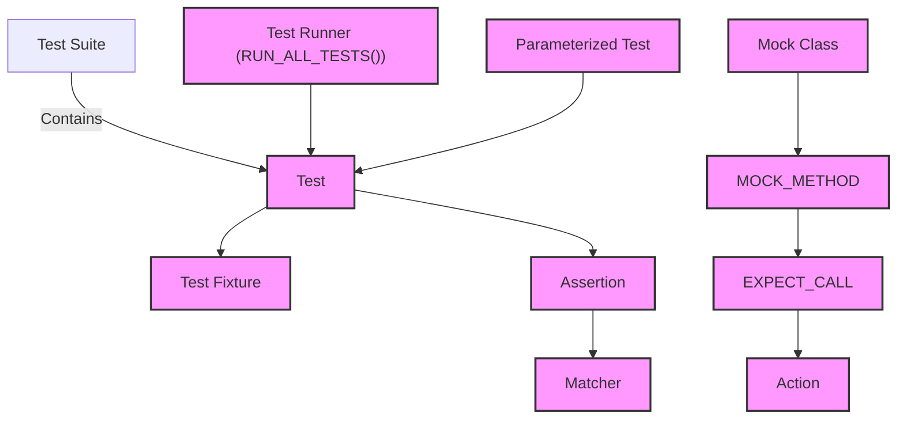

# Core Concepts & Terminology

Welcome to the foundational guide that maps out the essential concepts behind GoogleTest and GoogleMock. This page defines the central terminology you will encounter as you write, organize, and run tests using this integrated C++ testing and mocking framework. It is designed to help new users develop a shared mental model by connecting jargon to their practical roles and corresponding files.

---

## Why Understanding These Core Concepts Matters

Imagine you are entering a bustling workshop filled with specialized tools, each with a unique name and purpose. Knowing which tool to pick, and how it fits into the larger workflow, is critical to working efficiently and accurately.

In the same way, understanding terms like "test runner," "fixture," "matcher," and "mock object" empowers you to write precise, organized tests and leverage GoogleTest and GoogleMock's full capabilities without confusion or wasted effort.

---

## Central Concepts Defined

### 1. Tests

**Definition:** The fundamental units of verification, tests are self-contained functions or methods designed to check a specific behavior or piece of code.

- Implemented using macros like `TEST` and `TEST_F`.
- Grouped into test suites for logical organization.

**User Goal:** Validate units of code with clarity.

**Example:** Using `TEST(FooTest, DoesBar)` to verify that the `Foo` class correctly handles the `Bar` operation.

### 2. Fixtures

**Definition:** Structures or classes that set up a consistent environment before each test and clean up afterward.

- Created by deriving from `::testing::Test`.
- Shared setup code prevents duplication.

**User Goal:** Prepare and maintain test preconditions seamlessly.

**Example:** Sharing database initialization for multiple tests using a fixture class.

### 3. Assertions

**Definition:** Statements that evaluate conditions within tests, signaling pass or failure.

- Examples include `EXPECT_EQ` and `ASSERT_TRUE`.
- Different levels control test flow on failure (`EXPECT` vs `ASSERT`).

**User Goal:** Express expected outcomes clearly and halt tests appropriately.

### 4. Test Runners

**Definition:** The engines that discover, execute, and report on tests.

- Invoked by calling `RUN_ALL_TESTS()`.
- Handle test initialization, execution, and teardown sequences.

**User Goal:** Run tests efficiently and gather results.

### 5. Matchers

**Definition:** Flexible predicates that specify conditions for arguments or values in assertions and mock expectations.

- Used with assertions like `EXPECT_THAT(value, matcher)`.
- Includes `Eq()`, `Ne()`, `HasSubstr()`, and user-defined options.

**User Goal:** Express detailed and readable conditions for evaluation.

### 6. Actions

**Definition:** Behaviors defined for mocked methods to dictate what occurs when those methods are called.

- Specify return values, side effects, or custom operations.
- Used within `EXPECT_CALL` or `ON_CALL` clauses.

**User Goal:** Precisely control mock responses to simulate complex scenarios.

### 7. Mock Objects

**Definition:** Special test doubles that simulate real objects, allowing control over and verification of interactions.

- Created by defining mock classes with `MOCK_METHOD` macros.
- Use expectations (`EXPECT_CALL`) to specify required interactions.

**User Goal:** Isolate and verify interactions with external dependencies.

### 8. Parameterized Tests

**Definition:** Tests that run repeatedly with different input values or types to increase test coverage without duplication.

- Use the `TEST_P` macro and `INSTANTIATE_TEST_SUITE_P`.
- Support both value-parameterized and typed tests.

**User Goal:** Write scalable tests that cover multiple scenarios efficiently.

---

## How These Concepts Relate

This flow illustrates the layers of test organization and execution:
- Tests live within test suites, often sharing fixtures.
- Inside tests, assertions enforce expectations using matchers.
- Mock objects inject controlled behaviors via mock methods with specified actions.
- Parameterized tests multiply verification over data inputs.
- The test runner orchestrates execution and reporting.

---

## Practical Tips and Best Practices

- **Begin with clear test names**: Reflect precise behaviors being verified.
- **Use fixtures for shared setup**: This reduces boilerplate and improves test clarity.
- **Prefer `EXPECT` assertions for non-fatal checks**, `ASSERT` for fatal failures.
- **Leverage matchers for readable, maintainable assertions** instead of raw boolean expressions.
- **When mocking, set clear expectations with `EXPECT_CALL`, and default behaviors with `ON_CALL`**.
- **Use parameterized tests to cover edge cases without redundant code.**
- **Watch for common pitfalls**: Avoid mixing test names with underscores to prevent name collisions (see FAQ on naming).

---

## Troubleshooting Common Misunderstandings

<AccordionGroup title="Common Questions & Pitfalls">
<Accordion title="Why use fixtures instead of global variables?">
Fixtures ensure each test starts fresh, avoiding side effects that affect test independence and reliability.
</Accordion>
<Accordion title="What happens if `EXPECT_CALL` is missing for a mock method?">

Mock methods without expectations behave permissively or may cause warnings, potentially hiding missing verifications.
Always explicitly set expectations where verification matters.

</Accordion>
<Accordion title="How do parameterized tests differ from typed tests?">
Parameterized tests run the same test logic over different input values; typed tests run logic over different types.
Choosing depends on whether variations are data-driven or type-driven.
</Accordion>
</AccordionGroup>

---

## Next Steps

With this foundational vocabulary in place, you're ready to dive into examples and detailed how-tos:
- Visit the [GoogleTest Primer](../primer.html) to see these concepts in live code.
- Explore [Mocking for Dummies](../gmock_for_dummies.html) to master mock objects and expectations.
- Consult the [Mocking Reference](../reference/mocking.html) for deep dives into mock-related macros and classes.
- Learn about advanced usage and practical tips in the [Advanced Topics](../advanced.html).

---

## External Links

- [GoogleTest GitHub Repository](https://github.com/google/googletest)
- [GoogleTest Primer](../primer.html)
- [Mocking for Dummies](../gmock_for_dummies.html)
- [Mocking Reference](../reference/mocking.html)

---

<Note>
This page is part of the detailed architecture and core concepts section, linking closely with the product overview, architecture description, and guides on assertions, parameterized tests, and mocking.
</Note>
