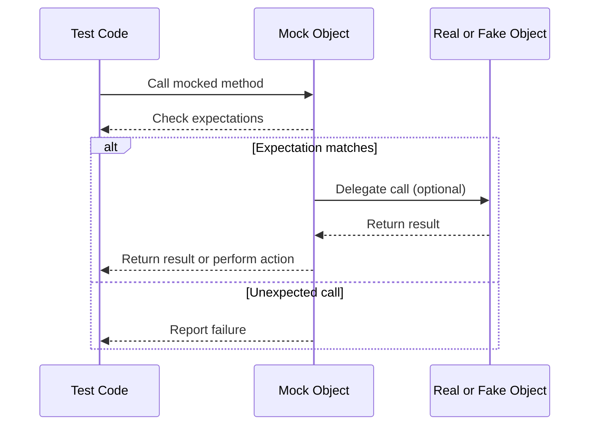

# Feature Highlights

Get a concise summary of GoogleTest and GoogleMock's main features that empower you to write effective, maintainable, and robust C++ tests with ease. These highlights encompass the xUnit-inspired test framework design, automatic discovery and execution of tests, the rich set of assertion and matcher tools, flexible test execution workflows, and GoogleMock's advanced capabilities for creating precise, behavior-driven mock objects.

---

## Why Feature Highlights Matter

Imagine you're setting up a new project or diving into an unfamiliar codebase. Understanding the key features upfront gives you the confidence and clarity on what you can accomplish and how GoogleTest and GoogleMock streamline your testing journey. This page distills those features into actionable insights that help you envision your test design and execution flow.

---

## Core Feature Summary

### 1. xUnit-Inspired Testing Framework
- Structure your tests into **Test Cases and Test Suites** for logical grouping.
- Use **Test Macros** such as `TEST()` and `TEST_F()` to write readable and maintainable tests.
- Benefit from **automatic test discovery**, so all your tests run without manual registration.

### 2. Comprehensive and Custom Assertions
- Rich set of predefined **assertions** (`EXPECT_EQ`, `ASSERT_TRUE`, etc.) ensures expressive validation.
- Full support for **fatal vs non-fatal failures** to control test flow precisely.
- Integrate **custom assertions and matchers** to fit your domain-specific scenarios.

### 3. Flexible Test Execution
- Run tests selectively or in bulk using easy-to-use **filters and flags**.
- Allow **parameterized and typed tests** to efficiently test multiple data sets and types.
- Support for **death tests** to verify process termination behavior safely.

### 4. Advanced Mocking with GoogleMock
- Declarative syntax for **mock class definition** using `MOCK_METHOD`, supporting virtual and overloaded functions.
- Set detailed expectations on calls with argument **matchers**, **cardinalities**, and **sequences**.
- Define **default actions** with `ON_CALL()` and expectation-driven actions with `EXPECT_CALL()`, supporting complex behaviors.
- Tools for controlling test strictness (`NiceMock`, `NaggyMock`, `StrictMock`) to balance test noise and rigor.
- Support for mocking of methods involving **move-only types**, **delegating calls** to real or fake objects.

---

## Real-World Workflow Example

```cpp
#include <gmock/gmock.h>
#include <gtest/gtest.h>

using ::testing::Return;
using ::testing::NiceMock;

class Foo {
public:
  virtual ~Foo() {}
  virtual int Bar(int x) const = 0;
};

class MockFoo : public Foo {
public:
  MOCK_METHOD(int, Bar, (int x), (const, override));
};

TEST(FooTest, BarReturnsExpectedValue) {
  NiceMock<MockFoo> mock_foo;
  ON_CALL(mock_foo, Bar).WillByDefault(Return(42));

  EXPECT_CALL(mock_foo, Bar(5))
      .Times(1)
      .WillOnce(Return(100));

  EXPECT_EQ(mock_foo.Bar(5), 100);  // Expected special case
  EXPECT_EQ(mock_foo.Bar(10), 42);  // Uses default action
}
```

This example highlights how mocks are defined, default behaviors are set, and strict expectations are declared to catch unexpected usage.

---

## Best Practices and Practical Tips

- **Set Expectations Before Exercise:** Always declare `EXPECT_CALL` before the tested code invokes the mock.
- **Use `ON_CALL` for Defaults:** Define default behaviors that don’t have strict call count requirements.
- **Leverage Matchers:** Use matchers like `_` for wildcards or custom predicates for precise control.
- **Sequence and Ordering:** Control call order with `InSequence` or `After` when logic depends on invocation order.
- **Manage Uninteresting Calls:** Use `NiceMock` to suppress warnings or `StrictMock` to treat unexpected calls as errors.
- **Delegate to Fakes or Real Objects:** Avoid duplication by forwarding calls to real or fake implementations when appropriate.

---

## Diagram of Core GoogleMock Testing Interaction



---

## Troubleshooting Common Issues

<AccordionGroup title="Common Challenges and Solutions">
<Accordion title="Uninteresting Mock Function Calls Warning">
When a mock method is called without a prior `EXPECT_CALL`, GoogleMock will emit a warning.

**Solution:**
- Use `EXPECT_CALL` if you expect specific calls.
- Use `ON_CALL` for default actions.
- Wrap the mock in `NiceMock<>` to suppress warnings on uninteresting calls.
</Accordion>
<Accordion title="Failure Due to Call Order">
If your test fails because calls happen in an unexpected order:

**Solution:**
- Use sequences (`InSequence`) to explicitly enforce order.
- Use the `After` clause to specify partial order constraints.
</Accordion>
<Accordion title="Mocking Non-Virtual or Free Functions">
GoogleMock works best with virtual methods.

**Solutions:**
- Refactor to introduce interfaces.
- Use mock functions or `MockFunction` for callbacks.
- Use dependency injection with templates for non-virtual functions.
</Accordion>
<Accordion title="Move-Only Types in Mock Methods">
If mocking methods with `std::unique_ptr` or other move-only types:

**Solution:**
- Use `MOCK_METHOD` as usual (supported since 2017).
- Return values via lambdas/`WillOnce` instead of `Return` to generate fresh instances.
- Refer to legacy workarounds only if stuck on older versions.
</Accordion>
</AccordionGroup>

---

## Next Steps

To get started leveraging these features:

- Proceed to the [GoogleTest Primer](../about-googletest/introduction.md) for foundational concepts.
- Read the [Getting Started with Mock Objects](../../guides/mocking-and-test-doubles/getting-started-with-mocks.md) guide for hands-on mock creation.
- Explore the [gMock Cookbook](../../docs/gmock_cook_book.md) for advanced mocking techniques and recipes.

---

**Explore more:**
- [Mocking Reference](../../reference/mocking.md) - Deep dive on mocking facilities.
- [Matchers Reference](../../reference/matchers.md) - Full list of built-in matchers.
- [Actions Reference](../../reference/actions.md) - Available mock actions.

---

This concise feature overview provides the essential pillars enabling you to write, maintain, and scale your C++ tests effectively with GoogleTest and GoogleMock.