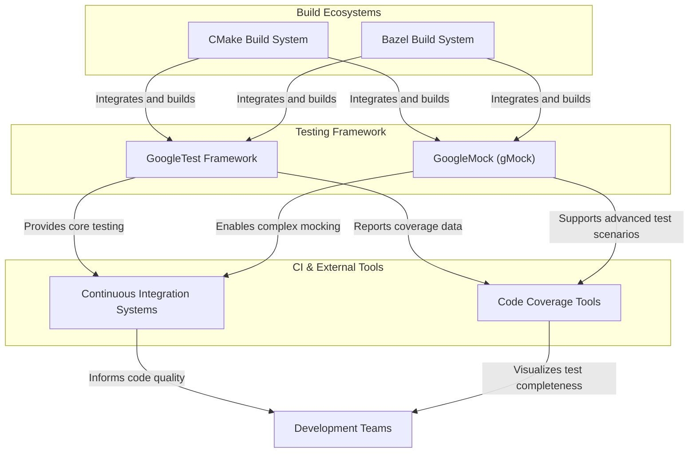

# Integration & Dependencies

## Seamless Integration into Larger Build Ecosystems

GoogleTest is designed to smoothly integrate with popular modern build systems like CMake and Bazel, streamlining your development and continuous integration workflows. Whether you’re working on small projects or large-scale codebases, GoogleTest fits right in, enabling efficient test builds and executions.

### Building with CMake

- **Native Support:** GoogleTest provides a comprehensive `CMakeLists.txt` allowing easy inclusion as a subdirectory or external project.
- **Configurable Options:** You can selectively build GoogleMock alongside GoogleTest or build GoogleTest alone, adapting to your project's mocking needs.
- **Customizable Integration:** Settings let you control installation paths, compile options, and linkage seamlessly.

**Example snippet for CMake inclusion:**

```cmake
include(FetchContent)
FetchContent_Declare(
  googletest
  URL https://github.com/google/googletest/archive/refs/tags/release-1.17.0.zip
)
FetchContent_MakeAvailable(googletest)

add_executable(mytests test.cpp)
target_link_libraries(mytests gtest_main gmock_main)
add_test(NAME MyTests COMMAND mytests)
```

### Incorporation with Bazel

- GoogleTest is also easily integrated within Bazel build definitions for scalable development.
- Bazel's hermetic build approach complements GoogleTest’s portability and reproducibility ideals.

## GoogleMock: The Complementary Mocking Framework

GoogleMock, often referred to as gMock, is bundled within the GoogleTest repository and provides powerful mocking capabilities to augment your testing.

### Why Use GoogleMock?

- **Declarative Mock Definitions:** Quickly define mocks with `MOCK_METHOD` macros that map naturally to your interfaces.
- **Rich Expectation Syntax:** Specify call sequences, argument matchers, behaviors, and verification criteria clearly and concisely.
- **Strong C++ Compatibility:** Supports mocking virtual and non-virtual methods, overloaded functions, templated classes, and move-only types, while avoiding exceptions.

### Real-World Scenario

In projects where dependencies have complex interfaces or side effects, GoogleMock allows you to isolate your unit under test by substituting collaborators with mocks that simulate expected behaviors or failures, ensuring your tests focus on logic correctness rather than external states.

Refer to [Mocking for Dummies](../guides/mocking-real-world/intro-mocking) for a beginner-friendly introduction.

## Continuous Integration and Open Source Utilities

GoogleTest and GoogleMock naturally complement your CI/CD pipelines and open-source workflows. Their design supports:

- **Fast Test Compilation and Execution:** Minimizing turnaround times during CI runs.
- **Cross-Platform Consistency:** Tests perform reliably on Linux, Windows, and macOS environments.
- **Scalable Test Suites:** Easily manage large test sets with automated discovery and parallel execution capabilities.
- **Robust Reporting:** Clear diagnostics facilitate quick failure analysis and fix cycles.

Many open-source projects leverage GoogleTest combined with tools like Bazel and CMake to enforce testing rigor and reliability.

## Key Dependencies and Synergies

GoogleTest depends primarily on standard C++17 features to maintain portability and minimal external dependencies. For mocking, GoogleMock is tightly integrated, sharing the same namespace and build infrastructure.

### Cross-Project Synergies

- **CMake and Bazel:** Build system support enhances adoption and maintainability.
- **GoogleMock:** Extends testing scope by enabling sophisticated interaction validation.
- **Third-Party Tools:** Integrates with CI systems (Jenkins, GitHub Actions, etc.) and code coverage tools.

<Tip>
To maximize the benefits of GoogleTest and GoogleMock, configure your build system to include them as part of your CI pipeline early on. This ensures consistent quality control and faster feedback during development.
</Tip>

## Troubleshooting Integration Issues

If you encounter common integration problems, such as linkage errors or conflicting definitions, consider the following:

- Ensure consistent C++ standards (C++17) across GoogleTest and your project.
- Verify that the correct GoogleTest version is included in the build.
- For CMake, check your `target_link_libraries` order and scope.
- In Bazel, confirm proper workspace and BUILD file configuration for GoogleTest dependencies.

Consult the [Installation & Build Troubleshooting FAQ](/faq/getting-started-common-issues/installation-build-troubleshooting) for detailed guidance.

---

## Summary Diagram: GoogleTest Integration Overview



---

## Getting Started with Integration

1. **Choose Your Build System:** Adopt CMake or Bazel according to project needs.
2. **Include GoogleTest:** Add GoogleTest and GoogleMock as submodules or dependencies.
3. **Configure Build:** Use provided CMakeLists or BUILD files to include tests.
4. **Write Tests and Mocks:** Use GoogleTest APIs and GoogleMock macros to create tests.
5. **Run and Validate:** Execute tests within your build system or CI environment.
6. **Leverage Documentation:** Expand knowledge with [GoogleTest Primer](../guides/getting-started/primer) and [Mocking Cookbook](../guides/mocking-real-world/advanced-mocking-patterns).

<Tip>
Refer to the "Setup, Prerequisites, and Installation" section in the documentation for step-by-step installation guidance.
</Tip>

## Additional Resources

- [GoogleMock Cheatsheet](../docs/gmock_cheat_sheet.md) – Quick reference for mocking syntax.
- [GoogleTest and GoogleMock GitHub Repository](https://github.com/google/googletest) – Source, issues, and contribution.
- [CI Integration Guide](/guides/solutions-and-patterns/integration-ci) – Best practices for pipelines.

---