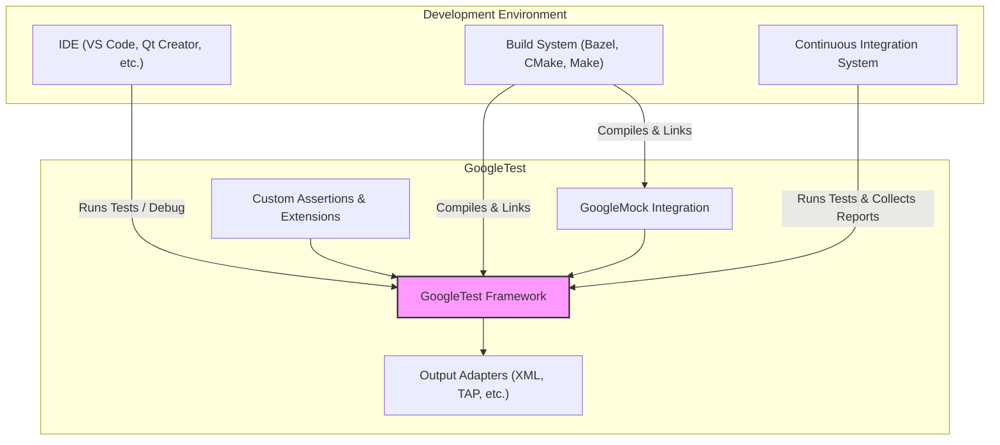

# Integration & Extensibility

GoogleTest seamlessly fits into your development workflow by integrating with build systems, continuous integration (CI) pipelines, and development tools to create an efficient, extensible testing environment. This page highlights how GoogleTest interacts with various external systems, supports customization, and enables adaptability to your team's needs.

---

## Why Integration Matters

Effective test frameworks must do more than provide APIs for writing tests—they must also work smoothly with the tools and processes you already use every day. GoogleTest is designed to plug into existing build systems and CI environments effortlessly, thereby reducing barriers to adoption and encouraging best testing practices.

## Build System Integration

GoogleTest supports a variety of popular build systems out-of-the-box, making it straightforward to include comprehensive testing in your builds:

- **Bazel**: Official support with well-maintained Bazel rules to run tests cleanly and efficiently.
- **CMake**: Easily configure GoogleTest targets with CMake’s testing modules for streamlined compilation and automated test discovery.
- **Makefiles and other systems**: GoogleTest's modular design lets you define custom build commands and test runners.

By integrating tests as first-class citizens, you ensure tests are compiled and executed as part of your normal build cycle, catching regressions early.

## Continuous Integration (CI) Environments

GoogleTest works harmoniously with popular CI systems such as Jenkins, GitHub Actions, GitLab CI, Travis CI, and others. It supports:

- **Standard output parsing**: Human-friendly and machine-readable test results for easy review and reporting.
- **XML output**: Generating JUnit-compatible XML reports to integrate with CI dashboards.
- **Exit codes**: Returning meaningful status codes to indicate test success or failure.

This compatibility ensures that your tests become an integral part of your automated quality gate.

## Extensibility for Customization

GoogleTest’s architecture not only supports running tests but also empowers you to extend its functionality through:

- **Custom Assertions**: Define your domain-specific checks for cleaner and more expressive test code.
- **Test Runner Hooks**: Customize test execution, setup, and teardown to fit complex environments.
- **Output Adapters**: Use or implement adapters to emit test status in formats compatible with other reporting systems.

These features allow teams to tailor testing behavior and reporting to organizational standards and requirements.

## External Adapters and Ecosystem

GoogleTest supports a variety of adapters and integrations that further enhance productivity:

- **VS Code and IDEs**: Plugins and extensions provide syntax highlighting, test discovery, and debugging support.
- **Qt Creator**: Seamless integration for running and debugging tests within the IDE.
- **TAP Protocol**: Produces output compatible with the Test Anything Protocol for wider toolchain support.
- **Abseil**: Works alongside Google's Abseil library, matching styles and conventions for broader usability.

This ecosystem support allows GoogleTest to blend into heterogeneous development environments without friction.

## Getting Started with Integration

To benefit from GoogleTest’s integration capabilities:

1. Choose and configure your build system to include GoogleTest appropriately.
2. Set up your CI environment to execute your tests and consume GoogleTest's XML reports.
3. Customize your tests with tailored assertions and test runners as your requirements evolve.
4. Explore available IDE integrations to streamline your test-debug cycles.

---

<Callout title="Tip">
Leverage GoogleTest's XML output option (`--gtest_output=xml`) for consistent test reporting across CI systems and third-party dashboards.
</Callout>

<Callout title="Note">
GoogleTest is bundled with GoogleMock, enabling mocking and interaction-based testing within the same integrated workflow.
</Callout>

---

### Visual Representation

---

### Practical Tips for Success

- Always include `InitGoogleTest()` early in your program's main function to ensure correct flag parsing and initialization of all GoogleTest components.
- Use XML output in CI for robust test reporting and easier debugging of flaky or failing tests.
- Isolate custom assertion code in dedicated helper files to keep tests clean and maintainable.
- Use `Mock::VerifyAndClearExpectations()` to explicitly verify mock expectations when dealing with complex test lifecycles.

### Common Pitfalls

- Forgetting to call `InitGoogleTest()` can lead to tests not running or improper flag handling.
- Running tests outside build or CI environments without proper adapters might lose benefits of automated reporting.
- Adding custom extensions without considering thread-safety and reentrancy can cause flaky tests.

---

## Summary

GoogleTest offers not only a powerful unit testing and mocking framework but also a robust integration story that fits into your build system, CI pipelines, and development environment. Its extensibility ensures you can customize assertions, execution, and reporting as your project grows, while ecosystem adapters help embed testing deeply into your daily workflow.

---

### Relevant Links

- [GoogleTest Overview](https://google.github.io/googletest/overview.html)
- [gMock Cookbook](https://google.github.io/googletest/gmock_cook_book.html)
- [Running Tests: Command Line & Output](https://google.github.io/googletest/running-tests.html)
- [GoogleTest Primer](https://google.github.io/googletest/primer.html)
- [Using GoogleTest with Bazel](https://docs.bazel.build/versions/main/test-encyclopedia.html#googletest)

---

For next steps, refer to the [Feature Overview at a Glance](/overview/architecture-core-concepts/feature-glance) to understand key capabilities, or jump to [Quickstart & Next Steps](/overview/introduction-getting-started/quickstart-navigation) to start experimenting with GoogleTest in your projects.
