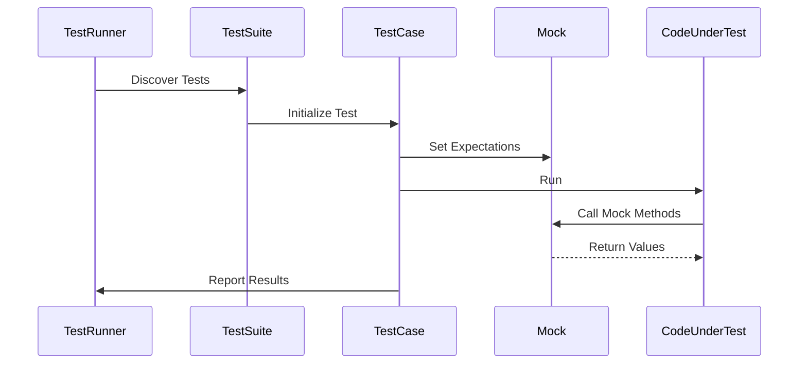

# Key Concepts & Terminology

Master the fundamental concepts of GoogleTest and GoogleMock to build reliable, maintainable, and powerful tests. This guide introduces the essential vocabulary and core ideas you need to understand tests, test suites, assertions, matchers, death tests, parameterized tests, type-parameterized tests, and mocking behaviors.

---

## Test Suites and Test Cases

### What Is a Test?
A *test* is a single check that verifies a specific behavior or condition in your code. It consists of assertions that validate code correctness.

### Test Suites (Previously Test Cases)
A **test suite** groups logically related tests together. This organization reflects the structure of your code, making tests easier to manage and understand.

Each test suite can contain multiple test functions, each verifying a distinct aspect of the code.

### Writing Tests with GoogleTest
Use the `TEST()` macro to define individual tests, specifying the test suite name and the test name:

```cpp
TEST(TestSuiteName, TestName) {
  // Test code and assertions
}
```

The first argument is the test suite, and the second is the test name.

---

## Assertions: Verifying Behavior

### Purpose of Assertions
Assertions check whether specific conditions hold true during test execution. They determine if a test passes or fails.

### ASSERT_ vs. EXPECT_
- `ASSERT_*` macros generate **fatal failures**: when an assertion fails, it aborts the current test function immediately.
- `EXPECT_*` macros generate **nonfatal failures**: when an assertion fails, the test continues to run, reporting all failures.

Use `EXPECT_*` to reveal multiple issues in a test run, and `ASSERT_*` when continuing after failure does not make sense.

### Example
```cpp
ASSERT_EQ(x.size(), y.size()) << "Vectors x and y are not the same size";
EXPECT_EQ(x[0], y[0]) << "First elements differ";
```

### Custom Failure Messages
Add informative messages to assertions by appending `<<` and your message, aiding debugging.

---

## Matchers: Fine-Grained Argument Checking

Matchers describe expected argument values in mock method calls or assertions.

### The Wildcard Matcher
The underscore, `_`, matches any value. It is useful when argument values are unimportant.

Example:
```cpp
EXPECT_CALL(mock_obj, Process(_));  // Matches any argument
```

### Built-in Matchers
GoogleMock provides a rich set of matchers:
- `Eq(value)` - equals value
- `Ge(value)` - greater than or equal
- `NotNull()` - non-null pointer
- `StartsWith("prefix")` - string matcher

### Combining Matchers
Use `AllOf()`, `AnyOf()`, `Not()` to construct complex match conditions.

Example:
```cpp
EXPECT_CALL(mock_obj, DoSomething(AllOf(Ge(0), Lt(10))));
```

### Custom Matchers
Define your own matcher for domain-specific checks ([see Writing New Matchers Quickly](../gmock_cook_book.md#NewMatchers)).

---

## Death Tests: Verifying Program Termination

Death tests check that certain code causes the program to exit or crash as expected.

### Using Death Assertions
Use macros like `EXPECT_DEATH()` to validate that an operation terminates the process:

```cpp
EXPECT_DEATH({ SomeFatalFunction(); }, "Expected error message regex");
```

### Use Cases
Ensure your code fails safely in invalid or extreme scenarios.

For more, see the [Death Test and Error Handling APIs](../api-reference/advanced-capabilities/death-test-and-error-handling-apis).

---

## Parameterized Tests

Parameterized tests run the same test logic over a range of input values, reducing duplication.

### How It Works
1. Define a test fixture class.
2. Register the test to receive parameters.
3. Provide parameter values.

### Benefits
- Increased coverage with less code
- Easily test multiple scenarios

For an in-depth guide, see [Value and Type Parameterized Testing](../api-reference/core-testing-apis/value-and-type-parameterized-testing).

---

## Type-Parameterized Tests

Type-parameterized tests run the same test code for multiple types.

### Usage
Useful when your code operates on generic types or templates.

### Workflow
1. Define a test fixture class template.
2. Use macros to instantiate tests for different types.

---

## Mock Behaviors: Controlling and Verifying Interactions

GoogleMock lets you simulate and control the behavior of dependencies to isolate and verify interactions.

### Mock Objects
Mocks implement the same interface as real objects but allow specifying:
- Expected method calls
- Number of calls
- Arguments
- Return values and side effects

### Setting Expectations
Use `EXPECT_CALL()` to declare expected function invocations and behaviors:

```cpp
EXPECT_CALL(mock_obj, MethodName(arg_matchers))
    .Times(n)
    .WillOnce(Return(value));
```

### Default Actions and ON_CALL
Set default behaviors for mock methods that are called but have no explicit expectations, using `ON_CALL()`.

### Ordering and Cardinalities
You can specify call orders (`InSequence`) and how many times calls should occur (`Times()`, `AtLeast()`, etc).

### Handling Uninteresting Calls
Unmocked or unexpected calls produce warnings by default. Use `NiceMock` to suppress these, or `StrictMock` to make them errors.

### Example of a Mock Class
```cpp
#include <gmock/gmock.h>

class MockFoo : public Foo {
 public:
  MOCK_METHOD(int, GetValue, (), (const, override));
  MOCK_METHOD(void, SetValue, (int), (override));
};
```

### Typical Workflow
1. Define mocks
2. Set up expectations
3. Invoke code under test
4. GoogleMock checks expectations at mock destruction

More details and recipes are available in the [Mocking Cookbook](../docs/gmock_cook_book.md) and [Mocking Reference](../docs/reference/mocking.md).

---

## Summary Diagram: Test Workflow



---

For a comprehensive introduction, see the [GoogleTest Primer](primer.md).

For an introduction to mocking, see [gMock for Dummies](gmock_for_dummies.md).

---

<AccordionGroup title="Common Terminology Definitions">
<Accordion title="Test Suite">
A named collection of related tests grouped to reflect the program’s structure.
</Accordion>
<Accordion title="Test Case / Test">
An individual test verifying a specific behavior or condition using assertions.
</Accordion>
<Accordion title="Assertion">
A statement in a test that verifies a particular condition.
</Accordion>
<Accordion title="Matcher">
An object describing expected argument values for assertions or mock methods.
</Accordion>
<Accordion title="Death Test">
A test checking that certain code causes the program to terminate or crash.
</Accordion>
<Accordion title="Parameterized Test">
A test that runs repeatedly over a range of input values.
</Accordion>
<Accordion title="Mock Behavior">
Predefined expectations and actions that simulate dependencies in tests.
</Accordion>
</AccordionGroup>

---

<Tip>
Naming Conventions: Use meaningful and consistent names for your test suites and test cases to improve clarity and maintainability.
</Tip>

<Note>
All mock methods must be declared in the public section of the mock class, even if the original methods are protected or private.
</Note>

<Warning>
Never set expectations on mock methods after the code under test has exercised the mock; this leads to undefined behavior.
</Warning>

---

### Next Steps
- Dive into the [GoogleTest Primer](primer.md) to practice writing tests and assertions.
- Explore the [Mocking for Dummies](gmock_for_dummies.md) guide to get started with mocks.
- Understand advanced matcher and mocking capabilities in the [Mocking Cheat Sheet](docs/gmock_cheat_sheet.md).

---

## References
- [GoogleTest Primer](primer.md)
- [Mocking for Dummies](gmock_for_dummies.md)
- [Mocking Cheat Sheet](docs/gmock_cheat_sheet.md)
- [Assertions Reference](docs/reference/assertions.md)
- [Matchers Reference](docs/reference/matchers.md)

---