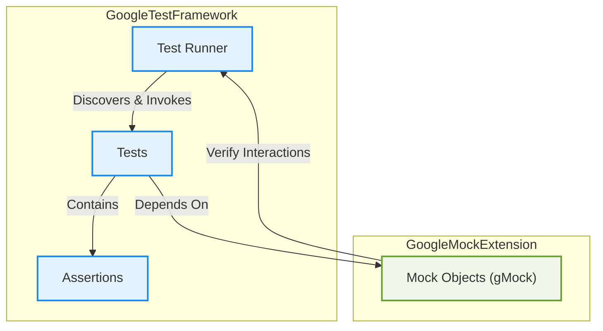

# System Architecture Overview

## Understanding the End-to-End Test Lifecycle in GoogleTest

This page presents a high-level walkthrough and visual diagram explaining the key components of GoogleTest’s testing framework and how they interact to execute tests. If you’re looking to grasp the big picture of how tests, assertions, mock objects, and the test runner collaborate seamlessly, this is your starting point.

### Why This Matters

For any developer or tester using GoogleTest, understanding system architecture helps:

- Anticipate test behaviors and results
- Debug more effectively
- Write tests that align with the framework’s flow
- Build confidence in your testing strategy

Whether you are creating simple unit tests or using advanced mocking, an architectural grasp streamlines your journey.

---

## Architecture at a Glance

### Core Components & Their Roles

- **Test Runner**: The engine that discovers, initializes, runs tests, and reports results.
- **Tests**: Defined blocks of code verifying behavior.
- **Assertions**: Validation checkpoints within tests that confirm expected outcomes.
- **Mock Objects (gMock)**: Test doubles that simulate real objects, allowing you to specify behaviors and verify interactions.

These components form the backbone of GoogleTest’s workflow.

### Interaction Overview

When you start running tests, the **Test Runner** locates all your test cases and invokes them. Inside each test, user-written test logic executes, containing **Assertions** to verify correctness. If your tests use **Mock Objects**, GoogleMock coordinates the setup and verification of expected calls and behaviors.

This interaction pattern guarantees robust and maintainable testing automation.

---

## Visualizing the Architecture



This flowchart illustrates how the test runner serves as the control center, executing tests that contain assertions while managing mock objects to simulate dependencies and validate interactions.

---

## How It Works: A User Perspective

### Writing and Running Tests

1. **You Write Tests:** Compose test cases that hold your test logic using GoogleTest’s macros.
2. **Assertions Check Behavior:** Inside tests, assertions validate whether your code behaves as expected.
3. **Mocks Simulate Components:** When dependencies exist, mocks replace them, enabling precise control over their behavior.
4. **Test Runner Executes:** When you run your test suite, the test runner finds all tests, runs them, and reports results.

### Example Workflow

```cpp
TEST(MyWidgetTest, ComputesValueCorrectly) {
  MockDependency mock_dep;
  EXPECT_CALL(mock_dep, GetValue()).WillOnce(Return(42));

  MyWidget w(&mock_dep);
  int result = w.Compute();
  EXPECT_EQ(result, 42);
}
```

- The test runner executes the test.
- MockDependency is invoked as per EXPECT_CALL.
- Assertions verify the returned result.
- Results are summarized.

---

## Practical Tips

- Use mocking to isolate the unit under test and verify interactions cleanly.
- Leverage sequences and ordering methods (`InSequence`, `After`) to enforce call order when needed.
- Use assertions to confirm both state and behavior.
- Investigate failures with `--gmock_verbose=info` for detailed call traces.

---

## Next Steps in Your Architecture Exploration

Now that you understand the system architecture of GoogleTest and GoogleMock, deepen your knowledge by exploring:

- [Core Concepts & Terminology](/overview/architecture-core-concepts/core-concepts-terminology): Understand key testing and mocking concepts.
- [Feature Overview at a Glance](/overview/architecture-core-concepts/feature-glance): Quick peek at all major features.
- [Mocking Basics: Using GoogleMock](/guides/mocking-and-advanced-techniques/mocking-basics): Learn how to create and use mock objects effectively.
- [Using Assertions and Matchers Effectively](/guides/everyday-workflows/assertions-matchers): Maximize test clarity and expression.

For practical coding and mocking patterns, the [gMock Cookbook](https://google.github.io/googletest/gmock_cook_book.html) is an essential reference.

---

## Useful References

- GoogleTest GitHub: [https://github.com/google/googletest](https://github.com/google/googletest)
- GoogleMock for Dummies: [https://google.github.io/googletest/gmock_for_dummies.html](https://google.github.io/googletest/gmock_for_dummies.html)

---