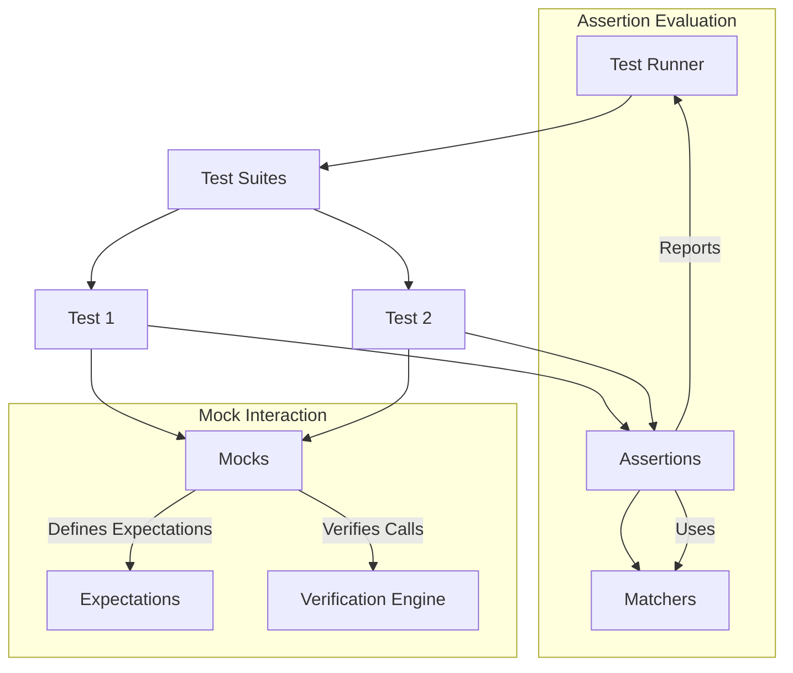

# System Architecture: Understanding Core Components

GoogleTest and GoogleMock together form a comprehensive C++ testing framework designed to empower developers with effective unit testing and mocking capabilities. This documentation provides a high-level architectural visualization to help you swiftly grasp how key components fit together, their interactions, and how they enable robust test creation and verification.

---

## Architectural Overview

At the heart of the system lie the essential components responsible for executing tests, managing expectations, and validating behaviors. This architecture centers on the interplay between **Test Runners**, **Test Suites**, **Assertions**, **Matchers**, and **Mocks**.

- **Test Runner**: Orchestrates the execution of test suites and individual tests, managing lifecycles and reporting outcomes.
- **Test Suites**: Logical groupings of related tests which share setup and teardown routines.
- **Assertions**: Statements that verify expected conditions in test code, such as equality, truthfulness, or exception throwing.
- **Matchers**: Flexible predicates used within assertions to describe the expected properties of values more expressively.
- **Mocks**: Simulated objects or classes that mimic real components, permitting fine-grained control of behavior and interaction verification.

This synergy offers a solid and extensible foundation for test-driven development and interaction-based verification.

 

## High-Level Architecture Diagram

This diagram captures the primary flow: the **Test Runner** invokes **Test Suites**, which contain individual **Tests**. Each test executes **Assertions** to verify behavior, employing **Matchers** to enhance expressiveness. When dependencies or collaborators need to be simulated, **Mocks** come into play, where expectations are set, verified, and enforced.

---

## Component Details and User Workflow

### 1. Test Runner
- **Role:** Coordinates discovery and execution of all tests.
- **User Goal:** Run tests consistently and receive detailed results.

### 2. Test Suites and Tests
- Group related tests allowing shared setup/teardown.
- Tests use assertions to verify behavior.

### 3. Assertions
- Allow verification of expected program states.
- Examples include `EXPECT_EQ`, `ASSERT_TRUE`, and death tests.
- Failures provide clear, immediate feedback aiding debugging.

### 4. Matchers
- Used inside assertions for expressive matching of arguments and values.
- Examples: `StartsWith()`, `HasSubstr()`, `Gt(5)`.
- Supports creating custom matchers for domain-specific needs.

### 5. Mocks
- Serve as stand-ins for real objects.
- Allow definition of expected calls, argument constraints, and return behaviors.
- Integrate tightly with assertions for automatic verification.
- Support sequencing and partial ordering of expected calls.
- Enable simulation of error conditions and control over dependencies.

---

## Real-World Scenario

Imagine you are testing a graphics program that uses a `Turtle` interface for drawing operations. The program under test uses a **real** `Turtle` implementation when running normally, but during testing, you replace it with a **mock** (`MockTurtle`). You explicitly specify expectations on calls, such as the turtle lifting its pen or moving forward by a certain distance.

- **Test Setup:** Instantiate `MockTurtle` and define expectations with `EXPECT_CALL`.
- **Execution:** Run drawing code that interacts with the turtle.
- **Verification:** GoogleMock automatically checks if the mock met all expectations in the correct order.
- **Outcome:** Report clear success or failure with deep insights into mismatches.

This approach isolates your drawing logic, making tests fast, deterministic, and maintainable.

---

## Practical Tips

- **Defining Mocks:** Use `MOCK_METHOD` macros to simplify mock creation.
- **Setting Expectations:** Always specify expectations before exercising your test code to avoid undefined behavior.
- **Ordering Calls:** Use `InSequence` or `Sequence` objects to enforce call order when necessary.
- **Suppressing Noise:** Use `NiceMock` to reduce warnings on unimportant call patterns.
- **Advanced Matchers:** Utilize built-in or custom matchers for complex argument validation.

---

## Troubleshooting

- **Unmatched Calls:** Ensure `EXPECT_CALL` precedes usage of mocks to establish clear expectations.
- **Over-Specified Tests:** Avoid overly strict expectations to prevent brittle tests.
- **Uninteresting Calls:** Use `NiceMock` or default actions (`ON_CALL`) to handle unexpected but harmless calls.
- **Mock Lifetime:** Verify timely destruction of mock objects to trigger expectation checks.

---

## Next Steps

Start implementing your first tests using the foundational **Test Runner**, write assertions using expressive **Matchers**, and leverage **Mocks** to isolate dependencies. For detailed guidance, refer to the [Getting Started](../../getting-started/) section and the extensive [GoogleMock CookBook](../gmock_cook_book.md).

---

#### Explore Related Pages:

- [Product Overview & Value Proposition](/overview/product-introduction/introduction-value)
- [Core Concepts & Terminology](/overview/architecture-core-concepts/core-concepts-terminology)
- [Creating and Using Mock Classes](/api-reference/gmock-api-core/creating-and-using-mocks)
- [Assertions and Predicate Macros](/api-reference/gtest-api-core/assertions-and-predicate-macros)
- [Using Matchers in GoogleTest](/api-reference/gtest-api-core/using-matchers)

---

*This document aims to orient you around GoogleTest and GoogleMock's system architecture, so you can effectively navigate the testing framework’s components and workflows.*
