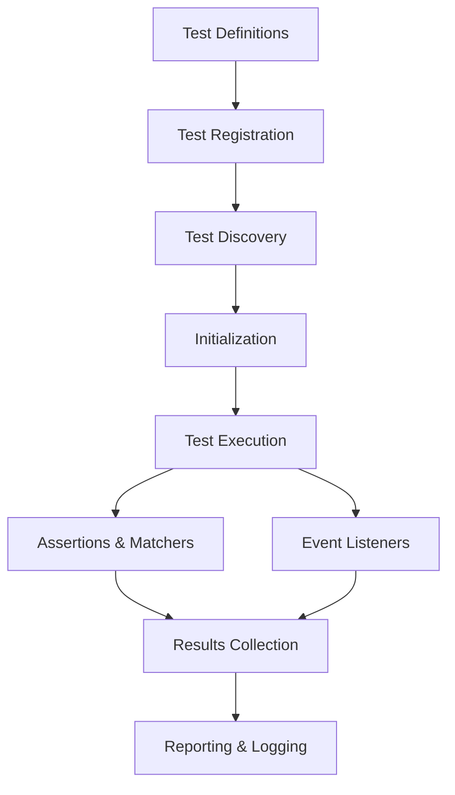

# System Architecture Overview

## Introduction: Understanding GoogleTest Components

In this section, you'll gain insight into the major components that power GoogleTest. This overview is designed to help you understand the user-facing features through the lens of their interplay—from the test code you write to how GoogleTest orchestrates execution and reporting.

Whether you are new or experienced, this guide clarifies how key elements like test macros, matchers, assertions, and the event/test runner lifecycle work together.

## Major Components Explained

### 1. Test Macros

At the core of GoogleTest are its test macros, such as `TEST()` and `TEST_F()`. These macros provide a simple, declarative way to define tests and test fixtures:

- `TEST(TestSuiteName, TestName)`: Defines an independent test function, allowing you to verify specific functionality.
- `TEST_F(TestFixture, TestName)`: Executes tests with a shared test fixture, enabling reuse of setup and teardown code across multiple tests.

These macros automatically register tests with the framework, relieving you from manual bookkeeping.

### 2. Assertions

Assertions verify that your code behaves as expected. GoogleTest offers rich assertion macros:

- Fatal assertions (`ASSERT_*`): Abort the current test upon failure.
- Nonfatal assertions (`EXPECT_*`): Log failure but continue execution.

This distinction allows you to decide if a failure should stop further testing or collect multiple failures within one test.

### 3. Matchers

Matchers provide expressive ways to specify expected argument values in assertions and mocks. They can be simple, like matching exact values, or complex, involving patterns or user-defined predicates.

Example:
```cpp
EXPECT_CALL(mockObject, Foo(Ge(5), NotNull()));
```
This expects that the `Foo()` method will be called with the first argument greater or equal to 5 and the second argument not null.

### 4. Assertions Combined with Matchers

GoogleTest supports combined use of assertions and matchers allowing you to write expressive tests that are clear and maintainable. For instance, `EXPECT_THAT(value, matcher)` allows you to write expectations using custom predicates and matchers.

### 5. Event/Test Runner Lifecycle

GoogleTest controls the test execution lifecycle through an event-driven test runner:

- **Definition Phase:** Your test macros register test and fixture definitions before execution.
- **Execution Phase:** The test runner executes registered tests, managing setup, teardown, and controlled sequencing.
- **Reporting Phase:** Test results, including passed, failed, or skipped tests, are collected and reported with details.

This lifecycle ensures that tests run in isolation, enabling reliable and repeatable testing.

## Visualizing GoogleTest Architecture

### High-Level Flow Diagram



#### Component Breakdown

- **Test Definitions:** Your `TEST()` and `TEST_F()` statements define what to test.
- **Test Registration:** The framework registers these tests internally.
- **Test Discovery:** At runtime, tests are discovered automatically.
- **Initialization:** Framework prepares the environment, parsing flags and setting prerequisites.
- **Test Execution:** Each test runs independently, invoking your test logic.
- **Assertions & Matchers:** Assertions ensure your code behaves as expected using matchers for detailed checks.
- **Event Listeners:** Extensible user-defined hooks observe test progress.
- **Results Collection:** Outcomes are tracked.
- **Reporting & Logging:** Summaries and detailed logs are printed.

## Practical Understanding Through User Flow

1. **Write tests using macros:** Define tests using `TEST()` or fixtures via `TEST_F()`.
2. **Specify expectations:** Use assertions like `EXPECT_EQ()`, `EXPECT_TRUE()`, or custom matchers.
3. **Build and run tests:** GoogleTest discovers and runs your tests, enforcing isolation and ordering guarantees.
4. **Test runner manages lifecycle:** Setup, execution, teardown, and reporting are coordinated behind the scenes.

## Tips and Best Practices

- Always use test macros to declare your tests—GoogleTest will manage registration and discovery.
- Choose between `ASSERT_*` and `EXPECT_*` macros based on whether failures should halt the test.
- Leverage matchers for concise and readable argument validation.
- Structure tests with fixtures (`TEST_F`) when sharing setup/teardown logic.
- Use event listeners to extend or customize testing behaviors (advanced).

## Troubleshooting Common Issues

| Symptom                                  | Cause                               | Solution                                  |
|------------------------------------------|-----------------------------------|-------------------------------------------|
| Tests not discovered or run               | Incorrect macro usage or missing   | Ensure proper use of `TEST()` and         |
|                                          | registration                      | `TEST_F()`. Ensure `RUN_ALL_TESTS()` is   |
|                                          |                                   | called.                                   |
| Assertion failures without detailed info | Using generic assertions or missing| Use expressive assertions and enable      |
|                                          | matcher details                   | verbose output flags if needed.            |
| Tests run out-of-order or interleaved    | Misunderstanding on test isolation | Each test runs in isolation; use sequences|
|                                          | behavior                        | or event listeners to control order.       |

## Summary

This page detailed how GoogleTest is architected from the user's standpoint:
- How **test macros** enable test declaration and registration.
- The role of **assertions and matchers** in specifying expected behavior.
- Overview of the **event-driven lifecycle** managing test discovery, execution, and reporting.
- Illustrated user flow from test definition to reporting.

By understanding this architecture, you know how to interact effectively with GoogleTest's key components and troubleshoot common issues.

---

## Related Links

- [Test Macros and Test Registration](/api-reference/core-apis/test-macros)
- [Assertions and Predicate Macros](/api-reference/core-apis/assertions)
- [Matchers](/api-reference/core-apis/matchers)
- [Mock Class APIs and Expectations](/api-reference/core-apis/mocking-basics)
- [Core Features & Product Benefits](/overview/introducing-googletest/core-features-benefits)
- [Mocking Reference](../docs/reference/mocking.md)

---

**Next Steps:**
- Begin writing your first test with GoogleTest macros.
- Explore assertions and matchers to make expressive tests.
- See the test runner integration page to understand how to invoke tests programmatically.
- Use the mocking reference for advanced mock object creations.
