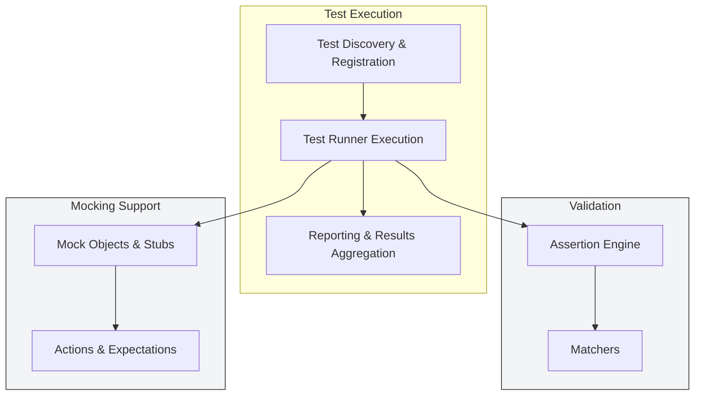

# System Architecture Overview

Explore how the core components of GoogleTest and GoogleMock work in concert to provide a comprehensive C++ testing toolkit. This overview introduces the key building blocks — from test runners to assertion engines, matchers, mocking frameworks, and reporting facilities — and maps out their relationships to clarify the modular yet seamless design.

---

## Understanding the Core Components

GoogleTest and GoogleMock together provide an ecosystem enabling developers to write, run, and maintain robust unit tests and sophisticated mocks. This system architecture overview highlights the main components involved and explains how they collaborate to deliver value.

### Test Runners: Orchestrating Test Execution

At the heart of GoogleTest is the **test runner**, the engine that discovers and runs all tests.

- **Discovery and Registration**: Tests are automatically registered via macros like `TEST()` and `TEST_F()` without extra bookkeeping.
- **Execution Flow**: The test runner creates a fresh test fixture for each test, invokes setup/teardown routines, executes test code, and collects results.
- **Flag Handling**: Initialization happens through `InitGoogleTest()`, parsing command-line flags to tweak behavior such as filtering, shuffling order, or enabling death tests.

This design guarantees isolation between tests, enabling reliable, repeatable runs.

### Assertion Engine: Verifying Expectations

Assertions are the conditions you test in code. The assertion engine powers assertions by:

- Evaluating conditions in macros like `EXPECT_EQ`, `ASSERT_TRUE`, and custom predicates.
- Differentiating between **fatal** failures that halt the current test immediately and **non-fatal** failures that allow continued checking.
- Providing detailed diagnostics with file names, line numbers, and custom failure messages.

This engine is robust, extensible, and provides comprehensive feedback to accelerate debugging.

### Matchers: Precise and Expressive Condition Checks

Matchers are predicates applied in assertions that verify a wide range of conditions with rich expressiveness.

- They simplify comparisons, e.g., `EXPECT_THAT(value, MatchesCondition())`.
- Support basic comparisons, complex logical combinations, and custom user-defined conditions.

Matchers let tests focus on intent instead of boilerplate checks.

### Mocking Facilities: Simulating Dependencies

GoogleMock integrates tightly with GoogleTest to provide mocking capabilities:

- **Mock Objects** represent dependencies with programmable behavior.
- **Actions and Expectations** let you specify what calls are expected, their parameters, and return values.
- Thread-safe and compatible with GoogleTest’s lifecycle.

This subsystem empowers Test-Driven Development (TDD) and fine-grained unit testing of complex, interdependent code.

### Reporting: Comprehensive Test Outcome Feedback

After tests run, the reporting layer aggregates results:

- Formats output summaries with pass/fail stats and detailed failure reports.
- Supports multiple output formats (console, XML, JSON).
- Integrates with CI/CD systems to facilitate automated testing and feedback loops.

This layer ensures users get actionable insights immediately.

---

## How These Components Work Together

This architecture is modular but tightly integrated for a fluent user experience.



**Narrative:**

1. **Test discovery** automatically collects all defined tests.
2. The **test runner** executes each test, orchestrating creation of fixtures and executing user code.
3. Assertions inside tests evaluate conditions using the assertion engine,
   which leverages **matchers** for expressive checks.
4. When tests involve mocked dependencies, the mocking subsystem handles interaction verification.
5. Finally, results flow into the reporting engine for user-friendly output.

---

## Practical Examples of the Architecture in Use

### Writing and Running a Simple Test

A developer writes simple assertions within a test method:

```cpp
TEST(FactorialTest, ComputesFactorials) {
  EXPECT_EQ(Factorial(0), 1);
  EXPECT_EQ(Factorial(5), 120);
}
```

- The test runner registers and executes `ComputesFactorials`.
- Assertions check the outputs.
- On failure, detailed reports surface.

### Mocking a Dependency

To isolate the class under test, the user creates a mock class:

```cpp
class MockMailer : public Mailer {
 public:
  MOCK_METHOD(void, SendEmail, (const std::string&), (override));
};

TEST(NotificationTest, SendsEmailOnAlert) {
  MockMailer mock;
  EXPECT_CALL(mock, SendEmail("admin@example.com"));
  NotificationSystem sys(&mock);
  sys.TriggerAlert();
}
```

- The mocking framework enforces expectations and integrates with test runner execution and assertion reporting.

---

## Best Practices and Tips

- **Use `RUN_ALL_TESTS()` once per program:** This ensures tests are discovered and run with lifecycle managed correctly.
- **Prefer `EXPECT_` macros for non-fatal failures:** It surfaces multiple issues in one run.
- **Group related tests in test suites for clarity and maintainability.**
- **Use fixtures (`TEST_F`) when multiple tests share state or setup.**
- **Use mocks to isolate external dependencies but avoid over-mocking, which can hamper test readability.**

---

## Troubleshooting Common Issues

- **Tests not running or discovered?** Double-check registration macros and ensure `RUN_ALL_TESTS()` is called.
- **Unexpected failures or flaky tests?** Isolate tests, check for shared static/global states.
- **Build/link errors on integration?** Ensure GoogleTest and GoogleMock are properly linked and compiled with compatible compiler flags.

---

## Next Steps

To dive deeper:

- Review the [Core Concepts & Terminology](/overview/architecture-core-concepts/core-terminology) to understand essential GoogleTest terminology.
- Explore the [Architecture Diagram](/overview/architecture-core-concepts/architecture-diagram) for a visual system architecture.
- Begin practical use by following the [GoogleTest Primer](/overview/introduction-value/what-is-googletest) and learning to write your first tests.


---

*For detailed compiler and build system integration, refer to the [GoogleTest CMake build instructions](https://github.com/google/googletest/blob/main/googletest/README.md) and [pkg-config usage guide](../../docs/pkgconfig.md).*