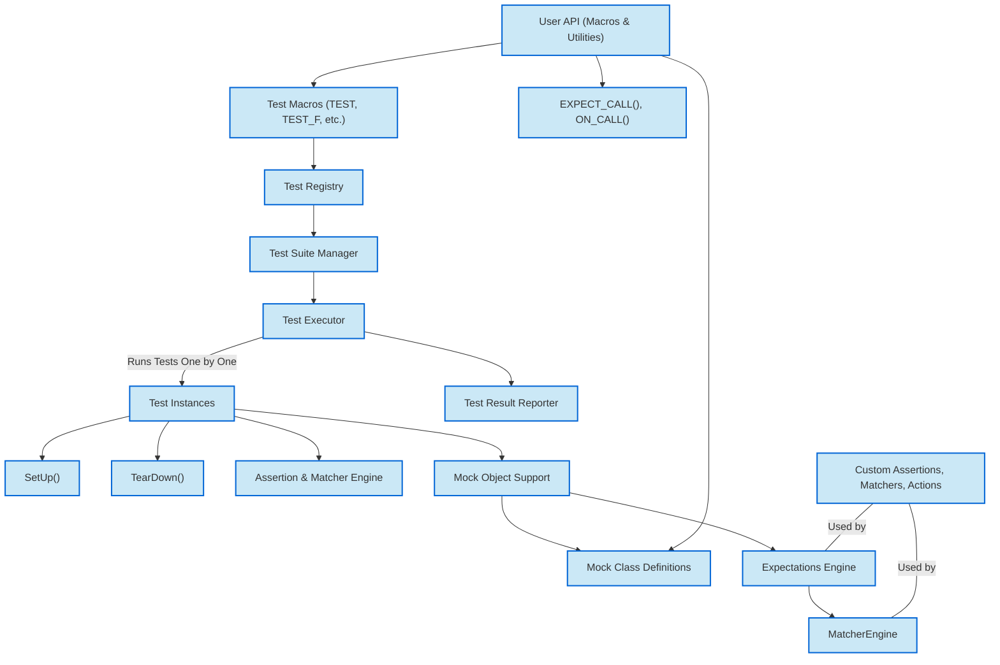

# System Architecture Overview

## Understanding the Core Components of GoogleTest & GoogleMock

The System Architecture Overview sheds light on how GoogleTest and GoogleMock function cohesively to empower developers to write, execute, and verify tests effectively. This overview helps you build mental models of the framework’s components, user APIs, and interaction patterns, orienting you toward a smooth test-writing experience.

---

## What This Page Covers

This documentation focuses on the architectural layout of GoogleTest and GoogleMock—not on detailed usage or API specifics. It explains how key components work together during test discovery, execution, mocking, assertion, and reporting. Through a clear flow and a visual Mermaid diagram of their relationships, you will understand how tests operate internally and how the framework can be extended.

## Architectural Highlights

- **Test Discovery & Registration:** Automatic detection and registration of tests from `TEST()`, `TEST_F()`, and related macros.
- **Execution Engine:** Runs each test independently, enforcing lifecycle hooks (`SetUp()`, `TearDown()`), and manages test suites.
- **Assertion & Matcher Engine:** Supports expressive assertions and matchers to verify test results with detailed failure reporting.
- **Mock Object Support (GoogleMock):** Provides utilities to define mock classes, set expectations, and verify interactions.
- **User API Layer:** The surface you interact with, including macros and utility functions.
- **Extensibility Points:** Areas designed for custom assertions, matchers, behaviors, and mock adaptations.

## How the System Works Together

At a high level, when you write tests, the framework takes responsibility from recognizing your test definitions through macros, executing them individually, verifying results through assertions and expectations on mocks, and finally reporting successes or failures in a comprehensible manner. As your tests grow complex, the architecture supports advanced features like parameterized tests, test fixtures, ordered and unordered expectations, and asynchronous test helpers.

## Component Relationship Diagram

## User Journey Through the Architecture

1. **Define Tests:** You create test cases using macros like `TEST()` or `TEST_F()`. These macros automatically register your test with the system test registry.

2. **Run Tests:** When `RUN_ALL_TESTS()` is called, the test suite manager retrieves all registered tests.

3. **Test Execution:** Each test instance is executed in isolation:
    - `SetUp()` prepares the environment.
    - Your test body runs, invoking assertions and possibly interacting with mocks.
    - `TearDown()` cleans up.

4. **Assertions & Matching:** Assertions invoke the matcher engine to verify expected conditions. Failures are recorded with detailed messages.

5. **Mocking:** When mocks are used, mock classes defined via macros intercept calls:
    - Expectations are set using `EXPECT_CALL()`.
    - The framework tracks calls, arguments, order, and cardinality.
    - Violations are caught instantly.

6. **Reporting:** After all tests run, results are aggregated and reported in console output or other listeners.

## Extensibility and Customization Points

- You can extend the framework by writing **custom assertions** and **matchers** to fit specific domain requirements.
- The mocking subsystem allows defining new **actions** and **matchers**, enabling sophisticated mocking behavior.

## Practical Tips

- Understanding this architecture helps you write more maintainable tests by leveraging test fixtures and mock lifecycles properly.
- Use the user APIs to avoid dealing with internal components directly.
- For complex mocking, refer to the mock object's expectations and actions engine.

## Next Steps

Explore the following documentation to deepen your mastery:

- [GoogleTest Primer](primer.md) — Learn how to write simple tests.
- [gMock for Dummies](gmock_for_dummies.md) — An accessible guide to mocking.
- [Key Features at a Glance](/overview/architecture-core-features/core-features-glance) — Overview of features.

---