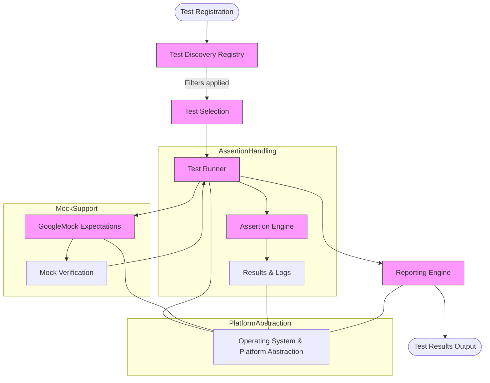

# System Architecture Overview

## Understanding the Core Components of GoogleTest

GoogleTest is a robust C++ testing framework designed with a modular architecture that balances usability, extensibility, and integration capabilities. This page provides a high-level diagram and explanation of GoogleTest's major components, focusing on test runners, assertion engines, platform abstractions, and the mock object support offered by GoogleMock. It clarifies how tests are discovered, executed, and reported, emphasizing the system's data flows and extensibility.

---

## Key Components and Their Roles

### Test Runners
The test runner is the heart of GoogleTest’s execution model. It discovers test cases and individual tests automatically by scanning registered tests, based on user annotations or macros defining the tests. Once identified, it sequentially or selectively executes these tests and orchestrates the reporting of pass/fail outcomes.

### Assertion Engines
Assertions form the verification backbone that GoogleTest provides. The assertion engine executes the verification macros like `EXPECT_EQ` and `ASSERT_TRUE`, capturing successes, failures, and fatal failures. It supports rich, descriptive error messages to aid debugging, and integrates closely with the test runner to manage test flow control based on assertions.

### Platform Abstractions
To maintain portability across diverse environments and operating systems, GoogleTest utilizes platform abstraction layers. These abstract away details like threading, process management, timing, and system calls, enabling the framework to provide a consistent interface and behavior across Windows, Linux, macOS, embedded systems, and more.

### Mock Object Support (GoogleMock)
GoogleMock extends GoogleTest by enabling mock object creation and behavior verification, essential for interaction testing. It provides a declarative syntax to define mock classes and expectations, a powerful mechanism to control method call sequences, argument matching, and default behaviors. This module integrates seamlessly with the core testing framework, allowing tests to validate interactions alongside traditional assertions.

## How Tests Are Discovered, Executed, and Reported

1.  **Discovery:** Test cases and individual tests are registered at runtime, typically using macros such as `TEST()` and `TEST_F()`. GoogleTest internally stores this metadata.

2.  **Filtering:** Users can specify filters (for example, via command-line flags) to select which tests to run.

3.  **Execution:** The test runner invokes each selected test, initializes test fixtures if applicable, and runs the user-defined test code.

4.  **Assertion Monitoring:** During test execution, assertions evaluate expected conditions. Failures are recorded and may halt test execution depending on the assertion type.

5.  **Mock Interaction Verification:** When using GoogleMock, the framework also verifies that mock expectations are met at the end of each test.

6.  **Reporting:** Results are collected and formatted into output streams, including summaries, detailed failure messages, and can be extended to custom reporters for integration with CI systems.

## Data Flows and Extensibility

GoogleTest is designed to flow data cleanly between components:

- Test metadata flows from registration macros to the test runner.
- Execution status and assertion outcomes flow from the assertion engine to the test runner.
- Mock expectations and call verifications flow between GoogleMock and the test lifecycle.

This separation enables:

- **Extensibility:** Users can add new assertion types, integrate custom test listeners, or extend mocking capabilities.
- **Portability:** Platform abstraction layers allow the same test code to run across diverse environments.
- **Maintainability:** Clear boundaries help isolate new functionality or diagnose issues without entangling unrelated parts.

## Visual Architecture Diagram

---

## Practical Example: Running a Test with Mocks

Consider a developer writing a test for a class that depends on an external interface. To isolate this component, they create a mock with GoogleMock, define expectations on method calls, and run the test suite.

During execution:

- The test runner finds the test suite and test case.
- The mock object intercepts calls, checking them against the expectations.
- The assertion engine validates the test's logical conditions.
- GoogleMock reports unexpected calls or unmet expectations as test failures.
- The reporting engine compiles all results into comprehensive logs.

This process ensures that both state and interaction behaviors are verified consistently.

---

## Best Practices & Tips

- Use GoogleMock for verifying **interactions** between components rather than replicating state-based tests.
- Set expectations **before** exercising mock objects to avoid undefined behaviors.
- Prefer `ON_CALL` to define default behaviors without immediate expectations, using `EXPECT_CALL` when you want to enforce invocation.
- Use platform abstraction classes transparently; avoid relying on platform-specific behaviors in tests.
- Take advantage of custom test listeners to integrate reporting into build or CI systems.

---

## Troubleshooting Common Issues

- **Tests Not Discovered:** Ensure tests are registered via proper macros and that the test runner is invoked correctly.
- **Unexpected Mock Failures:** Utilize verbose flags (`--gmock_verbose=info`) to trace mock calls and expectations.
- **Platform Issues:** Confirm that your environment is supported and that platform abstraction layers are correctly implemented.

---

## Next Steps

- To get hands-on, visit the [Getting Started guides](../getting_started/essentials_setup/prerequisites.md) for setup instructions.
- For advanced mocking techniques, explore the [Mocking with GoogleMock](../guides/advanced-testing/mocking-with-googlemock.md).
- Refer to API references in the Mocking and Core Testing API sections for detailed usage patterns.

---

: