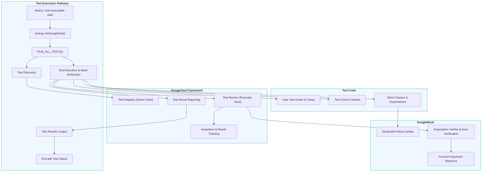

# System Architecture

## Understanding the Core Architecture of GoogleTest and GoogleMock

GoogleTest and GoogleMock together form Google’s powerful C++ testing framework. This page offers a clear, user-focused visualization of the system’s main architectural components, illustrating how your test code interacts with the framework and how GoogleTest and GoogleMock collaborate during test execution.

---

### Why System Architecture Matters

When you write and run tests, understanding the architectural flow lets you harness the framework's full power. You gain insight into:

- How your test code integrates smoothly with the framework
- How GoogleTest provides test discovery, execution, and reporting
- How GoogleMock supplements testing by allowing precise control and verification of mock objects

This understanding helps you troubleshoot, extend, and optimize your tests effectively.

---

### Overview of the Architecture

At a high level, the GoogleTest and GoogleMock architecture can be visualized as follows:

- **Test Code:** Your test cases, fixtures, and mock objects
- **GoogleTest Framework:** Core infrastructure for test discovery, execution control, assertion handling, and reporting
- **GoogleMock Add-on:** Provides mocking capabilities; integrates tightly with GoogleTest to verify interactions
- **Test Execution:** The runtime process that executes tests, applies assertions, enforces expectations, and outputs results

The flow starts when the test program runs and calls into the framework, which discovers tests, executes them (along with any mock expectations), then reports the pass/fail status.

---

### Mermaid Diagram: GoogleTest & GoogleMock System Architecture

---

### Walkthrough of the Components and Workflow

#### 1. Test Code

*This is your code.*

- Define **Test Suites and Test Cases** using `TEST()` or `TEST_F()` macros.
- Implement **Test Fixtures** when multiple tests share setup/teardown logic.
- Create **Mock Objects** using GoogleMock's declarative syntax to simulate dependencies.

This code exercises your implementation and verifies correctness.

#### 2. GoogleTest Framework

*The engine behind your tests.*

- The **Test Registry** auto-discovers all tests registered via macros.
- The **Test Runner** controls the lifecycle: setup, test execution, teardown.
- **Assertions** check conditions; failures update result status.
- The **Report Generator** formats and outputs detailed pass/fail feedback.

#### 3. GoogleMock Add-on

*Extends testing with mocks and expectations.*

- The **Declarative Mock Syntax** lets you define mock classes easily.
- The **Matcher Engine** validates function call arguments against expectations.
- The **Expectation Checker** verifies calls occurred as intended and auto-fails tests on mismatches.

GoogleMock integrates seamlessly, verifying interactions on mock objects during test execution.

#### 4. Test Execution Pathway

*The lifecycle of running tests.*

- Your test program begins with a `main()` function or links to `gtest_main`.
- Call `testing::InitGoogleTest()` to parse flags and initialize.
- Invoke `RUN_ALL_TESTS()` to start test discovery and execution.
- Tests run one by one; mocks are verified automatically.
- Results report to console or custom listeners.
- Exit status reflects overall test success or failure.

---

### Practical Example: What Happens When You Run Tests?

Assume you have a mock class `MockDatabase` and a test suite `UserServiceTest`:

1. `RUN_ALL_TESTS()` triggers discovery — the framework finds `UserServiceTest`.
2. The **Test Runner** creates fixture objects and invokes test functions.
3. Inside a test, you set expectations on `MockDatabase` (e.g., expect `Connect()` called once).
4. Your code under test interacts with `MockDatabase`.
5. GoogleMock verifies expectations as tests run; assertion failures or mock mismatches cause test failures.
6. The framework gathers results, generating a detailed report.
7. The process repeats for each test.

---

### Tips and Best Practices

- Treat **Test Suites** and **Fixtures** as your test organization tools — they map your tests logically.
- Use GoogleMock to **simulate dependencies** you can't or don’t want to instantiate directly.
- Remember **automatic test discovery** lets you add tests without updating test runners.
- Failure in an assertion or mock expectation immediately marks the test as failed but allows other tests to continue.
- Use your knowledge of the architecture to **debug** by inspecting the flow from test code through the framework.

---

### Troubleshooting Common Issues

<AccordionGroup title="Troubleshooting Tips for System Architecture">
<Accordion title="Tests Not Running or Being Discovered">
Make sure your test cases are properly declared with `TEST()`, `TEST_F()`, or `TEST_P()`.
Ensure your executable links against the GoogleTest libraries and calls `RUN_ALL_TESTS()`.
</Accordion>
<Accordion title="Mock Expectations Not Verified">
Verify that GoogleMock is linked correctly and that expectations are set before exercising code.
Remember mock objects auto-verify expectations at test teardown.
</Accordion>
<Accordion title="Test Execution Stalls or Deadlocks in Multi-threading">
GoogleTest is thread-safe if pthreads are available. For multi-threaded tests, carefully manage synchronization to avoid deadlocks.
</Accordion>
</AccordionGroup>

---

### Next Steps

With this architectural understanding, you are prepared to:

- Dive into [Feature Overview](/overview/architecture-features-integration/feature-overview) to see the framework capabilities.
- Begin integration using [Integrating with Your Build & CI](/overview/architecture-features-integration/integration-scenarios).
- Explore [Core Concepts & Terminology](/overview/intro-core-concepts/core-concepts-terminology) to master key Googletest terms.

This foundation empowers you to write robust, maintainable, and efficient C++ tests with GoogleTest and GoogleMock.

---

*End of System Architecture Documentation*