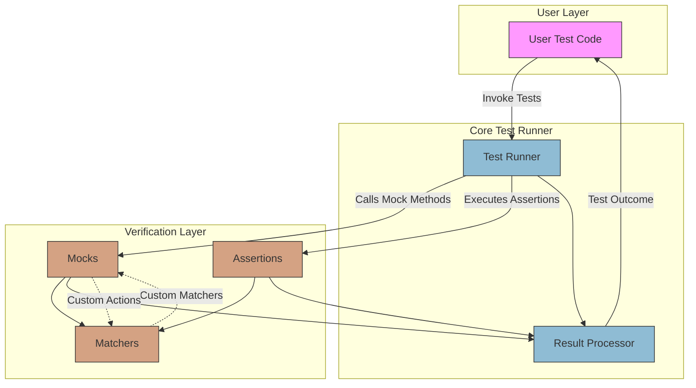

# System Architecture Overview

Explore the foundational structure and primary data flows that power GoogleTest and GoogleMock. This page provides a concise map of the core components — from how your user test code interacts with the test runner, to how assertions, matchers, and mocks are processed and verified.

Understanding this architecture prepares you to write effective tests, leverage extensibility, and troubleshoot with insight.

---

## What You'll See Here

This page presents a visual and conceptual overview of the key system components involved during test execution. It reveals:

- The flow of test cases from user-written code through the test runner
- How assertions, matchers, and mocks collaborate to validate behavior
- The points where extensions and customizations can integrate

At its heart, this overview clarifies the interactions between your code, the testing framework, and the underlying result processing mechanisms.

---

## High-Level Architecture Explained

At a high level, GoogleTest and GoogleMock operate through a well-orchestrated sequence of components working together:

1. **User Test Code:** Your test functions and test fixtures define test cases and expectations.
2. **Test Runner:** Orchestrates test lifecycle — setup, execution, and teardown.
3. **Assertions & Matchers:** Evaluate conditions and parameter matches within tests.
4. **Mocks:** Simulate complex dependencies, verifying interactions as specified.
5. **Result Processor:** Collects and communicates test outcomes.

Each component plays a vital role in ensuring your tests are expressive, reliable, and maintainable.

---

## Core Components and Their Roles

- **Test Runner:**
  - Controls the execution of all registered tests.
  - Manages test suites, test cases, and their state.
  - Reports results through listeners.

- **User Test Code:**
  - Contains the actual tests you create.
  - Defines expectations for mocks and assertions.
  - Calls GoogleTest and GoogleMock APIs.

- **Assertions:**
  - Check state and values within tests.
  - Use matchers to specify flexible validation rules.

- **Matchers:**
  - Facilitate detailed argument checking for mocks.
  - Provide expressive conditions (e.g., ranges, patterns).

- **Mocks:**
  - Replace real objects with controllable test doubles.
  - Capture call counts, argument patterns, and ordering.

- **Extension Points:**
  - Allow custom matchers, actions, and behaviors.
  - Enable fine-grained control over mock interaction.

---

## Visual Summary: System Data Flow

---

## How This Fits Into GoogleTest Documentation

This overview complements other documentation focused on detailed user workflows, core APIs, and mocking techniques:

- Visit **[Product Value & Benefits](/overview/product-intro-concepts/product-value-prop)** for why GoogleTest/Mock matters.
- Review **[Core Concepts & Testing Terminology](/overview/product-intro-concepts/core-concepts-terminology)** to understand testing basics.
- Dive into **[Writing Your First Unit Test](/guides/core-workflows/writing-unit-tests)** to start hands-on.
- Explore **[Mocking for Dummies](/docs/gmock_for_dummies.md)** for practical mock creation basics.

This page offers the architectural map that connects those practical guides with the underlying mechanics.

---

## Practical Tips for Users

- Think of the test runner as your test conductor, coordinating when and how your tests execute without you needing to manage that explicitly.
- Use mocks to isolate your unit tests and concentrate on the logic under test instead of external dependencies.
- Leverage matchers for expressive assertions beyond simple equality, making your intentions clearer and tests more maintainable.
- Customize behaviors through extension points only after mastering the standard APIs to keep test code simple and comprehensible.

---

## Troubleshooting the System Architecture

If tests fail unexpectedly or mock expectations are not verified:

- Ensure your test cases have the correct lifecycle (registered and run by the test runner).
- Validate that your mocks and expectations are set before exercising the code.
- Understand how matchers influence mock method verification—misused or overly strict matchers may cause failures.
- Confirm your environment supports necessary features like stack trace generation for rich failure reporting.

Understanding this architecture shines light on where issues may occur.

---

## Next Steps

To implement tests effectively, proceed to:

- **Writing and Running Your First Unit Test:** Learn how to author and execute tests.
- **Using Assertions Effectively:** Understand how to verify conditions.
- **Getting Started with Mocking:** Begin mocking dependencies.

Visit these sections under the [Guides tab](../../guides/core-workflows/) for hands-on examples and deep dives.

---

For detailed API references and advanced topics, explore the [API Reference tab](../../api-reference/) and [Guides](../../guides/).

---

## Summary
This page demystifies the core architecture of GoogleTest and GoogleMock by detailing how your user test code interacts with the test runner and how assertions, matchers, and mocks collaborate and feed results into the result processor. The included Mermaid diagram offers a clear, concise visualization of these relationships, helping you build a mental model for effective testing and debugging.

---