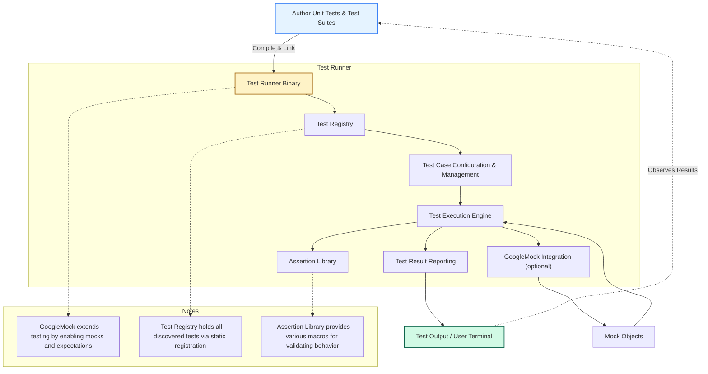

# Architecture Overview

Welcome to the Architecture Overview of GoogleTest, your comprehensive guide to understanding the core components and data flow within Google's C++ testing framework. This page visualizes the structure from test authoring, through execution, to result verification, including integration points with GoogleMock for mocking dependencies.

---

## Visualizing GoogleTest's Architecture

GoogleTest simplifies your unit testing efforts by orchestrating a set of components that collaborate seamlessly. Understanding these components will empower you to write, execute, and maintain tests effectively.

## Overview of Components

### Authoring Unit Tests & Test Suites
This is where your journey begins. You write test cases and organize them into suites, each validating a fragment of your C++ codebase. The goal here is to specify _what_ needs testing, not _how_ it will run.

### Test Runner Binary
Your tests are compiled into a single executable that encapsulates the GoogleTest framework runtime. Running this executable triggers the test discovery and execution process.

### Test Registry
A global repository that keeps track of all registered tests. Each test is registered statically upon program initialization, enabling automatic discovery.

### Test Case Configuration & Management
This module manages which tests will run based on filters, sharding, or other run-configuration. It ensures you can finely control test execution.

### Test Execution Engine
The heart of GoogleTest that runs each test, collects assertion results, manages test lifecycle hooks (SetUp, TearDown), and integrates with GoogleMock when mocks are used.

### Assertion Library
A rich collection of assertion macros and helpers empower you to verify conditions, ranging from simple checks to complex matcher-based validations.

### GoogleMock Integration (optional)
When mocks are required, GoogleMock seamlessly hooks into the test execution engine to provide facilities for creating mock objects, setting expectations, and custom behaviors.

### Mock Objects
Representations of dependencies or collaborators, these objects enable interaction-based testing, validating that your code calls external components correctly.

### Test Result Reporting
Final test status, logs, and error messages are reported here, producing either textual output, XML reports, or integration with continuous integration tools.

### User Terminal
Displays test outcomes to the developer, including pass/fail status, error messages, and optionally stack traces and call information.

---

## Why This Architecture Matters to You

Knowing the high-level architecture helps you understand GoogleTest’s workflow and how your tests are processed. It also clarifies where mocks fit into the testing lifecycle and guides troubleshooting when unexpected behavior arises.

For example, if your mock expectations are not being verified, knowing that verification happens upon mock object destruction in the test execution stage can help you ensure your mock lives through the test scope.

---

## Practical Tips

- **Registering Tests:** Simply use `TEST()` and `TEST_F()` macros; GoogleTest handles registration automatically.

- **Customizing Test Runs:** Use command line options to select tests with filters, or to run tests in parallel via sharding.

- **Mock Usage:** When using GoogleMock, instantiate mocks within your test fixture so their lifespan aligns with test execution.

- **Assertion Best Practices:** Use rich matcher macros for clear expectations; avoid over-specifying to keep tests flexible.

- **Debugging Test Failures:** Use the `--gmock_verbose=info` flag to gain detailed insights on mock calls and failures.

---

## Getting Started With GoogleTest and GoogleMock

For hands-on instructions on writing and executing your first test, see [Getting Started: Writing Your First Test](https://google.github.io/googletest/guides/core-workflows/getting-started.html).

To learn how to create and use mocks effectively, explore [Using and Creating Mock Objects](https://google.github.io/googletest/guides/mocking-and-advanced-testing/mock-objects.html) and [Customizing Mock Behavior with Matchers and Actions](https://google.github.io/googletest/guides/mocking-and-advanced-testing/using-matchers-and-actions.html).

---

## Troubleshooting

If your tests behave unexpectedly:

- Verify that mocks are not destroyed prematurely by keeping them alive through the test scope.

- Use `--gmock_verbose=info` to examine mock call interactions and expectation matches.

- Check test registry and filter settings if some tests are not running.

- Ensure that your mock classes are correctly set up with `MOCK_METHOD` macros in their public sections.

---

<Info>
For detailed technical reference on mocking capabilities and usage, refer to the [Mocking Reference](https://google.github.io/googletest/reference/mocking.html).
</Info>

---

## Summary

This architecture overview lays out the essential components of GoogleTest, visualizes interactions across these components, and places mocks within the test execution pipeline. Understanding this big picture is critical for effective test design, mock usage, and troubleshooting.

---

*Explore more on GoogleTest and GoogleMock in related documentation pages within this site for deeper dives on specific topics.*
