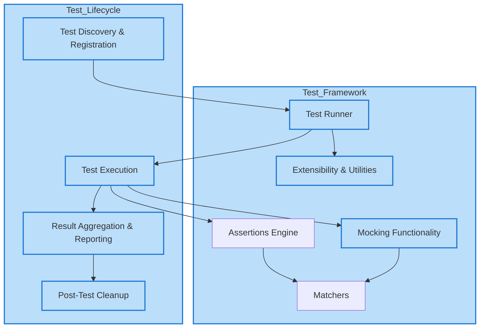

# Architecture Overview

## Introduction

GoogleTest is a comprehensive C++ testing framework designed to provide robust, extensible, and easy-to-use facilities for writing and running tests. Its architecture centers around several core components that work seamlessly together, enabling developers to write reliable tests with clear expectations and detailed diagnostics.

This page offers a high-level overview of the architecture of GoogleTest, detailing its key components, their interactions, and how the framework achieves its goals of flexibility, performance, and ease of use.

---

## Core Architecture Components

### Test Runner

The Test Runner serves as the heart of GoogleTest, managing the discovery, execution, and reporting of tests.

- **Responsibilities:**
  - Gathering all test cases and test suites registered by the user.
  - Executing tests in an isolated and controlled manner.
  - Managing test lifecycles, including setup, teardown, and fixture management.
  - Aggregating and reporting test results in various formats.

### Assertions Engine

Assertions are fundamental to verifying test outcomes.

- **Supported Assertions:**
  - Standard assertions like `EXPECT_EQ`, `ASSERT_TRUE`, etc.
  - Parameterized and custom assertions.
  - Death tests for verifying expected failures.

- **Functionality:**
  - Provides detailed failure messages, including file and line number.
  - Supports non-fatal (`EXPECT_*`) and fatal (`ASSERT_*`) assertions.

### Matchers

GoogleTest integrates with GoogleMock's rich matcher framework to refine expectations on values.

- **Purpose:**
  - Allow expressive, flexible matching predicates for arguments and values.
  - Support a wide variety of built-in matchers and user-defined custom matchers.

- **Usage context:**
  - Used in assertions (`EXPECT_THAT`), mock expectations, and parameter validators.

### Mocking Functionality

GoogleMock extends GoogleTest by providing powerful mocking capabilities to support interaction-based testing.

- **Key Components:**
  - Mock classes and mock methods automatically generated from specified interfaces.
  - Expectations and actions configured via intuitive syntax (`EXPECT_CALL`, `ON_CALL`).
  - Cardinality controls to specify call counts.
  - Sequencing constructs for ordering expectations (`InSequence`, `After`).
  - Strictness modes to handle uninteresting calls (`NiceMock`, `NaggyMock`, `StrictMock`).

- **Verification:**
  - Automatic checks verify that all expectations are met upon mock destruction.
  - Supports explicit verification and clearing of expectations.

### Extensibility and Utilities

GoogleTest and GoogleMock provide extension points and utility classes for advanced usage:

- Custom actions and matchers.
- Parameterized tests and fixtures.
- Test event listeners and reporters for custom output.
- Thread safety mechanisms allow safe multi-threaded test execution.

---

## High-Level Interaction Flow

1. **Test Discovery and Registration:**
   - Tests register themselves with GoogleTest during static initialization.
   - Test cases and suites are collected for execution.

2. **Test Execution:**
   - The Test Runner executes tests sequentially or in parallel.
   - Setup and teardown functions (fixtures) are invoked.

3. **Assertion and Mocking Checks:**
   - Assertions verify expected values and states.
   - Mock objects verify method call sequences, arguments, and counts.

4. **Result Aggregation and Reporting:**
   - Outcomes are recorded, including passes, failures, and errors.
   - Detailed diagnostics assist in identifying issues.

5. **Post-Test Cleanup:**
   - Mocks verify expectations on destruction.
   - Resources are cleaned up.

---

## Architecture Diagram

---

## Design Principles

- **Modularity:** Components are designed with clear responsibilities, enabling easy extension and replacement.
- **Ease of Use:** Provides intuitive macros and APIs that allow developers to write expressive tests with minimal boilerplate.
- **Performance:** Minimal overhead during test execution, with efficient management of test states.
- **Thread Safety:** Supports concurrent execution of tests with proper synchronization.
- **Extensibility:** Enables users to define custom matchers, actions, and event listeners.
- **Robustness:** Provides detailed diagnostics and automatic verification to catch errors early.

---

## Practical Tips

- **Use GoogleTest’s rich assertion macros** to write clear test validations.
- **Leverage GoogleMock** for interaction-based testing to precisely specify and verify method calls and behaviors.
- **Apply sequences and ordering constraints** to enforce call order expectations.
- **Choose appropriate strictness modes** (`NiceMock`, `NaggyMock`, `StrictMock`) depending on your test needs.
- **Use custom matchers and actions** to tailor behavior and verification to your domain.
- **Ensure virtual destructors** in interfaces intended for mocking to prevent resource leaks.

---

## Troubleshooting

- Be mindful when setting expectations; ensure they are declared before the test code executes to avoid undefined behavior.
- Unexpected or uninteresting call warnings indicate you might need to adjust `EXPECT_CALL` or use `NiceMock` to suppress benign warnings.
- Use the `--gmock_verbose` flag for detailed outputs helpful during debugging.
- Verify mock object lifetime to avoid leaked mocks which can cause skipped verifications.

---

## Summary

GoogleTest's architecture combines a robust test runner, flexible assertion framework, powerful matcher expressions, and comprehensive mocking capabilities under a modular, extensible model. Its integration with GoogleMock empowers C++ developers to write both state-based and interaction-based tests effectively, facilitating improved code quality and design.

---

## Next Steps

To deepen your understanding and practical skills:

- Explore the [Writing Your First Test](../guides/core-testing-workflows/writing-basic-tests) guide.
- Learn about mocks in the [Getting Started with Mocks](../guides/mocking-and-advanced-scenarios/mocking-basics) guide.
- Review detailed usage of expectations and actions in [Specifying Expectations](../guides/mocking-and-advanced-scenarios/setup-expectations-actions).

For detailed API references and examples, see:

- [Mocking Reference](../docs/reference/mocking.md)
- [gMock Cookbook](../docs/gmock_cook_book.md)
- [gMock Cheat Sheet](../docs/gmock_cheat_sheet.md)