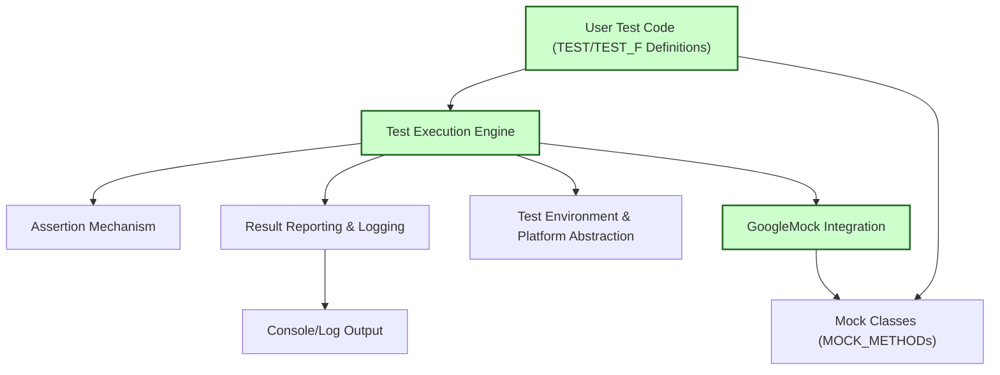

# Framework Architecture

## Understanding GoogleTest: An Inside Look

GoogleTest isn’t just a framework you use at the surface level—it’s designed with a robust architecture that ensures your C++ tests are effective, efficient, and scalable. This page demystifies how GoogleTest is constructed under the hood, allowing you to grasp the relationships between its core modules, the gateway points that start tests, and its deep integration with GoogleMock.

### Why Knowing the Architecture Matters

By seeing the internal architecture, you understand:

- **How your tests flow through the framework:** From writing test cases to executing them and reporting results.
- **The roles of different components:** What modules do, including how mocks fit in.
- **Why GoogleTest behaves the way it does:** This aids in troubleshooting, optimizing tests, and integrating GoogleTest into larger systems.

---

## Key Components and Their Relationships

At its core, GoogleTest is composed of several focused modules working together seamlessly:

### 1. User Test Code

Your C++ test definitions — using macros like `TEST()` or `TEST_F()` — serve as the entry points. These define individual tests or test suites.

### 2. Test Execution Engine

This is the core orchestrator that discovers defined tests, runs them, and manages their lifecycle, including setup, teardown, and assertion checking.

### 3. Assertion Mechanism

Integrated deeply into the test engine, this module evaluates all assertions like `EXPECT_EQ`, reporting failures and successes.

### 4. GoogleMock Integration

GoogleTest tightly integrates with GoogleMock (gMock) to allow mocking and verification of method calls on fake objects. This enables interaction-based testing on top of state-based testing.

### 5. Result Reporting and Logging

After tests execute, this module formats and reports results clearly, aggregating failures, success rates, and other critical information.

### 6. Test Environment & Platform Abstraction

GoogleTest abstracts platform differences ensuring portability across Linux, Windows, and Mac OS, even when dealing with threading, exceptions, or file system access.

---

## From Test Definition to Result: The Flow

### Writing the Test

You start by writing tests using `TEST()` or `TEST_F()` macros, which define test suites and test cases.

### Registration & Discovery

Upon compilation and initialization, GoogleTest registers all test cases via static registries. The test runner engine then discovers these tests at runtime.

### Running the Test

The Test Execution Engine manages each test's lifecycle:
- Constructs the test fixture (if `TEST_F`)
- Calls `SetUp()`
- Runs the test body
- Checks all assertions
- Calls `TearDown()`
- Destroys the test fixture

### Mock Handling

If mocks are used, GoogleMock seamlessly intercepts calls and enforces expectations.

### Reporting

Results of each test (pass/fail, assertion details) are accumulated, formatted, and outputted by the result reporting system.

---

## Integration with GoogleMock

GoogleMock is packaged inside GoogleTest and acts as an extension to support interaction testing.

- **Core Integration**: GoogleMock provides macros like `MOCK_METHOD` that generate mock classes compatible with the test framework.
- **Verification & Expectations**: GoogleMock expectations automatically tie into GoogleTest failures.
- **Flow**: During test execution, mocked method calls are monitored, intercepted, and their behavior dictated by expectations.

This tight integration allows developers to blend state- and interaction-based testing naturally.

---

## Practical Scenario: End-to-End Test Flow

Imagine you write a mock class for a `Database` interface and a test that uses it:

1. You define `MockDatabase` with `MOCK_METHOD`s.
2. In your test, you use `EXPECT_CALL` to set expectations on the mock.
3. Your test code triggers operations on `MockDatabase`.
4. As your test runs, GoogleMock intercepts calls, checks against expectations.
5. GoogleTest runs the test lifecycle, evaluates assertions.
6. If any unexpected calls or assertion failures occur, GoogleTest reports them immediately.
7. Test results are formatted and output.

---

## Tips to Navigate the Framework Architecture

- **Focus on User Intent**: Remember, the flow is about what your test code wants to achieve — writing, executing, verifying, reporting.
- **Follow the Call Stack**: Knowing which component handles what helps identify why tests succeed/fail.
- **Leverage the Integration**: Using GoogleMock inside GoogleTest is more than syntax sugar — it's a robust contract processor that integrates expectation verification at the right phase.

---

## Troubleshooting Common Failures

- **Test Discovery Issues**: Make sure your tests are properly registered (tests disappear if registration statics are optimized away).
- **Mock Expectations Not Met**: Check that `EXPECT_CALL`s are set before the tested code runs.
- **Failure Reporting Not Clear**: Use higher verbosity flags `--gmock_verbose=info` for detailed trace.

---

## Get Started with Architecture in Mind

Once you understand the overall architecture and test flow, you can dive deeper into GoogleTest’s rich feature set and GoogleMock’s mocking strategies. Begin by writing simple tests and use mocks to simulate interactions, incrementally expanding as you master the framework.

**Next Steps:**
- Explore the [Getting Started Guides](https://github.com/google/googletest/tree/main/docs/gmock_for_dummies.md) for hands-on usage.
- Refer to the [Mocking Cookbook](https://github.com/google/googletest/tree/main/docs/gmock_cook_book.md) to master mocking patterns.
- Learn how tests execute internally with the [Test Lifecycle Documentation](https://github.com/google/googletest/tree/main/concepts/core-architecture/test-lifecycle.md).

---

## Summary

This page offers a foundational understanding of GoogleTest’s internal structure and how its components orchestrate the journey from test creation to result reporting. Knowing this will empower you to write better tests, debug effectively, and harness mocking fully.

---