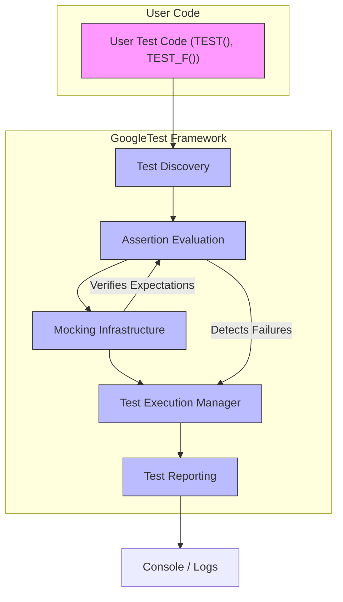

# System Architecture (with Diagram)

## Understanding GoogleTest's Architecture

GoogleTest is a powerful C++ testing framework designed to help developers write, organize, and execute tests efficiently. This page provides a high-level overview of GoogleTest's architecture, focusing on how your test code interacts with the framework's core mechanisms. We cover key elements such as test discovery, assertion handling, mocking infrastructure, and how these components integrate to provide a seamless test execution and reporting experience.

By understanding this architecture, you will better appreciate how GoogleTest processes your tests, which will help you write more effective and maintainable test suites.

---

## Core Architecture Components

GoogleTest’s architecture can be understood as a workflow that starts with the tests you write and ends with detailed test execution and reporting. The system is organized around the following core components:

### 1. Test Discovery

GoogleTest automatically discovers tests within your codebase. It identifies test cases and test methods based on macros such as `TEST()` and `TEST_F()`. This process eliminates the need to manually register tests, enabling a smooth and scalable experience.

### 2. Assertion Mechanism

At the heart of GoogleTest is a rich set of assertion macros (`EXPECT_`, `ASSERT_`) that verify expected outcomes. These assertions transform your test logic into pass/fail results, tracking failures and continuing or aborting test execution as needed.

### 3. Mocking Infrastructure

Integrated closely with the GoogleMock framework (gMock), GoogleTest provides an expressive and robust mocking system. This infrastructure allows you to simulate and verify interactions with dependencies using mock classes, expectations, and matchers.

### 4. Test Execution Framework

GoogleTest manages the lifecycle of test execution, from initialization to teardown. This includes setting up test fixtures, running individual test methods, and handling exceptions or failures gracefully.

### 5. Reporting and Output

Once tests run, GoogleTest summarizes results with detailed output. It shows successes, failures, and provides diagnostic messages including stack traces and argument values for failed assertions or mock expectations.

---

## Workflow Visualization

The following Mermaid diagram illustrates the typical path from your user-written test code to the final reporting.

---

## Detailed Component Overview

### Test Discovery
- **What it does:** Automatically finds test definitions in compiled test binaries.
- **Why it matters:** Eliminates tedious test registration, scales effortlessly.
- **How it helps you:** Write tests naturally with macros; the system manages inclusion.

### Assertion Mechanism
- **Core functionality:** Validates conditions and records results.
- **User impact:** Allows tests to express expectations clearly.
- **Features:** Supports fatal assertions (`ASSERT_`) that abort tests and non-fatal (`EXPECT_`) that continue execution.

### Mocking Infrastructure
- **Integration:** Powered by GoogleMock (gMock).
- **Capabilities:** Define mock classes, set expectations with `EXPECT_CALL`, specify behaviors, and verify interactions.
- **User benefits:** Isolate units under test, simulate external dependencies, verify usage patterns.

### Test Execution Framework
- **Responsibilities:** Manages setup and teardown; executes each test method individually.
- **User experience:** Provides test fixtures to share state; robust lifecycle management to avoid side effects.

### Reporting and Output
- **Details:** Presents clear pass/fail summaries.
- **Diagnostic help:** Provides stack traces, detailed match failure explanations, and mock call logs when enabled.
- **Customization:** Verbosity levels and output formats can be configured.

---

## Example Scenario: From Test to Reporting

Imagine you’ve written a test using `TEST_F` and applied some `EXPECT_CALL` mocks and assertions:

1. GoogleTest's **Test Discovery** detects the new test case.
2. When run, the **Test Execution Framework** sets up any fixtures and runs your test method.
3. During execution, your **Assertions** check conditions and mock **Expectations** verify interaction contracts.
4. If an assertion fails or an unexpected mock call occurs, GoogleTest records failure information but continues with non-fatal failures.
5. After all tests complete, the **Reporting** module outputs a summary including any failures and diagnostic information.

This workflow ensures your tests are automatically managed, failures are clearly communicated, and mocks behave as expected.

---

## Practical Tips

- **Leverage Test Fixtures:** Use `TEST_F` for shared setup and teardown across tests.
- **Use Mock Classes Wisely:** Define mocks using `MOCK_METHOD` macros to gain precise control over dependencies.
- **Set Clear Expectations:** Use `EXPECT_CALL` with appropriate matchers and cardinalities to specify required interactions.
- **Handle Assertion Failures:** Use `ASSERT_` for critical checks that require aborting a test, and `EXPECT_` where continuing makes sense.
- **Control Verbosity for Debugging:** Run tests with `--gmock_verbose=info` to diagnose mock call matching issues.

---

## References & Next Steps

For a deeper dive into individual components and practical guidance:

- [What is GoogleTest?](/overview/product-intro-core-concepts/what-is-googletest) — Introduction to GoogleTest’s purpose and architecture.
- [Introduction to Mocking with GoogleMock](/guides/mocking-advanced-testing/intro-mocking) — Learn to leverage mocks effectively.
- [Feature Overview](/overview/architecture-features-integration/feature-quick-overview) — Explore all core GoogleTest capabilities.
- [Assertions API](/api-reference/core-apis/test-assertions) — Comprehensive details on assertions.

Understanding the architecture on this page will provide the foundation to master GoogleTest and GoogleMock, enabling you to write robust, maintainable C++ tests and mock objects.

---

### Source Code Reference

<Source url="https://github.com/google/googletest" branch="main" paths={[{path: "googlemock/include/gmock/gmock.h", range: "1-102"}, {path: "docs/reference/mocking.md", range: "1-500"}]} />