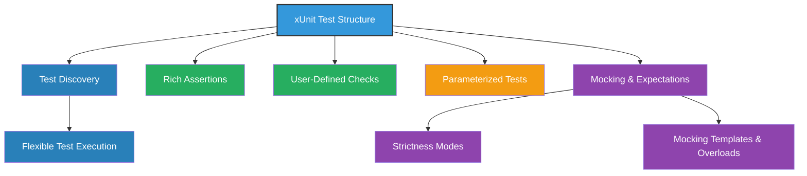

# Feature Highlights

Quickly scan the main features that distinguish GoogleTest: xUnit structure, test discovery, rich assertions, user-defined checks, advanced mocking, parameterized testing, and multiple test execution strategies. Understand at a glance what makes GoogleTest powerful and adaptable.

---

## Introduction

GoogleTest is a robust C++ testing framework that empowers developers to write expressive and maintainable unit tests with ease. This page highlights the core features that make GoogleTest stand out as a powerful tool for testing modern C++ code.

Whether you are new to GoogleTest or evaluating its capabilities, these feature highlights will provide a concise overview of what to expect and why they matter in your testing workflow.

---

## Key Features at a Glance

### 1. xUnit-Based Test Structure

GoogleTest adopts the familiar xUnit testing architecture, enabling you to organize tests into test cases (test suites) and individual test functions. This structure promotes clarity and reusability in your test code.

- Write clear, isolated test cases mapped to logical units of functionality.
- Easily group related tests and shared setup or teardown logic.

### 2. Automatic Test Discovery

No tedious registration steps needed. GoogleTest automatically discovers test cases and test functions in your codebase, reducing boilerplate and setup time.

- Run all tests or a subset with simple command-line options.
- Supports filtering tests by name for targeted execution.

### 3. Rich Set of Assertions and Matchers

Assert the correctness of your code with extensive built-in assertions and matchers:

- Basic assertions: equality, inequality, pointer validity.
- Arithmetic and relational assertions: less/greater than, near equality.
- String comparisons and pattern matching.
- Container element checks.
- Support for expressive predicate and matcher compositions.

Example:
```cpp
EXPECT_EQ(expected, actual);
EXPECT_THAT(container, ::testing::ElementsAre(1, 2, 3));
```

### 4. User-Defined Checks and Custom Assertions

Extend GoogleTest's assertion capabilities with custom predicates and matchers, enabling tailored validation logic specific to your domain.

- Write reusable custom checks for complex data types.
- Enhance test readability with clear failure messages.

### 5. Advanced Mocking with GoogleMock Integration

Integrated with GoogleMock, GoogleTest offers advanced mocking features:

- Define mocks with precise control over method behavior.
- Set expectations on call counts, argument matching, and call order.
- Support for strict, nice, and naggy mock behaviors to fine-tune test sensitivity.
- Utilities for mocking templates, overloaded, and const methods.

Example:
```cpp
class MockFoo : public Foo {
 public:
  MOCK_METHOD(int, Bar, (int arg), (override));
};
```

### 6. Parameterized Tests

Write tests that run against multiple inputs without duplication:

- Define parameterized test fixtures.
- Provide input sets for systematic coverage.
- Facilitate data-driven testing and reduce code repetition.

### 7. Flexible Test Execution Strategies

GoogleTest supports various ways to run tests and control execution:

- Run tests individually, by test case, or by patterns.
- Control output format: plain text, XML, JSON.
- Integrate smoothly with continuous integration systems.

---

## Why These Features Matter

GoogleTest’s features collectively allow you to achieve:

- **Reliable Testing**: Catch regressions and bugs with precise assertions and expectation control.
- **Readable Tests**: Clear structure and expressive assertions make tests easier to understand and maintain.
- **Faster Development**: Automatic test discovery and parameterization slash setup and duplication time.
- **Robust Mocking**: Validate interactions and dependencies accurately with advanced mocking support.
- **Adaptability**: Scale from simple unit tests to complex integrated scenarios.

### Example Scenario

Imagine verifying a library’s string processing module:

- Use **xUnit structure** to organize tests by function groups.
- Write **parameterized tests** to cover edge cases.
- Employ **GoogleMock** to mock dependencies like file I/O.
- Leverage **rich assertions** to validate outputs and internal state precisely.

Together, these features reduce test fragility and improve confidence in your code.

---

## Getting Started Preview

Begin your GoogleTest journey with simple installation and a "Hello World" test:

- Include GoogleTest headers.
- Define test cases using the TEST macro.
- Run tests with the built-in runner.

```cpp
#include <gtest/gtest.h>

TEST(SampleTest, BasicAssertions) {
  EXPECT_EQ(1 + 1, 2);
}

int main(int argc, char **argv) {
  ::testing::InitGoogleTest(&argc, argv);
  return RUN_ALL_TESTS();
}
```

Visit the **[Getting Started guide](https://google.github.io/googletest/getting-started.html)** for comprehensive instructions.

---

## Explore Further

To harness the full power of GoogleTest, explore detailed documentation on:

- [Writing Your First Test](../guides/core-testing-workflows/writing-basic-tests)
- [Using Mocks with GoogleMock](../guides/mocking-and-advanced-scenarios/mocking-basics)
- [Assertion Styles and Best Practices](../guides/core-testing-workflows/assertions-best-practices)
- [Parameterized Testing](../guides/core-testing-workflows/parameterized-tests)
- [Mock Strictness and Behavior Control](../concepts/scalability-and-extensibility/strictness-modes)

---

<Callout title="Tip">
Start simple: begin with basic tests, then progressively add mocks and parameterization as your needs grow.
</Callout>

<Callout title="Note">
GoogleTest comes bundled with GoogleMock for a seamless mocking experience.
</Callout>

---

## References

- [GoogleTest GitHub Repository](https://github.com/google/googletest)
- [GoogleMock Cookbook](https://google.github.io/googletest/gmock_cook_book.html)
- [GoogleMock Mocking Reference](../docs/reference/mocking.md)
- [GoogleTest Overview](../overview/product-intro-core-concepts/what-is-googletest)

---

Understanding these feature highlights positions you to make the most of GoogleTest’s capabilities, ensuring your C++ code is robust, reliable, and thoroughly tested.


---

### Summary Diagram of Feature Relationships


