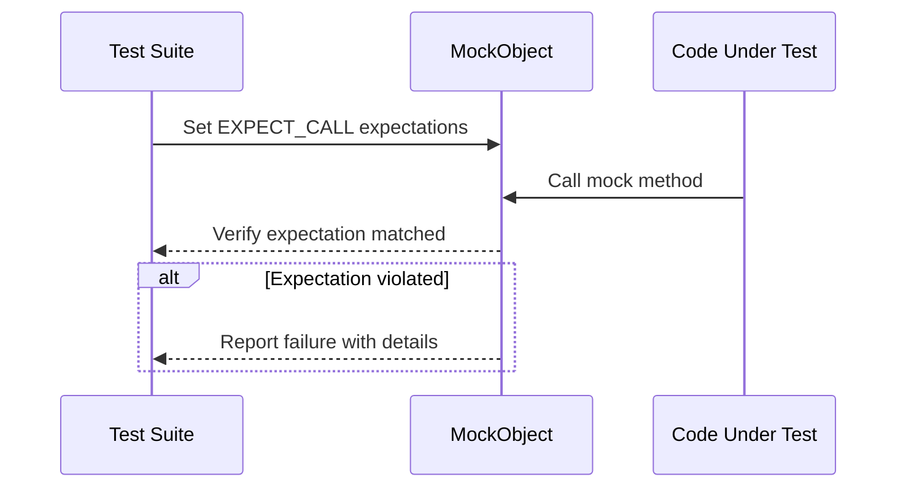

# Feature Overview & Highlights

Explore the core capabilities that empower C++ development teams to build robust, maintainable, and well-tested software using GoogleTest and GoogleMock. This overview introduces essential GoogleMock features such as automated test discovery, a rich assertion library, specialized test types (customized, death, parameterized, typed), flexible test runners, and the ability to extend functionality through user-defined matchers and actions.

---

## Introduction

GoogleTest is a comprehensive C++ testing framework that streamlines the process of writing and running unit tests. Built on a foundation of features that simplify test creation, it enables developers to verify code correctness efficiently.

GoogleMock complements this by providing a powerful mocking framework to simulate and verify the behavior of C++ objects in isolation. Together, they form a toolset designed to ensure your code behaves as expected while maintaining flexibility and clarity.

## Key Features & Capabilities

### 1. Automatic Test Discovery

GoogleTest discovers all tests automatically by scanning test definitions in your code. This eliminates manual registration and helps you focus on writing tests rather than configuration.

### 2. Rich Assertion Library

The assertion macros provided enable validation across a range of conditions, from simple equality checks to complex predicate matchers. This expressive library reduces boilerplate and highlights test intent at a glance.

### 3. Customized and Death Tests

- **Customized Tests:** Extend and tailor test behaviors with fixtures and inheritance-based setups.
- **Death Tests:** Validate that your program terminates as expected under error conditions, catching crashes or failures for more robust error handling.

### 4. Parameterized and Typed Tests

These features provide means to run the same test logic with multiple input values or types without repeating boilerplate, promoting test reuse and improving coverage:

- **Parameterized Tests:** Supply different data sets that your test will iterate over.
- **Typed Tests:** Run the same tests for various data types, ensuring type compatibility and behavior correctness.

### 5. Flexible Test Running Options

GoogleTest supports granular control over test execution:

- Run all tests or a filtered subset by name patterns.
- Control test sharding and repeat runs for flaky test management.
- Integration hooks for continuous integration environments.

### 6. User-Defined Extensions

GoogleMock excels in extensibility. Developers can define:

- **Custom Matchers:** Tailor argument matching to complex invariants.
- **Custom Actions:** Specify intricate method behaviors during mock invocation.

This empowers precise control over mock object behavior for realistic testing scenarios.

## Real-World Usage Scenario

Imagine testing a component that interacts with a complex third-party API. With GoogleMock, you can create mocks of the API interface to:

- Define expected calls and their parameters using `EXPECT_CALL`.
- Specify return values and side effects to simulate API responses.
- Enforce call order and cardinality constraints to verify proper usage.

This approach lets you isolate the component under test, identifying subtle bugs and ensuring correct integration without relying on the actual API.

## Practical Tips & Best Practices

- **Set expectations before exercising mocks:** Always define `EXPECT_CALL` before invoking code that uses mocks.
- **Use `ON_CALL` for default behavior:** Define default mock behaviors that don't impose expectations.
- **Leverage sequences and `After` clauses:** Enforce call orders to mirror real-world workflows.
- **Suppress warnings judiciously:** Use `NiceMock` to reduce noise from uninteresting calls without hiding real issues.
- **Use parameterized tests** for input space coverage without duplicating code.

## Common Pitfalls & Troubleshooting

- Forgetting to provide a virtual destructor in interfaces to be mocked can cause unexpected behavior.
- Over-specifying expectations leads to brittle tests; prefer minimal, intent-focused specs.
- Calls made prior to setting expectations have undefined behavior—set up mocks early.
- Unmatched calls will cause failures; ensure your matchers cover all expected scenarios or use catch-all `EXPECT_CALL` with `Times(AnyNumber())`.

## Getting Started Preview

### Quick Start

Getting started with GoogleMock begins with 3 simple steps:

1. Include `<gmock/gmock.h>` in your test.
2. Define a mock class using `MOCK_METHOD` macros.
3. Use `EXPECT_CALL` to specify expected interactions.

Example:

```cpp
#include <gmock/gmock.h>

class Turtle {
 public:
  virtual ~Turtle() {}
  virtual void PenDown() = 0;
  virtual void Forward(int distance) = 0;
  virtual int GetX() const = 0;
};

class MockTurtle : public Turtle {
 public:
  MOCK_METHOD(void, PenDown, (), (override));
  MOCK_METHOD(void, Forward, (int distance), (override));
  MOCK_METHOD(int, GetX, (), (const, override));
};

// Usage in a test
TEST(PainterTest, DrawsLine) {
  MockTurtle turtle;
  EXPECT_CALL(turtle, PenDown());
  EXPECT_CALL(turtle, Forward(100));

  // Your testing code exercising 'turtle'
}
```

### Prerequisites

- A C++11 (or higher) compatible compiler.
- GoogleTest and GoogleMock source or binaries.
- Basic understanding of C++ virtual methods.

### Next Steps

- Explore detailed mocking techniques ([gMock Cookbook](https://google.github.io/googletest/gmock_cook_book.html))
- Learn how to define custom matchers and actions.
- Deep dive into parameterized and typed tests for scalable test coverage.

---

## Additional Resources

- [gMock Cheat Sheet](https://google.github.io/googletest/gmock_cheat_sheet.html) for quick syntax reference.
- [Mocking Reference](https://google.github.io/googletest/reference/mocking.html) for comprehensive API details.
- [Legacy gMock FAQ](https://google.github.io/googletest/gmock_faq.html) for common troubleshooting.

---

## Visualizing Mock Interactions



---

## Summary

GoogleTest coupled with GoogleMock provides an intuitive, expressive, and powerful framework for C++ unit testing with advanced mocking capabilities. From discovering tests automatically to setting detailed expectations on mock objects, it enables developers to catch bugs early while keeping tests maintainable and scalable.

