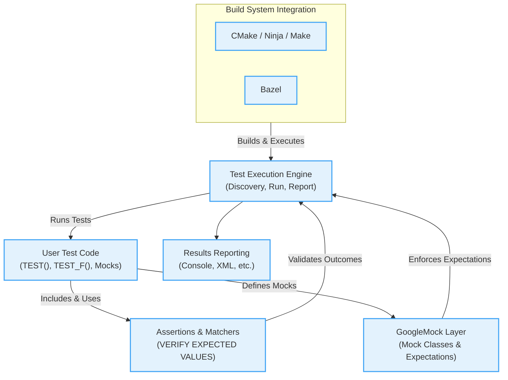

# High-Level Architecture of GoogleTest

GoogleTest is a comprehensive C++ testing framework designed to support robust and maintainable unit testing. This architecture overview illustrates how test code, assertions, mocks, and the test execution pipeline interact within GoogleTest, as well as how it integrates with common build systems like CMake and Bazel.

---

## Overview

GoogleTest's architecture is modular, aiming to provide seamless workflows for defining, organizing, executing, and verifying tests.

At a high level, the system consists of:

- **Test Code**: User-written test cases and test fixtures that leverage GoogleTest macros and APIs.
- **Assertions and Matchers**: Components that validate conditions and compare expected and actual results.
- **Mocking Layer (GoogleMock)**: Provides mock objects and expectations to isolate test dependencies.
- **Test Execution Engine**: Manages test lifecycle, runs tests, collects and reports results.
- **Build System Integration**: Tools and scripts that embed GoogleTest tests into build pipelines via CMake, Bazel, or other build tools.

## How It Works Together

1. **User writes tests** defining test cases (`TEST()`, `TEST_F()`) and mock classes using macros like `MOCK_METHOD`.
2. **Assertions** validate expected conditions during test execution.
3. When mocks are used, the GoogleMock layer verifies interaction contracts via expectations.
4. The **test runner** invokes tests, manages their lifecycle, captures outputs, and reports comprehensive results.
5. Build systems automate compilation and execution of tests within development workflows.

---

## Architecture Diagram

---

## Component Details

### 1. User Test Code
- Your C++ tests live here.
- Uses GoogleTest macros like `TEST` and `TEST_F` to define test cases and fixtures.
- Defines mock classes with the `MOCK_METHOD` macros, integrating GoogleMock capabilities.

### 2. Assertions and Matchers
- Provide expressive validation of expected test outcomes.
- Include predicates and comparison matchers (e.g., `EXPECT_EQ`, `EXPECT_CALL`).
- Facilitate detailed failure reports, improving debugging.

### 3. GoogleMock Layer
- Supports declarative creation of mock classes and methods.
- Allows setting expectations on mock method calls, order, parameters, and return values.
- Works closely with assertions to verify code interactions.

### 4. Test Execution Engine
- Discovers test cases automatically.
- Orchestrates test lifecycle: setup, execution, teardown.
- Handles output capturing, error reporting, and statistics gathering.
- Supports parameterized and typed tests for flexible scenarios.

### 5. Results Reporting
- Emits test results in various formats (console, XML, JSON).
- Provides detailed diagnostics on failures, including stack traces and matcher descriptions.

### 6. Build System Integration
- GoogleTest integrates smoothly with common C++ build systems.
- Provides CMake targets and Bazel rules to build, run, and manage tests.
- Ensures tests can be run as part of continuous integration workflows.

---

## Why This Architecture Matters

- **Separation of Concerns:** Each component focuses on a specific responsibility, simplifying maintenance and understanding.
- **Extensibility:** GoogleMock and matcher systems can be extended or customized independently.
- **Integration:** Tight coupling with build systems means tests effortlessly become part of normal development and deployment cycles.
- **User Focus:** The user deals mainly with writing tests and setting expectations, while the framework handles complexity behind the scenes.

---

## Getting Started

To start using GoogleTest and see this architecture in action:

<Steps>
<Step title="Write Your First Test">
Write simple `TEST()` or `TEST_F()` cases in your `.cc` files.
</Step>
<Step title="Build with CMake or Bazel">
Add `gtest` and `gmock` targets in your CMakeLists or Bazel BUILD files.
</Step>
<Step title="Run Tests">
Invoke tests via your IDE, command line, or CI integration.
</Step>
</Steps>

For detailed instructions, see [Getting Started: Installation and Setup](/guides/core-workflows/setup-getting-started).

---

## Troubleshooting Common Issues

If you experience issues with mock methods or test execution order, review:

- Correct use of `EXPECT_CALL` and `ON_CALL` for mocks.
- Proper mocking of const and overloaded methods.
- Runtime warnings via `--gmock_verbose=info` to trace mock calls.

For more help, consult [Troubleshooting Installation & Configuration](/getting-started/troubleshooting-common-issues/common-setup-issues).

---

## Additional Resources

- [GoogleTest Intro & Core Concepts](/overview/intro-core-concepts/what-is-googletest)
- [Mocking Reference: EXPECT_CALL, ON_CALL, and MOCK_METHOD](/api_reference/mocking_api/expectations_and_actions)
- [gMock Cookbook](https://google.github.io/googletest/gmock_cook_book.html)
- [gMock Cheat Sheet](https://google.github.io/googletest/gmock_cheat_sheet.html)

---

This high-level architecture provides a clear picture of how GoogleTest and GoogleMock components collaborate to offer a powerful, flexible C++ testing environment. It abstracts complexity from users and enables integration into standard C++ build systems for continuous testing.

---

*End of Document*