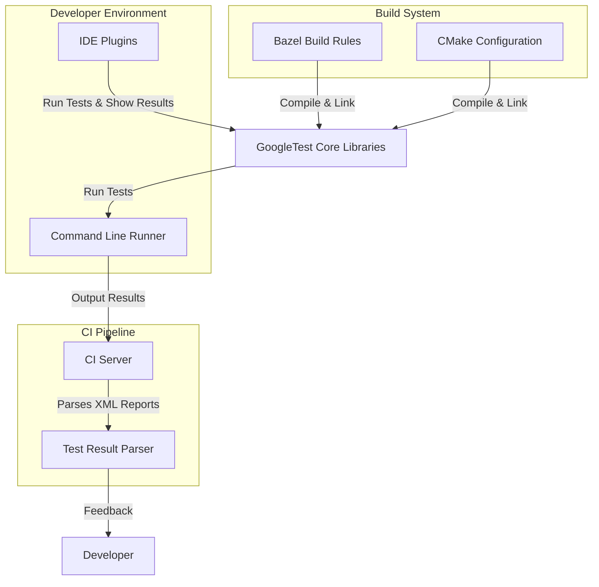

# Integration & Ecosystem

Discover how GoogleTest seamlessly integrates into modern C++ development workflows, enhancing test automation and cross-platform compatibility. This page guides you through essential integration points with popular build systems, continuous integration (CI) pipelines, and common third-party tools, enabling you to harness GoogleTest’s full potential in your development environment.

## Why Integration Matters

To maximize the benefits of GoogleTest — fast, reliable, and maintainable C++ testing — it must fit naturally into your existing tooling and processes. Whether you’re orchestrating builds with Bazel, CMake, or integrating tests into CI systems, a smooth integration unlocks automation, consistent results, and developer productivity.

## Integrating with Build Systems

GoogleTest offers robust support for the most prevalent build environments, ensuring your tests build reliably and run consistently across platforms.

### Bazel

- **Native Support:** GoogleTest integrates as a first-class Bazel target, simplifying test setup.
- **Bazel Rules:** Use `cc_test` rules to define test targets that automatically link against GoogleTest libraries.
- **Test Discovery:** Bazel detects and runs tests efficiently, leveraging GoogleTest’s test suites.
- **Example:**

```python
cc_test(
    name = "my_component_test",
    srcs = ["my_component_test.cc"],
    deps = ["@com_google_googletest//:gtest_main"],
)
```

### CMake

- **Find Package:** Easily add GoogleTest via `find_package(GTest REQUIRED)`.
- **Targets:** Link your test executable with `GTest::gtest` and `GTest::gtest_main`.
- **Cross-Platform:** CMake configurations ensure consistent builds on Linux, Windows, and macOS.

Example CMake snippet:

```cmake
find_package(GTest REQUIRED)
add_executable(my_tests test_main.cpp my_tests.cpp)
target_link_libraries(my_tests GTest::gtest_main GTest::gtest pthread)
add_test(NAME MyTests COMMAND my_tests)
```

> **Tip:** For convenience, GoogleTest ships with a `gtest_main` library that provides a ready-to-use `main()` function.

## Continuous Integration (CI) Pipelines

GoogleTest’s output and integration capabilities are designed for easy consumption by CI systems.

- **Standard Output:** Tests produce human-readable summaries and detailed failure diagnostics,
  suitable for quick developer feedback.
- **XML Output:** Use the `--gtest_output=xml:<file>` argument to generate JUnit-compatible XML test reports,
  widely supported by CI tools like Jenkins, GitLab CI, and CircleCI.
- **Parallel Test Execution:** GoogleTest supports running tests in parallel,
  accelerating pipeline throughput.
- **Exit Codes:** GoogleTest exits with non-zero status when failures occur, enabling CI to detect breaks reliably.

### Example: Running Tests with XML Output

```bash
./my_tests --gtest_output=xml:test_results.xml
```

This XML can then be ingested by your CI dashboard.

## Third-Party Runners and Interfaces

GoogleTest’s design ensures compatibility with many IDE plugins, test result parsers, and GUI test runners.

- **IDE Integration:** Plugins and extensions for Visual Studio, CLion, and Eclipse automatically discover and run GoogleTest tests, highlighting failures inline.
- **Result Parsers:** Popular CI tools recognize GoogleTest XML output natively.
- **Custom Runners:** GoogleTest’s modular architecture allows custom adapters and runners to integrate seamlessly.

## Major Dependencies and Portability

GoogleTest relies on only minimal, portable dependencies:

- **C++ Standard:** Requires a C++11-compliant compiler or newer.
- **Standard Libraries:** Uses standard C++ libraries; no heavy third-party runtime dependencies.
- **Threading Support:** Supports pthreads on POSIX platforms; alternative threading implementations where available.

This lightweight dependency footprint ensures GoogleTest builds and runs consistently across Linux, Windows, macOS, and embedded platforms.

## Cross-Platform Development

GoogleTest is carefully crafted for cross-platform compatibility, allowing you to:

- Write tests once and run them anywhere supported by your build system.
- Utilize native platform capabilities for threading and synchronization without changing test code.
- Rely on consistent test semantics regardless of operating system or compiler.

## Visualizing Integration Flow



This diagram illustrates how GoogleTest bridges your build system, test execution, and CI integration, providing test results seamlessly back to developers.

## Best Practices for Integration

- Always integrate GoogleTest build targets directly in your existing build system rather than running manual compilation.
- Leverage GoogleTest’s XML output for CI reporting.
- Use test filters to run subsets during rapid iterative development.
- Consider parallel test execution to improve pipeline performance.

## Troubleshooting Common Integration Issues

<AccordionGroup title="Common Issues and Solutions">
<Accordion title="Build Failures with CMake">
Check that your project links against `GTest::gtest` and `pthread` (on POSIX).
Ensure your C++ standard compiler flag is set (e.g., `-std=c++11`).
</Accordion>
<Accordion title="Tests Not Discovered by IDE">
Verify your IDE plugin supports GoogleTest and is properly configured.
Make sure test binaries are built with `gtest_main` or a proper main function.
</Accordion>
<Accordion title="CI Test XML Not Generated">
Add the command-line flag `--gtest_output=xml:<filename.xml>` when invoking tests.
Check file write permissions.
</Accordion>
</AccordionGroup>

## Next Steps

- Explore [Build System Integration](getting-started/prep-requirements-installation/install-cmake-bazel.md) for practical setup guides.
- Review [Project Setup & Integration](getting-started/configuring-using-tests/project-setup-integration.md) for step-by-step instructions.
- See [Running Tests & Interpreting Output](getting-started/configuring-using-tests/running-tests-validate-output.md) to master test execution and results.

For deeper understanding, the architecture and core concepts pages provide valuable insights on how GoogleTest fits into your software lifecycle.

---

**References:**

- [GoogleTest Primer](primer.md)
- [gMock for Dummies](gmock_for_dummies.md)
- [gMock Cookbook](gmock_cook_book.md)
- [Mocking Reference](reference/mocking.md)
- [Integration with Bazel and CMake](guides/integration-and-best-practices/build-system-integration.md)
