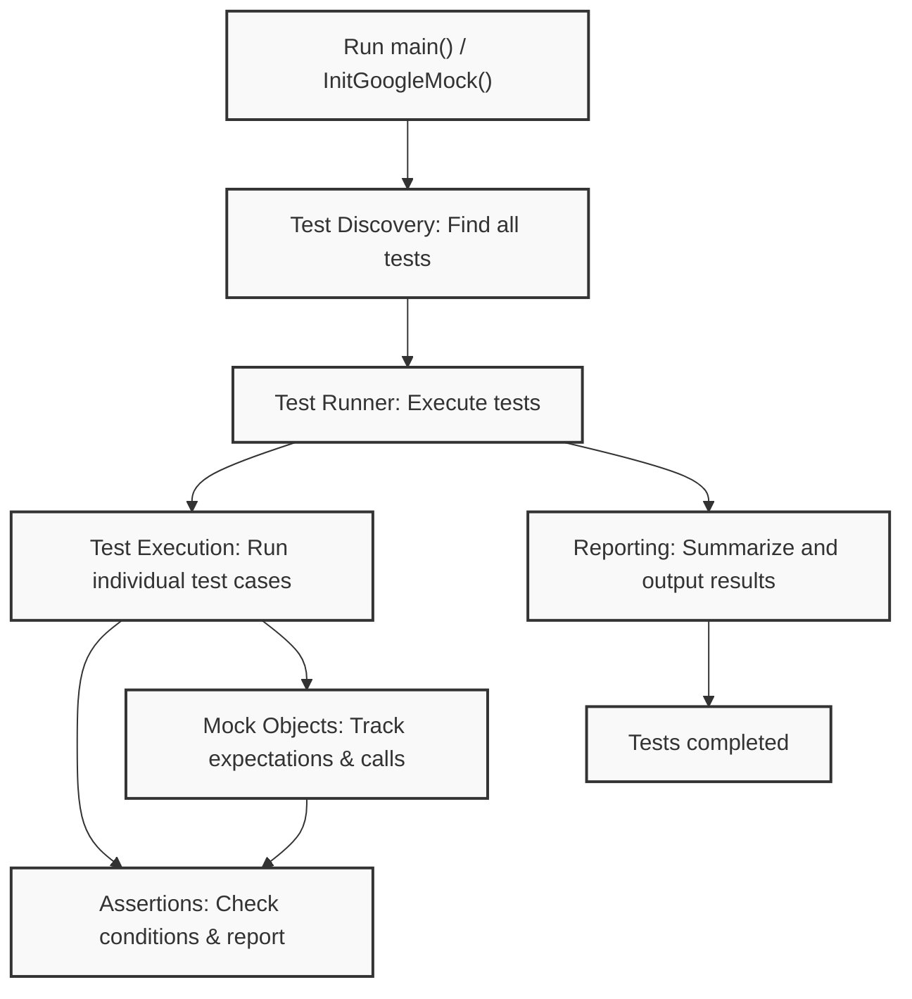

# System Architecture Overview

## Introducing the Core Architecture

Understanding how GoogleTest and GoogleMock interconnect at a high level empowers you to harness their capabilities efficiently. This overview introduces the main components: test runners, assertion mechanisms, mock objects, test discovery, and user entry-points — explaining how they collaborate to deliver robust testing workflows.

Through both textual explanation and a diagram, you'll gain a clear mental model of the data and control flows that drive your tests.

---

## Main Components Explained

### 1. Test Runner
The Test Runner acts as the orchestrator of your test suite execution. It initializes the testing framework, discovers all registered tests, executes them, and reports results.

**User goal:** Run all tests seamlessly and receive detailed outcomes.

### 2. Test Discovery
GoogleTest auto-discovers all tests defined via `TEST()`, `TEST_F()`, and related macros. It maintains a registry of these tests that can be selectively run based on filters.

**User goal:** Easily find and execute targeted tests without manual enumeration.

### 3. Assertion Mechanisms
Assertions verify expected conditions inside tests, producing detailed diagnostics on failure. GoogleTest offers various assertion macros (e.g., `EXPECT_EQ`, `ASSERT_TRUE`) to express and check your test conditions.

**User goal:** Validate test assumptions and gain actionable failures with stack traces.

### 4. Mock Objects
GoogleMock extends GoogleTest by enabling creation of mock classes that simulate real objects with programmable behavior and expectations. These mock objects track calls, verify invocation patterns, and simplify complex dependency testing.

**User goal:** Isolate code under test by replacing dependencies with controllable mocks, ensuring interaction correctness.

### 5. User Entry Points
Your test code typically begins in `main()` or, more commonly, links against provided test runners like `gtest_main` or `gmock_main`, which automatically call initialization and `RUN_ALL_TESTS()`. This makes integrating tests easy and standardized.

**User goal:** Focus on writing tests without custom main loop hassles.

---

## Interaction and Flow

These components collaborate as follows:

1. When your test program starts, the Test Runner initializes GoogleTest and GoogleMock.
2. Test Discovery finds all registered tests.
3. Tests execute one by one:
   - Inside each test, assertion macros validate functionality.
   - If mocks are used, expectations are set on mock objects.
   - Mock objects monitor calls to verify compliance.
4. Test Runner collects and summarizes all results.

The visual below consolidates this flow.

---

## Practical User Scenarios

- **Running Your Full Test Suite:** Simply link with `gtest_main` or `gmock_main`. Your test binary auto-discovers and runs all tests.
- **Adding Complex Mocks:** Define mock classes using `MOCK_METHOD` macros, set expectations with `EXPECT_CALL`, and use `ON_CALL` for default behavior. Mocks verify interaction correctness automatically.
- **Diagnosing Failures:** When assertions fail or mocks detect violated expectations, detailed messages with stack traces help pinpoint issues.

---

## Tips for Success

- Always initialize GoogleTest/GoogleMock using `InitGoogleMock()` before running tests.
- Use provided `gtest_main`/`gmock_main` binaries to simplify test entry point setup.
- Register tests via standard macros (`TEST()`, `TEST_F()`); do not manually register.
- Write mocks by inheriting interfaces and declaring `MOCK_METHOD`s for virtual functions.
- Set expectations before exercising mocks to avoid undefined behaviors.
- Use sequences or `InSequence` blocks to control call order when necessary.

---

## Troubleshooting Common Issues

**Problem:** Tests not running or no tests found.
- Ensure proper macros (`TEST`, `TEST_F`) are used.
- Verify that `InitGoogleMock` or `InitGoogleTest` is called.
- Confirm you are running the correct test binary.

**Problem:** Mock expectations not verified.
- Make sure mocks go out of scope to trigger verification.
- If allocating mocks on the heap, consider forcing verification manually with `Mock::VerifyAndClearExpectations()`.

**Problem:** Unexpected mock calls.
- Review your `EXPECT_CALL` matchers for correctness.
- Use `NiceMock` or `StrictMock` modifiers according to the desired strictness.

---

## Next Steps

To deepen your mastery, explore:

- [Writing and Running Unit Tests](/guides/core-workflows/writing-tests)
- [Using Mocks for Dependency Isolation](/guides/core-workflows/using-mocks)
- [Mocking Cheat Sheet](https://google.github.io/googletest/gmock_cheat_sheet.html) for quick reference on mocking syntax
- [System Requirements and Installation](/getting-started/installation-prerequisites/system-requirements)

---

This overview anchors your understanding of GoogleTest and GoogleMock core architecture, easing your journey through more advanced topics and empowering you to build reliable, scalable C++ tests with confidence.

<Source url="https://github.com/google/googletest" branch="main" paths={[{"path": "docs/gmock_main.cc", "range": "1-54"}]} />