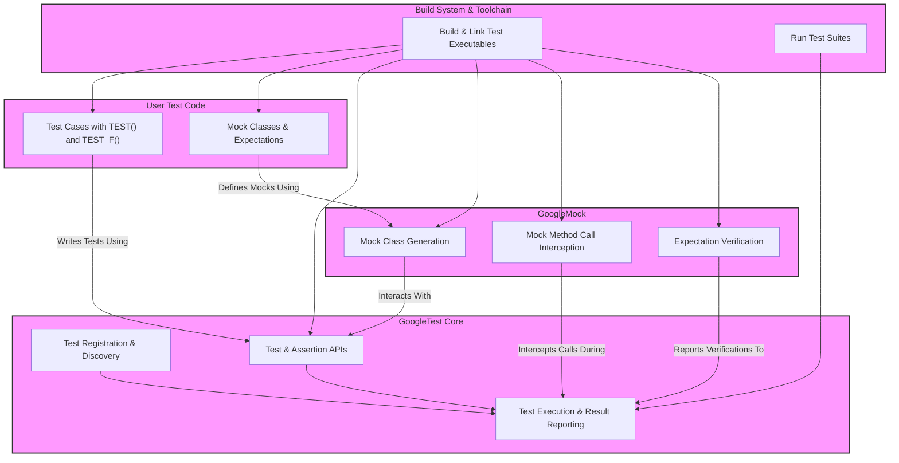

# System Architecture

Get a clear, high-level view of GoogleTest's architecture and how its core components interact. This conceptual map highlights the main modules of the GoogleTest ecosystem—GoogleTest core, GoogleMock, test and assertion APIs—and shows how they integrate with your user code and build systems. Whether you're new to GoogleTest or looking to deepen your understanding, this architectural overview helps orient you within the framework so you can navigate and leverage its capabilities effectively.

---

## Understanding the Overall Architecture

GoogleTest is designed as a comprehensive C++ testing framework composed of several key modules working together seamlessly. At its core lies GoogleTest itself, responsible for running tests and managing assertion APIs. GoogleMock complements this by providing a powerful mocking framework to create and control mock objects in your tests.

This page presents a bird’s-eye view, showing how these components relate to each other and to your code and build environment. By understanding this architecture, you’ll gain insight into how GoogleTest integrates into your workflows and where each part fits.

## Core Components and Their Roles

- **GoogleTest Core**: This is the foundation of the framework. It handles test discovery, registration, execution, result aggregation, and reporting. It exposes the test and assertion APIs that you use to write your tests.

- **GoogleMock (GoogleTest’s Mocking Library)**: Provides the functionality to create mock classes and methods, define expectations, and control their behavior. This module works in tandem with GoogleTest Core to verify interactions during tests.

- **Test and Assertion APIs**: These APIs allow you to write expressive tests with rich assertions. Assertions are the heart of test verification, distinguishing between fatal and nonfatal failures to give you granular control.

- **User Code Interface**: This is where your test code lives. You write tests using the APIs provided by GoogleTest and GoogleMock. User code leverages fixtures, test suites, mock objects, and assertions exposed by the framework.

- **Build Systems Integration**: GoogleTest integrates with your existing build system to compile, link, and execute your test programs. The architecture assumes a standard workflow where test binaries produced by your build system incorporate GoogleTest libraries.

## How It All Connects

Your test code interacts with the GoogleTest Core through the testing APIs. When you define tests using `TEST()` and `TEST_F()`, GoogleTest automatically registers these tests. At runtime, invoking `RUN_ALL_TESTS()` triggers GoogleTest Core to execute all registered tests.

Within your tests, if you use mocks, GoogleMock intercepts method calls on mocks, verifies expectations, and reports outcomes. GoogleMock is tightly coupled with GoogleTest so that mock verification is included in test results.

Meanwhile, the build system ensures your test targets are compiled with GoogleTest and GoogleMock libraries and linked properly.

## Visualizing the Architecture

*Diagram Legend:* 
- **User Test Code**: Your test code using test and mocking constructs
- **GoogleTest Core**: Main test engine and API provider
- **GoogleMock**: Mock object infrastructure
- **Build System**: Responsible for build and test execution

## Why This Matters to You

Understanding this architecture empowers you to:

- Grasp the separation of concerns between testing, mocking, and your code.
- Navigate the documentation effectively, knowing where to look for API details or build integration guidance.
- Debug issues faster by recognizing which component may be involved.
- Extend or customize your tests with awareness of the underlying framework structure.

## Best Practices for Working within This Architecture

- **Leverage test fixtures (`TEST_F`) to organize related tests and shared data.**
- **Use GoogleMock features to isolate code dependencies and verify interactions precisely.**
- **Integrate GoogleTest libraries consistently within your build system to avoid linkage problems.**
- **Invoke `RUN_ALL_TESTS()` once in your test program’s main to execute everything in order.**

## Troubleshooting Common Architectural Pitfalls

<AccordionGroup title="Common Issues and Tips">
<Accordion title="Tests Not Running / Discovered">
Make sure you link GoogleTest libraries correctly and call `RUN_ALL_TESTS()` after `InitGoogleTest()`. Tests defined with `TEST()` or `TEST_F()` macros register themselves automatically.
</Accordion>
<Accordion title="Mock Expectations Not Verified">
Verify that your mocks are used in conjunction with GoogleMock and that the mock object’s destructor is called (which triggers verification). If mocking behaviors aren’t acting as expected, check your `EXPECT_CALL` and `ON_CALL` usage.
</Accordion>
<Accordion title="Build Linking Errors with GoogleTest or GoogleMock">
Ensure your build system sources include GoogleTest and GoogleMock headers and libraries. Use the provided CMake integration to manage dependencies efficiently.
</Accordion>
</AccordionGroup>

## Next Steps

To deepen your understanding and get started:

- Visit [What is GoogleTest?](../product-intro-core-concepts/what-is-googletest.md) for an introduction to key concepts.
- Explore [Core Concepts and Terminology](../product-intro-core-concepts/core-concepts-terminology.md) to get familiar with common testing vocabulary.
- Review [Installation and Setup](../../getting-started/setup-prerequisites-installation/prerequisites-system-requirements.md) to prepare your environment.
- Learn how to start writing tests with [Writing Your First Test](../../getting-started/first-test-run-validation/writing-your-first-test.md).

---

> This page serves as a conceptual map to orient you within the GoogleTest ecosystem. It complements more detailed guides on features, APIs, workflows, and integrations.

---