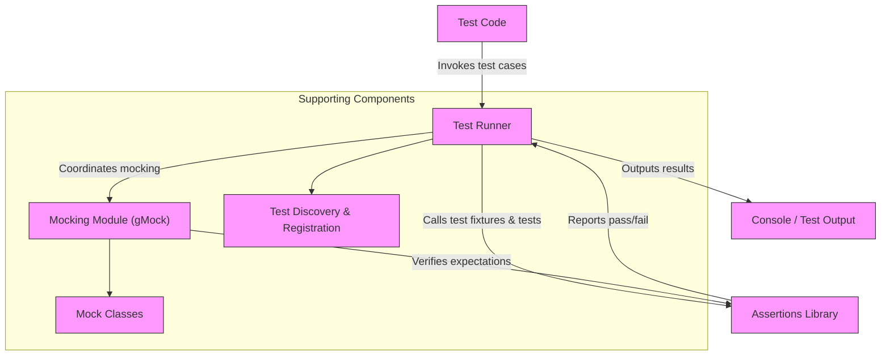

# System Architecture at a Glance

GoogleTest is a powerful C++ testing framework that brings clarity and reliability to your development lifecycle. This page provides a high-level tour of its system architecture, illustrating how test code, runners, assertion libraries, and mocking modules collaborate to deliver seamless test execution.

---

## Understanding the GoogleTest Architecture

### What Happens When You Run Tests?

Imagine you have written some test code using the GoogleTest framework to validate your C++ application. When you execute this test program, multiple components come into play to make sure your tests run correctly, your assertions are evaluated, and your mocks behave as expected.

### Core Components

- **Test Code:** This is your collection of test cases and test fixtures written using GoogleTest macros and classes.
- **Test Runner:** The executable harness that discovers, schedules, and runs your tests, reporting results.
- **Assertions Library:** Provides the macros and helper functions that verify test conditions, gracefully reporting success or failure.
- **Mocking Module (gMock):** An optional but deeply integrated library allowing you to define mock classes, set expectations, and simulate interactions for complex dependencies.

Together, these form a cohesive ecosystem enabling developers to write robust, expressive tests with clear outcomes.

## Architecture Overview Diagram



---

## How the Components Work Together

### Step-by-Step Workflow

1. **Test Discovery & Registration:**
   When you build and run your test executable, the test runner automatically registers all test cases and fixtures you have written. This enables dynamic discovery of tests without manual configuration.

2. **Test Execution:**
   The test runner sequentially or in parallel runs the registered tests.

3. **Assertions Evaluation:**
   Within each test, GoogleTest’s assertion library validates conditions (e.g., EXPECT_EQ, ASSERT_TRUE). Assertions report success or failure immediately with helpful diagnostics.

4. **Mock Interactions:**
   If you use gMock for mocking dependencies, the mocking module creates mock objects and verifies that your code interacts with them as expected. It works hand-in-hand with the assertion library to fail tests if expectations are violated.

5. **Result Reporting:**
   The framework compiles test outcomes, summarizes pass/fail statistics, and outputs to the console or XML/JSON reports.

---

## Practical Example: Running a Test with GoogleTest and gMock

Consider a test suite that uses both basic assertions and mocks.

```cpp
#include <gtest/gtest.h>
#include <gmock/gmock.h>

using ::testing::Return;

class ServiceInterface {
 public:
  virtual ~ServiceInterface() {}
  virtual int Compute(int x) = 0;
};

class MockService : public ServiceInterface {
 public:
  MOCK_METHOD(int, Compute, (int x), (override));
};

TEST(MyTest, UsesMock) {
  MockService mock_service;
  EXPECT_CALL(mock_service, Compute(5))
      .Times(1)
      .WillOnce(Return(10));

  int result = mock_service.Compute(5);
  EXPECT_EQ(result, 10);
}
```

**Flow in action:**
- The test runner finds `MyTest/UsesMock`.
- It instantiates `MockService` and sets the expectation.
- The mock `Compute` method is invoked.
- gMock verifies the call, returns 10, integrates with assertions.
- GoogleTest asserts the returned value.
- Test result is reported.

---

## Tips to Navigate the Architecture

- **Leverage gMock for dependencies:** Use mocking to isolate your tests and verify interactions rather than only outcomes.
- **Understand the lifecycle:** Be aware tests run under a centralized test runner which handles setup and teardown.
- **Focus on failures:** Assertion library and mocking module provide detailed diagnostics on failures with stack traces.
- **Use output formats:** Besides standard console output, GoogleTest supports detailed XML/JSON reporting for CI pipelines.

---

## Troubleshooting Common Issues

<AccordionGroup title="Common Issues in Test Execution">
<Accordion title="Tests Not Being Discovered">
Make sure you use TEST or TEST_F macros properly. GoogleTest automatically registers tests during static initialization.
</Accordion>
<Accordion title="Mock Expectations Not Met">
gMock will fail tests if expectations are not fulfilled or are violated. Use verbose mode (`--gmock_verbose=info`) to trace mock calls.
</Accordion>
<Accordion title="Assertions Not Triggering Failures">
Confirm your assertion macros are correctly scoped, e.g., EXPECT_* vs ASSERT_* differences. Ensure there are no premature exits in test code.
</Accordion>
<Accordion title="Uninteresting Function Calls Warning">
This means a mock method was called without an explicit expectation. You can suppress warnings by adding `EXPECT_CALL` with `.Times(AnyNumber())` or use NiceMock.
</Accordion>
</AccordionGroup>

---

## Getting Started Preview

Starting with GoogleTest involves:

- Writing test cases using provided macros.
- Optionally, defining mocks with gMock.
- Building and running tests using provided test executables.

For detailed tutorials:
- See [GoogleTest Primer](https://google.github.io/googletest/primer.html)
- Learn mocking via [gMock for Dummies](https://google.github.io/googletest/gmock_for_dummies.html)

Next step: Explore the [Feature Overview & Major Workflows](/overview/architecture-features/feature-quick-tour) for insights on using GoogleTest in real projects.

---

<Note>
Want to dive deeper? Check out related documentation for platform setup, writing your first tests, and advanced mocking recipes in the Guides section.
</Note>

---

## Related Documentation

Part of a broader set covering GoogleTest:

- [What is GoogleTest?](/overview/product-intro-core-concepts/what-is-gtest)
- [Core Philosophy & Benefits](/overview/product-intro-core-concepts/core-philosophy)
- [Mocking C++ Objects with GoogleMock](/guides/advanced-testing-strategies/mocking-with-googlemock)
- [Assertions Reference](/api-reference/core-testing-api/assertions)

Explore these to better understand and use the framework effectively.

---

## Summary

This page equips you with a top-down view of GoogleTest’s architecture, from the developer’s test code, through runners and assertions, to mocks and output. It clarifies how these components interact to reliably execute and verify C++ tests both simple and complex.

---

## Community and Support

Visit the [Community Documentation page](/community_created_documentation.html) for insights and user experiences.

---