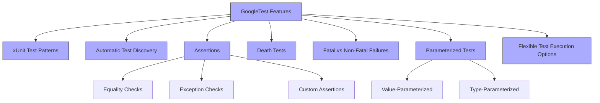

# Feature Overview

Unlock the full power of GoogleTest with its comprehensive set of core and advanced testing features. This page provides a concise, actionable summary designed to help you understand and leverage essential capabilities — from classic xUnit patterns to complex parameterized tests and custom assertions — all aimed at making your C++ testing efficient, expressive, and maintainable.

---

## Core Features and Their Value

### 1. xUnit Test Patterns
GoogleTest embraces the xUnit architecture, enabling you to organize your tests into well-structured test suites and test cases. This pattern promotes clarity, modularity, and scalability in your tests.

**Why it matters:**
- Organize related tests logically for easier maintenance.
- Facilitate test fixture reuse to avoid boilerplate setup.
- Improve test discoverability and execution order.

### 2. Automatic Test Discovery
Simply by using GoogleTest macros to define your tests, the framework automatically discovers and manages them—no manual registration needed.

**Benefits:**
- Saves you time during test development and integration.
- No risk of missing tests due to manual errors.
- Easy to scale large test suites effortlessly.

### 3. Rich Set of Assertions
GoogleTest offers an extensive range of built-in assertions to verify equality, inequality, exceptions, floating-point approximations, and more.

- **Equality and Relational Assertions:** Check for expected values with detailed failure reports.
- **Exception Assertions:** Confirm that your code throws or does not throw exceptions as expected.
- **Custom Assertions:** Extend GoogleTest with user-defined checks tailored to your domain.

**Example:**
```cpp
EXPECT_EQ(actual, expected); // Checks equality
ASSERT_THROW(foo(), std::runtime_error); // Checks for exceptions
```

**Value:** Precise and expressive tests that pinpoint failures quickly.

### 4. Death Tests
Special tests that verify your code aborts under expected fatal error conditions, such as invalid input or assertion failures.

**Use case:**
- Confirm your program handles invalid states as intended.
- Test error handling and program termination paths robustly.

### 5. Fatal vs Non-Fatal Failures
GoogleTest distinguishes between assertions that abort the current test (`ASSERT_`) and those that allow it to continue (`EXPECT_`), giving you fine control over test flow.

**Tip:** Use `ASSERT_` when continuing after failure is unsafe.

### 6. Parameterized & Type-Parameterized Tests
Run the same test logic against multiple inputs or types without duplication by leveraging GoogleTest’s powerful parameterized test features.

- **Parameterized Tests (`TEST_P`):** Test the same logic on different data values.
- **Type-Parameterized Tests (`TYPED_TEST`):** Test template-based code across various data/types.

**Example:**
```cpp
INSTANTIATE_TEST_SUITE_P(MySuite, MyParamTest,
                         testing::Values(1, 2, 3));
```

**Benefit:** Dramatically reduce code duplication and ensure comprehensive coverage.

### 7. Flexible Test Execution Options
Control how tests run with features like test filters, shuffle mode, repeat counts, and death test modes, empowering you to optimize for debugging or CI pipelines.

**Examples:**
- Run only tests matching a pattern.
- Shuffle execution order to detect test dependencies.
- Repeat tests to catch flaky behavior.


---

## Real-World Usage Scenario

Imagine you are developing a critical C++ library and want to ensure it behaves correctly across many scenarios without writing repetitive test code.

With GoogleTest’s test discovery and parameterized tests, you write one test method that automatically runs against various inputs to validate correctness. Using assertions, you check the outcomes precisely, and death tests ensure your error handling works as expected. When the test suite expands, you use flexible execution options to run targeted subsets during development and full suites in CI.

This workflow accelerates development, improves reliability, and reduces maintenance overhead.

---

## Best Practices and Tips

- Favor `EXPECT_` assertions to gather more failures per test run; use `ASSERT_` when failures should stop execution immediately.
- Use parameterized or type-parameterized tests to avoid duplication when testing with multiple inputs or types.
- Employ custom assertions for complex validation logic to keep tests readable.
- Use death tests to verify that your code safely aborts on invalid inputs.
- Leverage test execution flags (`--gtest_filter`, `--gtest_repeat`, etc.) to fine-tune test runs.

---

## Troubleshooting Common Pitfalls

- **Tests not discovered?** Ensure you use GoogleTest macros (`TEST`, `TEST_F`, `TEST_P`) properly.
- **Assertions not stopping test?** Use `ASSERT_` macros if test continuation after failure causes problems.
- **Flaky tests?** Run tests with repetitions and in shuffled order to identify dependencies.
- **Death tests failing unexpectedly?** Verify correct use of death test macros and ensure death test environment setup matches your platform needs.


---

## Getting Started Preview

To begin, write your first simple test using `TEST` or `TEST_F` macros, then expand to parameterized or typed tests to increase coverage without code duplication.

Explore the [Quickstart: Write & Run Your First Test](/getting-started/first-tests/quickstart-example) and [Installation & Setup](/guides/getting-started/installation-setup) to get up and running quickly.


---

## Additional Resources

- [What is GoogleTest?](/overview/intro-concepts/what-is-googletest) — Understand the overall framework and purpose.
- [Core Concepts & Terminology](/overview/intro-concepts/core-concepts-terminology) — Deep dive into GoogleTest fundamentals.
- [Assertions, Macros & Expectations](/guides/core-test-design/assertions-macros) — Complete guide on using assertions effectively.
- [Parameterized & Typed Tests](/guides/core-test-design/parameterized-typed-tests) — Unlock advanced test patterns.
- [Death Tests & Error Handling](/guides/core-test-design/death-tests-error-handling) — Master testing error conditions.

---

## Summary
This page empowers you to leverage a rich suite of GoogleTest features encompassing xUnit test patterns, automatic discovery, diverse assertions, death test capabilities, fatal and non-fatal failure handling, parameterized and type-parameterized tests, plus flexible execution options. Together, these enable precise, scalable, and maintainable C++ testing tailored for both simple and complex codebases.


---

### Related Diagram: Feature Hierarchy (Conceptual)

