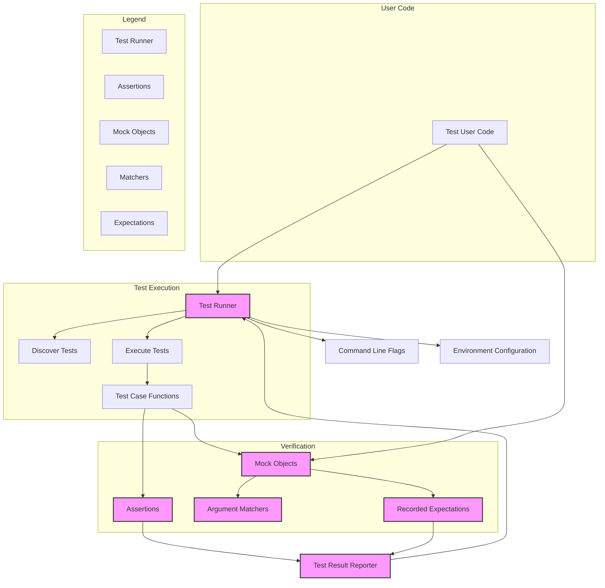

# System Architecture (with Diagram)

## Understanding the GoogleTest & GoogleMock Architecture

Welcome to the 'System Architecture (with Diagram)' page, where you'll gain a clear and actionable mental model of how GoogleTest and GoogleMock work together under the hood. Whether you are a C++ developer evaluating how the framework integrates into your testing workflow or a decision-maker seeking an architectural overview, this page provides a compelling, benefit-driven explanation supported by a detailed Mermaid diagram.

### Why This Matters to You

Visualizing how components such as test runners, matchers, assertions, and mocks collaborate equips you to:

- Understand where to hook into the system when writing custom extensions or tooling
- Diagnose integration points for troubleshooting
- Appreciate why GoogleTest’s seamless developer experience enables reliable, maintainable tests

Think of this architecture as the blueprint that makes your testing powerful, extensible, and easy to use.

---

## Core Components Explained

GoogleTest and GoogleMock form a powerful duo:

- **Test Runner:** The orchestrator that discovers, schedules, and executes your tests
- **Matchers:** Flexible predicates that verify argument values in mock calls
- **Assertions:** Your primary way to verify test conditions explicitly
- **Mocks:** Specialized objects mimicking real interfaces to observe and control behavior

Together, they create a robust, scalable testing environment tailored for C++ development.

### How They Work Together

1. Your test code defines tests and optionally mock objects.
2. The **Test Runner** initializes and sequentially executes these tests.
3. Inside tests, when you invoke mock methods, **Matchers** validate parameters and **Assertions** ensure expectations are met.
4. On completion, the framework reports pass/fail status and details.

This architecture supports everything from simple unit tests to complex interaction-based tests.

---

## Mermaid Diagram: GoogleTest & GoogleMock System Architecture

---

## Practical Implications

- **For test authors:** Understanding that your test runner orchestrates test execution and that mocks use matchers to verify calls provides clarity on how to write effective, maintainable tests.

- **For integrators:** Knowing where command line flags and environment configuration fit enables seamless continuous integration setups.

- **For debuggers:** Grasping the flow from test discovery to result reporting helps locate issues faster.

This architecture empowers you to make targeted improvements and leverage GoogleTest and GoogleMock’s full potential.

---

## Tips & Best Practices

- Use the **Matchers** flexibly to specify precise argument checks without over-constraining your tests.
- Structure your test cases to keep **Assertions** clean and focused for better readability.
- Leverage mock **Expectations** to validate interactions, catching subtle bugs early.
- Configure **Test Runner** behavior via command line and environment as needed for different test scenarios.

---

## Troubleshooting

- If a test fails unexpectedly, verify whether the **Matcher** conditions on mock methods match your expectations.
- For flaky test execution orders, ensure the **Test Runner** is running tests in the intended sequence.
- If outputs are unclear, enabling verbose logging or test result reporters can help trace through the architecture.

---

## Getting Started Preview

Ready to explore this architecture hands-on? Visit the [Getting Started](../getting-started/README.md) section to start your first tests, or 

- Read the [Feature Overview](./feature-overview.md) to dive deeper into capabilities
- Explore [Mocking with GoogleMock](../guides/mocking-advanced-techniques/intro-mocking.md) for advanced use

---

This page serves as your foundational map to navigate the architecture of GoogleTest and GoogleMock with confidence and insight.

---

*For a closer look at individual components or more detailed API usage, see related sections in this documentation.*
