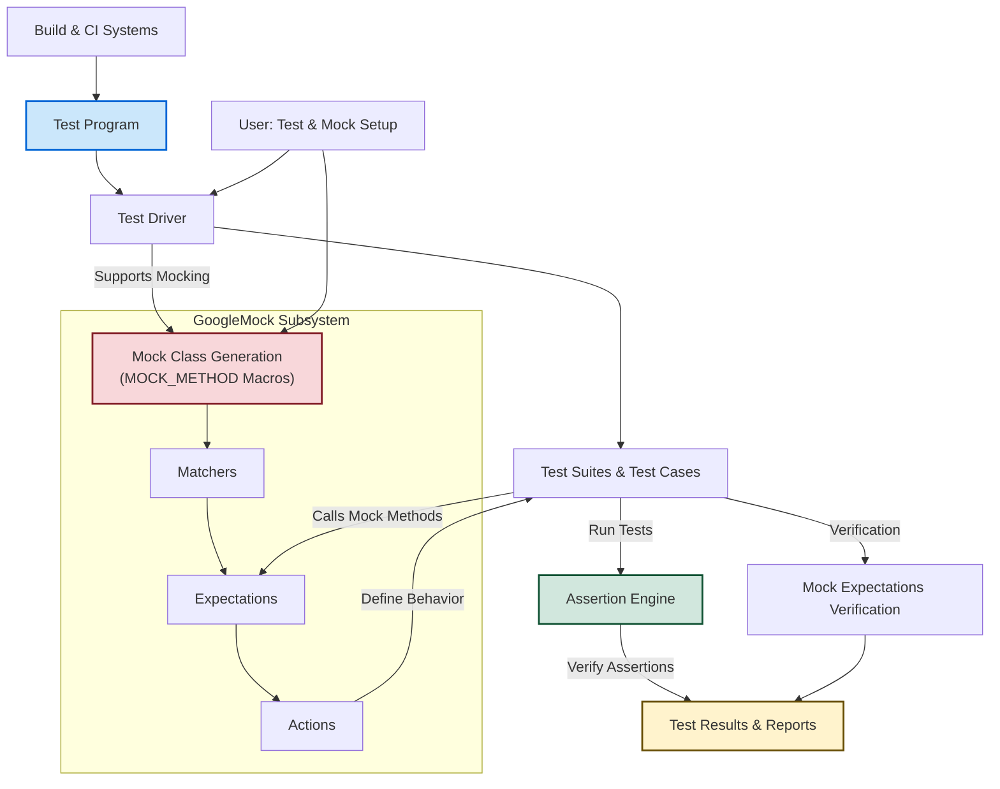

# System Architecture Overview

## Unifying GoogleTest and GoogleMock: A Seamless Testing Ecosystem

At the heart of high-quality C++ testing lies the collaborative power of **GoogleTest** and **GoogleMock**. This architecture overview provides a clear, high-level visualization of how these two subsystems intertwine, orchestrating a smooth and scalable testing experience. Whether you’re writing simple unit tests or complex interaction-based tests, understanding the key building blocks and their relationships will empower you to harness the full potential of the framework.

---

## Core Components and Their Collaboration

### 1. Test Drivers & Test Programs

Every test session begins here. Test drivers are the entry points for your test programs, executing defined test cases and suites.

- **Test Program**: The executable that runs your tests.
- **Test Suites & Test Cases**: Logical groupings of tests, structured to reflect the organization of your code.

### 2. Assertion Engine

Assertions verify your program’s behavior and form the backbone of test validations.

- Reports success or failure for each test assertion.
- Supports both **fatal** and **non-fatal** failures, allowing fine control over test flow.

### 3. GoogleMock Subsystem

The mocking framework extends the power of GoogleTest, enabling interaction-based testing through mock objects and expectations.

- **Mock Class Generation**: Using macros like `MOCK_METHOD`, mocks mirror your interfaces.
- **Matchers**: Flexible predicates that validate function arguments.
- **Expectations**: Specify number, order, and details of mock calls.
- **Actions**: Define mock behavior when methods are invoked.

### 4. Integration Points

Seamless integration between GoogleTest and GoogleMock creates a unified testing experience.

- **Automatic Registration**: Tests and mocks are registered without manual enumeration.
- **Shared Execution Control**: Test execution and verification phases unify mocking and assertion checks.
- **Thread Safety**: Both systems handle multithreaded test scenarios gracefully.

---

## Illustrated Architecture Flow

---

## Real-World Scenario: From Test Author to Test Execution

Imagine you are verifying a complex module with multiple dependencies. You start by writing your **test program**, structuring your tests into suites reflecting logical units of your code. For your dependencies, you create mock classes with `MOCK_METHOD` macros, setting expectations to specify how these mocks should behave.

When tests run:

- The **test driver** instantiates the test suites.
- Tests execute, invoking mocked methods where applicable.
- **Matchers** check argument correctness.
- **Assertions** validate expected outcomes.
- If any expectation fails — too many calls, wrong arguments, order violations — GoogleMock communicates these failures clearly.
- The **assertion engine** tracks all success and failure results.

This process continues smoothly, without you having to worry about the complexity of registration, execution order, or verification details — you focus on what matters: *writing effective tests*.

---

## Practical Tips for Success

- **Define clear mock interfaces** that correspond closely to real dependencies.
- **Use matchers wisely** to keep tests robust but not brittle.
- **Leverage sequences and ordering** (`InSequence`, `After`) to enforce expected call order only when necessary.
- **Set up common mock behavior with `ON_CALL`**, and reserve `EXPECT_CALL` for *verifying* calls.
- **Employ NiceMock, NaggyMock, or StrictMock** to manage warnings about unexpected calls.
- **Remember to verify and clear mock expectations early** with `Mock::VerifyAndClearExpectations()` if your mocks outlive the test scope.

---

## Next Steps

Explore the following to deepen your mastery:

- [Feature Highlights](/overview/architecture-features/feature-glance) to understand key capabilities
- [Ecosystem & Integration Points](/overview/architecture-features/integration-ecosystem) to see how testing tools connect
- [Creating and Using Mock Objects](/guides/mocking-techniques/creating-mocks) to refine mocking skills
- [Setting and Verifying Expectations](/guides/mocking-techniques/setting-expectations) for advanced test setup

Understanding the architecture empowers you to craft highly maintainable, reliable tests with confidence.

---