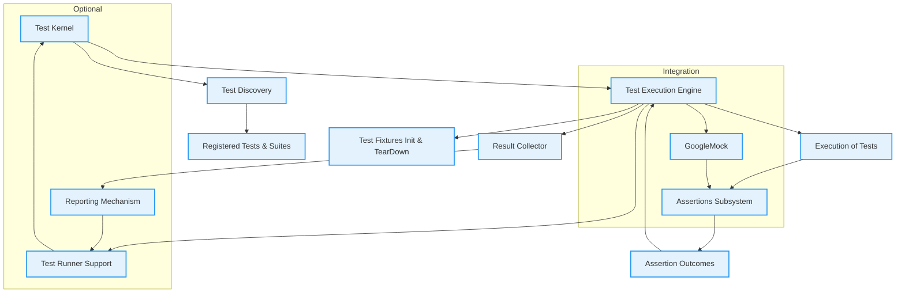

# System Architecture

Discover the core structure behind GoogleTest — a robust C++ testing framework focused on making automated tests powerful, reliable, and easy to maintain. This page offers a clear, approachable view into how GoogleTest’s essential components interact, from discovering tests to executing assertions and reporting results, while also highlighting integration points with GoogleMock and optional test runner support.

---

## Overview

GoogleTest orchestrates the lifecycle of C++ tests through a set of well-defined components working seamlessly together. This architecture empowers users to write expressive tests, have them automatically discovered and executed, verify program correctness through assertions, and report outcomes clearly.

By visualizing the system with a Mermaid-based diagram, we highlight how:

- **Test Discovery** enables GoogleTest to locate tests across projects effortlessly.
- **Test Execution** controls running tests and aggregates results.
- **Assertions** verify expected behaviors inside tests.
- **Reporting** communicates test outcomes with detailed feedback.
- **Integration with GoogleMock** augments testing capabilities by mocking dependencies.
- **Optional Test Runner** support offers flexibility in test execution.

In essence, this architecture provides a resilient backbone for effective testing workflows.

---

## Key Components & Data Flow

### Components

- **Test Kernel:** Acts as the heart of GoogleTest, managing test registration, discovery, and lifecycle.
- **Test Discovery:** Traverses all registered test cases and suites so tests can be invoked without manual enumeration.
- **Assertions Subsystem:** Evaluates test conditions, asserts equality, inequality, and other predicates, reporting failures instantly.
- **Test Execution Engine:** Runs tests individually or collectively, managing setup, teardown, and result collection.
- **Reporting Mechanism:** Formats outcomes, prints detailed logs and summaries, helping users quickly identify issues.
- **GoogleMock Integration:** Optional but common, allowing users to mock interfaces to isolate code and verify interaction.
- **Test Runner Support:** Optional adapters or extensions to integrate GoogleTest execution with external tools or CI/CD pipelines.

### Data Flow

1. **Initialization:** Upon test program startup, GoogleTest registers all test cases and prepares its execution environment.

2. **Test Discovery:** The kernel scans and organizes registered tests, enabling user commands or continuous integration systems to call specific tests or groups.

3. **Test Execution:** When a test or test suite is triggered, GoogleTest initializes required fixtures, runs the code under test, and evaluates assertions.

4. **Assertion Checking:** Assertions verify critical conditions inside tests. Failures are reported immediately, triggering potential test aborts if fatal.

5. **Result Collection:** Execution results, including pass/fail status and failure details, are collected centrally.

6. **Reporting:** Test outcomes are systematically reported, offering summaries and detailed failure information for ease of diagnosis.

7. **Mock Interactions:** If GoogleMock is used, it seamlessly interposes during test execution to check mock object expectations.

8. **Optional Runner Interaction:** Tests may invoke or be controlled by external test runners for scheduling, reporting, and orchestration.

---

## Mermaid Diagram of GoogleTest System Architecture

---

## Practical Example: How It Works in Your Workflow

Imagine you’ve written a suite of GoogleTest tests for your project. When you run your test executable:

- The **Test Kernel** enumerates all tests.
- The **Test Execution Engine** runs each test with its setup and teardown.
- Within each test, assertions in the **Assertions Subsystem** check your code’s behavior.
- If you use **GoogleMock** to isolate dependencies, mock expectations are checked during test execution seamlessly.
- After running all tests, the **Reporting Mechanism** summarizes results, indicating success or pinpointing failures with detailed messages.

This process transforms your raw tests into actionable feedback quickly and reliably.

---

## Integration Points

### GoogleMock

GoogleMock tightly integrates with GoogleTest’s system architecture to provide mocking capabilities. Mock objects participate in test execution and assertion checking, allowing you to verify interactions and control dependencies naturally.

### Optional Test Runner

For advanced use cases, GoogleTest supports integration with external test runners or CI/CD tools that may orchestrate test execution and aggregate results across multiple test suites or systems.

---

## Best Practices & Tips

- **Understand the lifecycle**: Knowing how test discovery, execution, and reporting flow helps you write better tests and debug failures more efficiently.
- **Use GoogleMock integration deliberately**: Mocking should complement functional tests, providing isolation and control over dependencies.
- **Leverage reporting information**: The detailed reporting subsystem ensures you can target issues with precision.
- **Explore Optional Runners for CI**: If integrating into complex CI pipelines, utilize test runner extensions for custom orchestration.

---

## Next Steps

- Visit [Core Concepts & Terminology](/overview/architecture-foundations/core-terminology) to deepen your architectural understanding.
- Explore [Integrating with Projects & External Systems](/overview/architecture-foundations/integration-points) for advanced integration techniques.
- Begin writing tests guided by the [Product Overview](/overview/product-intro/product-overview) and feature guides.

---

## References

- [GoogleMock (gMock) Mocking Framework Documentation](https://github.com/google/googletest/tree/main/googlemock)
- [Mocking Reference](../reference/mocking.md)
- [GoogleTest Getting Started Guides](../../getting-started/setup-and-installation/prerequisites-and-system-requirements)

---

<Tip>
This system architecture visualization helps you see the big picture and understand how GoogleTest components collaborate to deliver dependable C++ testing. Use this knowledge to navigate the framework confidently and write tests that harness its full potential.
</Tip>

---
