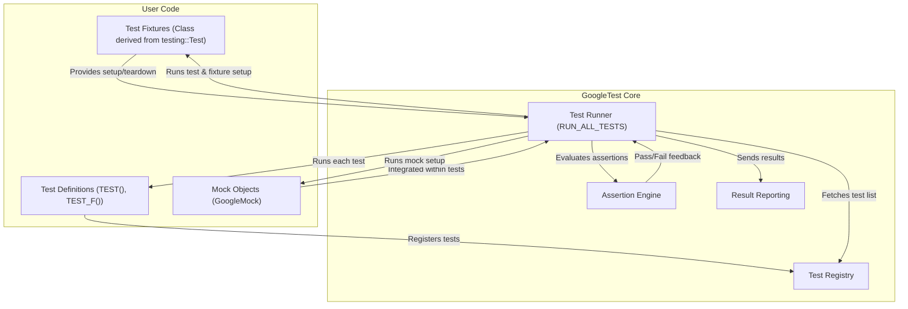

# Architecture Overview

## Major Components of GoogleTest

GoogleTest organizes test execution around several key components that work together to provide a seamless, reliable, and extensible testing framework for C++.

- **Test Runner**: Coordinates the discovery, setup, execution, and teardown of tests. It manages test lifecycle sequences, ensuring each test runs in isolation.
- **Assertion Engine**: Provides a rich set of macros to evaluate test conditions and report failures. Differentiates between fatal and non-fatal assertions to control flow.
- **Mocking System (GoogleMock)**: Integrates with the test framework to allow creation and management of mock objects, enabling fine-grained control over dependencies.
- **Integration Points**: Hooks and APIs that connect GoogleTest to external build systems, test discovery tools, and user code.

Each component plays a vital role in enabling developers to write expressive, maintainable, and fast tests.

## From Test Definition to Execution: Workflow Overview

GoogleTest follows a clear and consistent flow from when a user defines their tests to when they execute:

1. **Test Definitions**: Users define tests via macros like `TEST()` and `TEST_F()`. These definitions automatically register with the GoogleTest framework, so no manual enumeration of tests is required.

2. **Test Fixture Preparation**: For tests that share common setup/teardown, a *fixture* class derived from `testing::Test` is used. Fresh instances of fixtures are created per test to isolate state.

3. **Mock Objects Setup**: GoogleMock constructs and expectations are created as part of tests to simulate collaborator behaviors.

4. **Test Runner Invocation**: When `RUN_ALL_TESTS()` is called, the runner iterates through all registered tests, initializing fixtures, running the test body, then tearing down the fixtures.

5. **Assertion Checking**: Throughout test execution, assertions validate conditions. A failing fatal assertion aborts the current test; nonfatal assertions continue execution but mark the test as failed.

6. **Result Reporting**: After all tests have run, results are collected and reported, including aggregate pass/fail status and detailed failure messages.

This workflow ensures tests are independent, clearly structured, and informative.

## Visualizing the Architecture and Test Flow

The following Mermaid.js diagram illustrates the primary components and their interactions during test processing and execution.

## Detailed Component Descriptions

### Test Runner

The heart of GoogleTest that manages the entire lifecycle of test execution. It loads tests registered at compile time, creates fresh test fixture instances for each test to ensure isolation, and coordinates the setup and teardown processes.

- Guarantees independence between tests.
- Handles fatal failures by aborting only the current test, not the entire suite.
- Provides entry-point `RUN_ALL_TESTS()` which users invoke to execute tests.

### Assertion Engine

Responsible for assertion evaluation and failure reporting.

- Supports `ASSERT_*` for fatal failures and `EXPECT_*` for non-fatal failures.
- Automatically captures file names, line numbers, and failure messages.
- Helps users pinpoint exact failure causes while allowing multiple assertions per test.

### Mocking System

GoogleMock integrates seamlessly to support mock object creation. This integration:

- Enables behavior-driven tests by setting expectations on mocks.
- Works transparently with the test lifecycle managed by the test runner.
- Supports rich matchers and actions to verify interactions.

### Integration Points

GoogleTest is designed to work with a variety of build and test environments:

- Compatible with standalone and integrated CMake builds.
- Supports linking as static or shared libraries.
- Allows easy embedding into existing projects via subdirectories or package managers.

## Why This Architecture Matters

This architecture balances extensibility, usability, and maintainability. It ensures:

- Tests never interfere with each other, improving reliability.
- Detailed failure information helps faster debugging.
- Easy mock integration enables effective testing of complex interactions.
- Support for multiple platforms and build systems minimizes integration friction.

## Getting Started

If you are new to GoogleTest, understanding this architecture will help you write better tests and diagnose failures more effectively. To get started:

- Familiarize yourself with writing tests via the `TEST()` and `TEST_F()` macros.
- Explore how to use fixtures to share setup code.
- Learn to write assertions using the assertion engine's macros.
- Consider integrating GoogleMock for mocking dependencies.
- Invoke all tests using the `RUN_ALL_TESTS()` macro in your test runner code.

For detailed examples, see the [GoogleTest Primer](./overview/product-intro-core-concepts/what-is-googletest) and [Writing Your First Test](./getting-started/first-steps-with-tests/writing-first-test).

<Tip>
Understanding the test lifecycle and how GoogleTest processes your tests helps avoid common pitfalls like shared state leaks or unexpected test failures. Always keep tests independent and leverage fixtures for repeated setups.
</Tip>