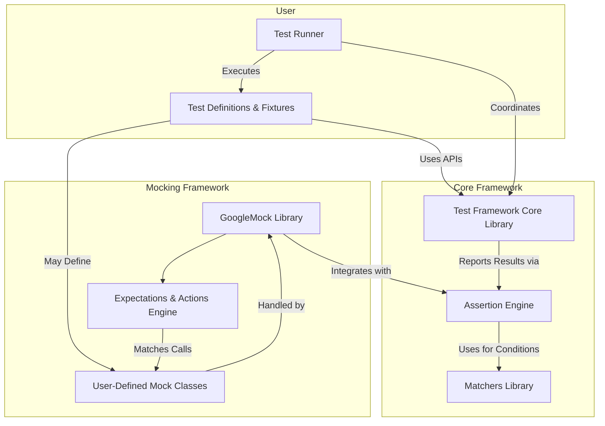

# System Architecture Overview

Understanding the core architecture of GoogleTest reveals how its primary components work together to deliver a powerful and flexible C++ testing framework. This page presents a visual, high-level diagram mapping out the interrelations between GoogleTest's core libraries, assertion engines, matchers, and the mocking framework, GoogleMock, helping you build a clear mental model of the system.

---

## Visualizing GoogleTest Components and Interactions

At the heart of GoogleTest is a well-orchestrated set of libraries and engines that combine to deliver comprehensive test definition, execution, result verification, and reporting. This diagram illustrates how these pieces interconnect, enabling you to understand the flow of data and control as tests run.

> **Diagram Explanation:**
> - **Core Framework** includes:
>   - *Test Framework Core*: Manages test registration, lifecycle, and execution.
>   - *Assertion Engine*: Evaluates test assertions and logs results.
>   - *Matchers Library*: Provides expressive, composable predicates for assertions.
> - **Mocking Framework** consists of GoogleMock, which leverages user-defined mocks and an engine to set expectations, verify function call interactions, and inject behavior.
> - **User Components** represent the tests and test runner that create and execute test cases using GoogleTest APIs.

---

## How It All Fits Together

- **User Tests** define test cases, fixtures, and optionally mocks that form the testable specifications.
- The **Test Runner** orchestrates the execution cycle, instantiating tests, triggering assertions, and generating pass/fail results.
- During execution, **Assertions** call into the matcher library to evaluate conditions, creating detailed diagnostic outputs when expectations fail.
- **GoogleMock** extends these capabilities by allowing tests to create mock objects with programmable behaviors and strict expectations. It hooks into the assertion engine for failure reporting and tracking.

This modular architecture empowers users with the flexibility to write simple tests or complex interactive tests involving mocks and parameterized assertions.

---

## Practical Benefits of Understanding the Architecture

- **Better Test Design:** Knowing how GoogleMock integrates with the core assertion framework helps you write mock-driven tests that leverage the assertion power seamlessly.
- **Debugging Insight:** Understanding the data flow clarifies where failures become visible and how matchers contribute to assertion diagnostics.
- **Extension Opportunities:** Recognizing component boundaries aids advanced users in extending or customizing GoogleTest features safely.

---

## Tips for Navigating the System Architecture

- Start with the **Core Testing APIs** to get a foundation of test definition and execution.
- Explore **Assertions and Matchers** to understand the rich expression language used for test verification.
- Dive into **Mocking and GoogleMock** to master test doubles, expectation setting, and call verification.
- Use the visual diagram here as a reference to see how new concepts relate to each other.

---

## Troubleshooting Common Architectural Questions

<AccordionGroup title="Troubleshooting Architecture Questions">
<Accordion title="Why do GoogleMock expectations need to be set before test code runs?">
Expectations drive the behavior and verification of mock objects. Setting them upfront allows GoogleMock to detect unexpected calls immediately and produce precise diagnostics with stack traces, improving debugging.
</Accordion>
<Accordion title="What happens if I don't use matchers in EXPECT_CALL?">
By default, literal argument values are treated as equality matchers. If omitted, for non-overloaded methods, the call will match any arguments. For overloaded methods, you must clarify which overload is expected.
</Accordion>
<Accordion title="How does GoogleTest support different test case structures?">
Test cases and suites, including parameterized and typed tests, are registered and run via the core framework, leveraging the assertion and matcher system for validation at runtime.
</Accordion>
</AccordionGroup>

---

## Next Steps: Deepen Your Knowledge

- [About GoogleTest](../product-intro/about-googletest) for core framework principles.
- [Assertions and Matchers](../core-concepts/assertions-and-matchers) to explore assertion capabilities.
- [Mocking and GoogleMock](../core-concepts/mocking) for full mocking workflow.

This architectural overview prepares you to navigate the documentation efficiently and leverage GoogleTest to its fullest.

---

## References

- [GoogleMock README](https://github.com/google/googletest/blob/main/googlemock/README.md) for detailed mocking architecture and usage.
- [gMock Cheat Sheet](https://google.github.io/googletest/gmock_cheat_sheet.html) for quick mocking syntax.
- [Core Concepts overviews](../core-concepts) for foundational testing concepts.

---

This page is part of the [Architecture & Integration](../architecture-integration) documentation section, providing foundational knowledge for effective GoogleTest usage.
